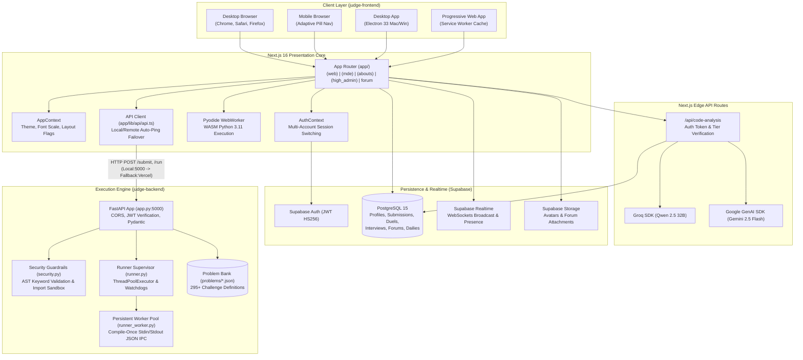
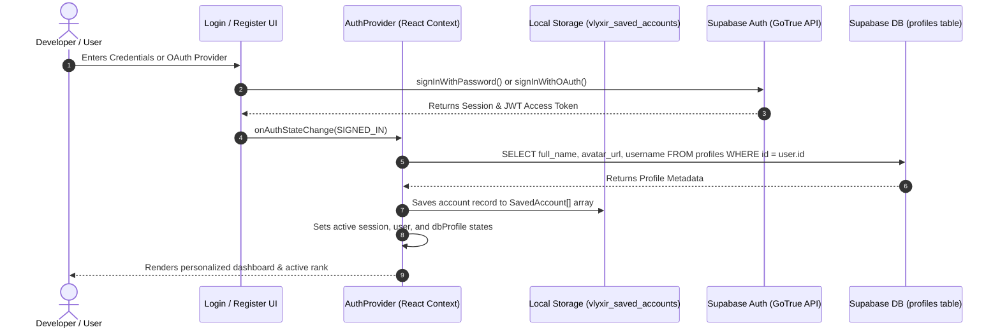
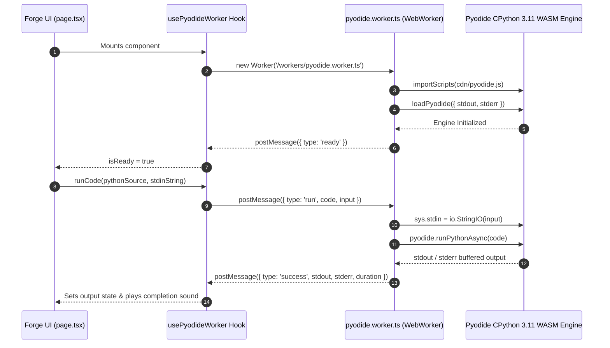
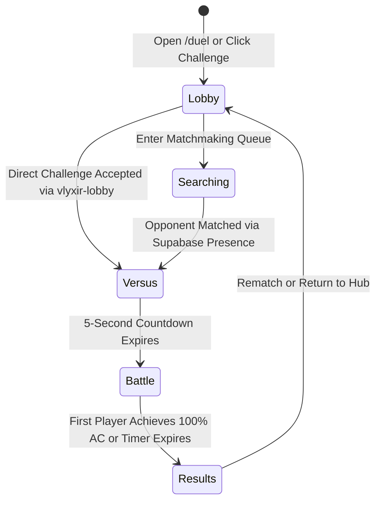
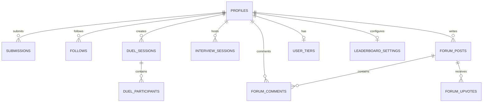

# ⚖️ Vlyxir — Complete Architecture & Platform Documentation

> **Version:** 7.3.20  
> **Release Class:** Enterprise Developer Platform / High-Performance Online Judge & Cloud IDE  
> **Target Environments:** Web (Next.js 16 + React 19), Progressive Web App (PWA), Desktop (Electron 33 macOS / Windows)  
> **Core Backend:** Python 3.10+ / FastAPI / Persistent Worker IPC Pool  
> **Persistence & Realtime:** Supabase (PostgreSQL 15, Auth, Row-Level Security, Realtime WebSockets)  
> **AI Inference Tier:** Groq Cloud (Qwen 2.5 32B / LLaMA 3.3 70B) & Google Gemini API (Gemini 2.5 Flash / Pro)  
> **In-Browser Sandbox:** Pyodide WebAssembly (Python 3.11 Runtime in WebWorker)  

---

## Table of Contents

1. [Executive Overview & Platform Vision](#1-executive-overview--platform-vision)
   - 1.1 What is Vlyxir?
   - 1.2 Target Audience & Core Value Proposition
   - 1.3 High-Level System Architecture & Topology
   - 1.4 Dual-Experience Paradigm: Classic vs. MDE (Modern Design Experience)
   - 1.5 Multi-Platform Delivery (Web, PWA, Electron Desktop)
2. [System Architecture & Repository Topology](#2-system-architecture--repository-topology)
   - 2.1 Complete Monorepo Directory Tree
   - 2.2 Tech Stack Matrix & Library Ecosystem
   - 2.3 Environment Configurations & Runtime Variables
   - 2.4 Build, Test, and Packaging Pipeline
3. [Authentication, Identity & Multi-Account Architecture](#3-authentication-identity--multi-account-architecture)
   - 3.1 Architecture of AuthContext & AuthProvider
   - 3.2 Supabase Auth Integration & Session Lifecycle
   - 3.3 Multi-Account Switching & Local Persistence
   - 3.4 User Profiles & Role Hierarchy (User, Pro, Super)
   - 3.5 Username Policy, Availability Validation & Regex Security
4. [Comprehensive Route Directory & Page Matrix](#4-comprehensive-route-directory--page-matrix)
   - 4.1 Route Mapping Table (All 35+ Routes)
   - 4.2 Route Implementations & Deep Walkthroughs
   - 4.3 Dynamic Routes & Parameter Handlers
   - 4.4 Next.js Route Groups & Viewport Isolation
   - 4.5 Internal API Route Handlers
5. [The Core Pillars of Vlyxir](#5-the-core-pillars-of-vlyxir)
   - 5.1 Pillar I: The Online Judge Engine & Problem Solving Architecture
   - 5.2 Pillar II: Cloud IDE, Virtual Workspace & Local Execution (Forge)
   - 5.3 Pillar III: Real-Time 1v1 Algorithmic Duels & Competitive Arena
   - 5.4 Pillar IV: Collaborative Technical Interview Suite
   - 5.5 Pillar V: AI Code Intelligence & Multi-Model Analysis
   - 5.6 Pillar VI: Interactive Data Structures & Algorithms Curriculum (Learn)
   - 5.7 Pillar VII: Community, Discussion Forums & Social Network
   - 5.8 Pillar VIII: Gamification, Global Leaderboard & Identity
   - 5.9 Pillar IX: High-Admin Governance & Platform Telemetry
   - 5.10 Pillar X: High-Performance Execution Engine & Backend Infrastructure
6. [Frontend Component Catalog & UI Library](#6-frontend-component-catalog--ui-library)
   - 6.1 General & Shell Components
   - 6.2 Editor & Development Components
   - 6.3 Interview & Collaboration Components
   - 6.4 Forum & Community Components
   - 6.5 Auth & Modal Components
7. [Frontend State Management, Contexts, Hooks & Utilities](#7-frontend-state-management-contexts-hooks--utilities)
   - 7.1 AppContext & Theme Engine
   - 7.2 AuthContext & Multi-Account Management
   - 7.3 Custom Hooks (usePyodideWorker, useInterviewRealtime)
   - 7.4 Client-Side Caching & LocalStorage Utilities
   - 7.5 Complete LocalStorage & Submission Synchronization API (storage.ts)
8. [Database Schema, Data Dictionary & Row Level Security (RLS)](#8-database-schema-data-dictionary--row-level-security-rls)
   - 8.1 Schema Architecture & Relational Topology
   - 8.2 Detailed SQL Table Definitions
   - 8.3 Enums & Constraint Specifications
   - 8.4 Row-Level Security (RLS) Policies
   - 8.5 Database Triggers & Automated Procedures
9. [The Design System: Modern Design Experience (MDE)](#9-the-design-system-modern-design-experience-mde)
   - 9.1 Glassmorphism & Atmospheric Lighting
   - 9.2 Tailwind CSS v4 Configuration & Design Tokens
   - 9.3 Animation Orchestration: Framer Motion & Anime.js
   - 9.4 Viewport Locking & Responsive Drawer Paradigms
   - 9.5 Accessibility, Motion Reduction & Typography
10. [REST API Specification & Endpoint Reference](#10-rest-api-specification--endpoint-reference)
    - 10.1 Backend REST API Endpoints (FastAPI)
    - 10.2 Next.js Edge Serverless Endpoints
11. [Installation, Deployment & DevOps Runbook](#11-installation-deployment--devops-runbook)
    - 11.1 Local Development Environment Setup
    - 11.2 Production Deployment (Vercel & Cloud VPS)
    - 11.3 Electron Desktop Compilation (macOS DMG & Windows EXE)
    - 11.4 Supabase Setup & Migration Runbook
    - 11.5 Troubleshooting, Common Pitfalls & Operational FAQ
12. [Appendix: Complete Problem Bank & Algorithmic Index](#12-appendix-complete-problem-bank--algorithmic-index)
    - 12.1 Problem Taxonomy & Classification
    - 12.2 Complete Challenge Catalog (295+ Challenges)
13. [Security & Penetration Testing Disclosures](#13-security--penetration-testing-disclosures)
14. [License & Intellectual Property Notice](#14-license--intellectual-property-notice)

---

# 1. Executive Overview & Platform Vision

### 1.1 What is Vlyxir?

**Vlyxir** (pronounced */vlɪk-sɪər/*) is an industrial-grade, full-lifecycle coding ecosystem and cloud development environment engineered for developers, competitive programmers, technical interviewers, and algorithms students. It fuses a sub-millisecond Python judging engine with an immersive, glassmorphic desktop and web interface, an in-browser WebAssembly Python sandbox, real-time multiplayer code duels, live collaborative interview rooms, structured computer science curricula, and tier-gated artificial intelligence analysis.

Traditional online judges (e.g., LeetCode, Codeforces, HackerRank) frequently suffer from architectural friction:
1. **Subprocess Spawn Overhead:** Traditional judges spawn a new operating system process (`python solution.py`) for each test case. When evaluating a solution across 100 to 120 test cases, process initialization and tear-down incur hundreds of milliseconds of artificial latency.
2. **Disconnected Tools:** Developers must write code in a separate editor, test snippets locally, paste them into a submission box, seek AI explanations from external chatbots, and use separate meeting software for mock interviews.
3. **Rigid, Monolithic Interfaces:** Standard platforms use static layouts that cannot adapt to ultrawide displays, multi-monitor setups, or mobile responsive constraints.

Vlyxir eliminates these limitations by consolidating all aspects of technical programming into ten interconnected architectural pillars, powered by a persistent worker pool, WebAssembly client-side execution, Supabase Realtime synchronization, and multi-model AI inference.

```
+-----------------------------------------------------------------------------------------------+
|                                       VLYXIR ECOSYSTEM                                        |
+------------------------------+-------------------------------+--------------------------------+
|      PRACTICE & EXECUTION    |     COMPETITION & CAREER      |     INTELLIGENCE & COMMUNITY   |
+------------------------------+-------------------------------+--------------------------------+
| - 295+ Problem Bank          | - 1v1 Real-Time Code Duels    | - Multi-Model AI Code Review   |
| - Sub-Millisecond Judge Pool | - Collaborative Interviews    | - Deep Analytics & Insights    |
| - Cloud IDE (Multi-File)     | - Global Leaderboard (+10/-5) | - Discussion Forums & Threads  |
| - Pyodide WASM Local Forge   | - Accuracy 2.0 Metric         | - 16-Category DSA Curriculum   |
+------------------------------+-------------------------------+--------------------------------+
```

### 1.2 Target Audience & Core Value Proposition

Vlyxir is tailored for four distinct user personas:

| User Persona | Core Pain Point | Vlyxir Solution |
| :--- | :--- | :--- |
| **Competitive Programmers** | Sluggish judge turnaround times and inaccurate performance percentiles. | Sub-millisecond persistent worker judging pool, sub-case execution profiling, and 1v1 real-time live duels. |
| **Job Seekers / Interviewees** | Context switching between algorithm problem sets, video calls, and code scratchpads. | Built-in collaborative interview rooms with dual-role controls, live output synchronization, and candidate logs. |
| **Computer Science Students** | Disjointed theory and practice; inability to run Python code without installing local tools. | Interactive DSA Curriculum (`/learn`) linked directly to problem definitions, plus in-browser WebAssembly Forge (`/forge`). |
| **Senior Engineers & Mentors** | Lack of deep algorithmic code review beyond simple pass/fail verdicts. | Groq & Gemini-powered AI code reviews examining Big-O time/space complexity, static code quality, and security vulnerabilities. |

### 1.3 High-Level System Architecture & Topology

Vlyxir is organized as a distributed monorepo separating client presentation, edge APIs, cloud persistence, and high-security code execution.



### 1.4 Dual-Experience Paradigm: Classic vs. MDE

Vlyxir provides two distinct interface philosophies that users can toggle dynamically in the settings modal or via global switches:

1. **Classic Interface (`(web)` routes):**
   - Clean, functional, LeetCode-familiar presentation.
   - Traditional page scrolling for documentation, leaderboard, account settings, and policy pages.
   - Focuses on maximum clarity, tabular data inspection, and standard code submission workflows.
   - Routes: `/code-judge`, `/code-ide`, `/code-analysis`.

2. **Modern Design Experience (MDE) (`(mde)` routes):**
   - High-immersion, dark glassmorphic styling utilizing backdrop blurs, ambient radial glows, and GPU-accelerated micro-interactions via Framer Motion and Anime.js.
   - Strict viewport containment (`h-screen overflow-hidden`): The application behaves like a native desktop operating system window without browser body scrolling.
   - Modular dockable split panels with drag handles, full keyboard navigation, and specialized tools.
   - Routes: `/arena` (replacing code-judge), `/forge` (replacing code-ide), `/insights` (replacing code-analysis), `/duel` (1v1 competitive arena), `/interview` (collaborative mock interviews), `/learn` (interactive curriculum).

The path resolution engine (`paths.ts`) dynamically resolves URLs based on the user's active UI mode:

```typescript
export function getCodeJudgePath(useNewUi: boolean) {
  return useNewUi ? "/arena" : "/code-judge";
}

export function getCodeIdePath(useNewUi: boolean) {
  return useNewUi ? "/forge" : "/code-ide";
}

export function getCodeAnalysisPath(useNewUi: boolean) {
  return useNewUi ? "/insights" : "/code-analysis";
}
```

### 1.5 Multi-Platform Delivery

Vlyxir is designed to run seamlessly across form factors:

- **Web Application:** Powered by Next.js 16 with React 19 Server Components and Client Components, deployed to Vercel edge networks.
- **Progressive Web App (PWA):** Configured via `@ducanh2912/next-pwa` with custom service workers, app manifests (`manifest.ts`), offline page caching, and home-screen installation.
- **Desktop Electron Application:** Packaged using Electron 33 and `electron-builder`. Provides native desktop windows, custom window chrome (`TitleBar.tsx`), hardware-accelerated rendering, menu integration, and macOS Apple Silicon universal binaries as well as Windows NSIS installers.

---

# 2. System Architecture & Repository Topology

### 2.1 Complete Monorepo Directory Tree

The Vlyxir repository is structured into two primary top-level workspaces: `judge-frontend` (Next.js client and edge application) and `judge-backend` (FastAPI execution service and problem catalog), accompanied by configuration, documentation, and asset directories.

```
Vlyxir/
├── .gitignore                          # Monorepo git ignore rules
├── CODE_OF_CONDUCT.md                  # Contributor Covenant Code of Conduct
├── DOCUMENTATION.md                    # Exhaustive master documentation (this file)
├── LICENSE                             # Dual licensing (MIT Frontend, Proprietary Backend)
├── README.md                           # Quickstart guide and screenshots
├── SECURITY.md                         # Security policy and disclosure guidelines
│
├── judge-backend/                      # High-performance Python execution engine
│   ├── app.py                          # FastAPI application, CORS, JWT verification, routes
│   ├── runner.py                       # Supervisor process, thread pool, timeout watchdogs
│   ├── runner_worker.py                # Persistent worker script, stdin/stdout JSON IPC
│   ├── security.py                     # Static analysis AST scanner & sandbox import hook
│   ├── benchmark.py                    # Performance benchmarking suite
│   ├── benchmark_toggle.py             # Toggle worker pool vs sequential subprocess runs
│   ├── test_api.py                     # Backend unit and integration tests
│   ├── test_echo_input.py              # Terminal input echo harness tests
│   ├── test_runner_multi.py            # Multi-file execution test suite
│   ├── test_security.py                # AST security policy penetration tests
│   ├── verify_failures.py              # Testcase failure report verification
│   ├── add_tags_script.py              # Automated problem tag classification utility
│   ├── generate_new_problems.py        # Problem generation script
│   ├── requirements.txt                # Python runtime dependencies (FastAPI, psutil, PyJWT)
│   └── problems/                       # Catalog of 295+ challenge definitions
│       ├── two_sum.json                # Problem definition: metadata, sample/hidden test cases
│       ├── binary_search.json
│       ├── climbing_stairs.json
│       ├── invert_binary_tree.json
│       ├── median_of_three.json
│       └── ... (295+ JSON definitions)
│
└── judge-frontend/                     # Next.js 16 + React 19 + TypeScript + Tailwind v4
    ├── package.json                    # Dependencies, scripts, and Electron build configurations
    ├── tsconfig.json                   # TypeScript compiler options and path aliases (@/*)
    ├── next.config.ts                  # Next.js configuration, PWA setup, asset domains
    ├── tailwind.config.ts              # Tailwind CSS configuration
    ├── postcss.config.mjs              # PostCSS plugins (@tailwindcss/postcss)
    ├── eslint.config.mjs               # ESLint 9 configuration
    ├── main.js                         # Electron main process entrypoint
    ├── preload.js                      # Electron secure context bridge preload script
    ├── tag_problems.js                 # Frontend problem metadata synchronization utility
    ├── generate_problems.js            # Problem schema validator and builder
    │
    ├── app/                            # Next.js App Router root
    │   ├── layout.tsx                  # Root HTML shell, fonts, AppWrapper, AuthProvider
    │   ├── page.tsx                    # Landing page: hero, features, CTA, stats showcase
    │   ├── globals.css                 # Global styles, Tailwind directives, glassmorphic utilities
    │   ├── not-found.tsx               # Custom 404 page with atmospheric styling
    │   ├── manifest.ts                 # Web App Manifest generator for PWA
    │   ├── sitemap.ts                  # Search engine XML sitemap generator
    │   │
    │   ├── (abouts)/                   # Route group: Informational and marketing pages
    │   │   ├── features/               # Detailed feature catalog and capabilities breakdown
    │   │   │   ├── layout.tsx
    │   │   │   └── page.tsx
    │   │   └── what-is-vlyxir/         # Platform philosophy, mission, and architecture overview
    │   │       ├── layout.tsx
    │   │       └── page.tsx
    │   │
    │   ├── (high_admin)/               # Route group: Super-admin governance portal
    │   │   ├── admin/                  # Administrative dashboard
    │   │   │   ├── page.tsx            # Metrics, telemetry, user management table
    │   │   │   ├── components/         # Admin components (UserManagementModal)
    │   │   │   └── modals/             # Admin modals (ConfirmPermission, CreateUser, etc.)
    │   │   └── docs-int/               # Internal developer documentation portal
    │   │       └── page.tsx
    │   │
    │   ├── (mde)/                      # Route group: Modern Design Experience
    │   │   ├── arena/                  # MDE Online Judge interface
    │   │   │   ├── page.tsx
    │   │   │   ├── layout.tsx
    │   │   │   ├── layoutOptions.ts
    │   │   │   ├── layouts/            # ClassicLayout, GroupedSwitchLayout, StackedLayout
    │   │   │   └── modals/             # Submission result modals
    │   │   ├── duel/                   # Real-time 1v1 multiplayer coding battle
    │   │   │   └── page.tsx
    │   │   ├── forge/                  # MDE Cloud IDE with Pyodide WASM execution
    │   │   │   ├── page.tsx
    │   │   │   ├── layout.tsx
    │   │   │   ├── layoutOptions.ts
    │   │   │   └── layouts/            # ClassicIdeLayout, WideIdeLayout
    │   │   ├── insights/               # MDE AI Code Review and complexity analyzer
    │   │   │   ├── page.tsx
    │   │   │   └── layout.tsx
    │   │   ├── interview/              # Collaborative mock interview platform
    │   │   │   ├── page.tsx            # Interview dashboard and room code entry
    │   │   │   └── [id]/               # Active real-time collaborative interview room
    │   │   │       ├── page.tsx
    │   │   │       └── InterviewClientPage.tsx
    │   │   └── learn/                  # Interactive DSA curriculum
    │   │       ├── page.tsx            # Curriculum directory and progress tracker
    │   │       ├── layout.tsx
    │   │       ├── components/         # TopicSidebar, TopicViewer
    │   │       └── [category]/[topic]/ # Topic reader and integrated code runner
    │   │           ├── page.tsx
    │   │           └── TopicClientPage.tsx
    │   │
    │   ├── (web)/                      # Route group: Classic web views & user management
    │   │   ├── account-controls/       # GDPR data export and cascade account deletion
    │   │   ├── account-settings/       # User profile editing, avatar, username, country
    │   │   ├── code-analysis/          # Classic AI code analysis view
    │   │   ├── code-ide/               # Classic online IDE view
    │   │   ├── code-judge/             # Classic LeetCode-style judge view
    │   │   ├── community-guidelines/   # User code of conduct & forum rules
    │   │   ├── docs/                   # Public API and user documentation
    │   │   ├── download-vlyxir/        # Electron desktop application download hub
    │   │   ├── leaderboard/            # Global competitive leaderboard
    │   │   ├── login/                  # Authentication login page
    │   │   ├── meet-developer/         # Developer bio, acknowledgements, contact
    │   │   ├── policies/               # Privacy policy & terms of service
    │   │   ├── register/               # User registration page
    │   │   ├── upgrade-tiers/          # Subscription plans (Free vs. Pro Tiers 1-3)
    │   │   ├── user/[user_id]/         # Public user profile & submission statistics
    │   │   ├── your-plan/              # Current subscription tier manager
    │   │   └── your-profile/           # Redirect helper to current user profile
    │   │
    │   ├── api/                        # Next.js Serverless Edge Routes
    │   │   ├── code-analysis/          # Serverless endpoint calling Groq & Gemini APIs
    │   │   │   └── route.ts
    │   │   └── groq-test/              # Health check route for AI provider connectivity
    │   │       └── route.ts
    │   │
    │   ├── auth/                       # Auth callback routes
    │   │   └── callback/               # OAuth token exchange and session confirmation
    │   │       └── page.tsx
    │   │
    │   ├── forum/                      # Community discussion platform
    │   │   ├── page.tsx                # Forum main feed, channel filters, search
    │   │   ├── layout.tsx              # Forum layout with persistent sidebar & right panel
    │   │   ├── [forum_id]/             # Thread detail page with nested comments
    │   │   ├── drafts/                 # User draft manager with local/cloud autosave
    │   │   ├── edit-post/[post_id]/    # Post edit client page
    │   │   ├── new-post/               # Markdown post creation studio
    │   │   ├── your-content/           # User post & comment history manager
    │   │   └── forum-helper/           # Forum API utilities, profanity filter, modals
    │   │
    │   └── lib/                        # Shared client/server application libraries
    │       ├── api/                    # API client layer
    │       │   ├── admin.ts            # High-admin queries and telemetry fetchers
    │       │   ├── ai-types.ts         # TypeScript interfaces for AI responses
    │       │   ├── ai-utils.ts         # Prompt templates and markdown sanitizers
    │       │   ├── api.ts              # Core judge API client with local/remote failover
    │       │   ├── forge-limits.ts     # Forge and AI usage rate limit enforcement
    │       │   ├── gemini.ts           # Google Generative AI (Gemini 2.5 Flash) service
    │       │   ├── groq.ts             # Groq SDK (Qwen 2.5 32B) service
    │       │   ├── interview.ts        # Interview session database mutations
    │       │   └── supabase/           # Supabase client initializer
    │       │       └── client.ts
    │       ├── auth/                   # Authentication and application state
    │       │   ├── auth-context.tsx    # Multi-account session provider
    │       │   └── context.tsx         # Global UI state (theme, font, daily problem)
    │       ├── data/                   # Static curriculum datasets
    │       │   └── learnData.ts        # 1.25 MB comprehensive DSA curriculum syllabus
    │       ├── hooks/                  # Custom React hooks
    │       │   └── useInterviewRealtime.ts # Realtime WebSocket channel synchronization
    │       ├── types/                  # Global TypeScript type definitions
    │       │   ├── interview.ts        # Types for interview sessions and messages
    │       │   └── types.ts            # Types for problems, submissions, users
    │       └── utils/                  # Core utility functions
    │           ├── anime.ts            # Anime.js animation helpers
    │           ├── cache.ts            # In-memory and local storage caching engine
    │           ├── country-options.ts  # ISO country code list with emoji flags
    │           ├── editor-config.ts    # Monaco editor configuration presets
    │           ├── paths.ts            # Dynamic route resolver (Classic vs. MDE)
    │           └── storage.ts          # LocalStorage CRUD and Supabase submission sync
    │
    ├── components/                     # Reusable React component library
    │   ├── Account/                    # DeleteAccountModal
    │   ├── Auth/                       # AuthForm, LoginPrompt
    │   ├── Editor/                     # CodeEditor (Monaco), Toolbar, FileExplorer, Settings
    │   ├── General/                    # ClientLayout, NavBar, NewNavBar, ThemeToggle, DailyProblemModal
    │   ├── Interview/                  # InterviewLayout, ChatPanel, NotesPanel, VerdictSelector
    │   ├── forge/                      # PythonRunner (client-side execution)
    │   ├── forum/                      # ForumFeed, PostDetail, CommentThread, CreatePostForm
    │   ├── CountryDropdown.tsx         # Searchable country selector
    │   ├── ProblemList.tsx             # Filterable problem table
    │   ├── ProblemSelector.tsx         # Dropdown problem picker
    │   └── ProblemViewer.tsx           # Markdown problem description and testcase viewer
    │
    ├── hooks/                          # Top-level client hooks
    │   └── usePyodideWorker.ts         # Hook interfacing with Pyodide WebWorker
    ├── public/                         # Static assets, icons, hero images, worker scripts
    ├── supabase/                       # Supabase migration scripts and schemas
    │   └── migrations/                 # Versioned SQL migrations
    └── workers/                        # Web Worker scripts
        └── pyodide.worker.ts           # WebAssembly Python runtime execution thread
```

### 2.2 Tech Stack Matrix & Library Ecosystem

| Domain | Technology | Version | Purpose & Architectural Rationale |
| :--- | :--- | :--- | :--- |
| **Frontend Framework** | Next.js | `^16.1.6` | App Router architecture, Server Components, Edge API routing, Turbopack support. |
| **UI Library** | React & React DOM | `19.2.3` | Modern concurrency, Actions, `use()` hook for promise unwrapping, minimal hydration lag. |
| **Language** | TypeScript | `^5.0` | Strict type safety across frontend and backend boundaries. |
| **Styling Engine** | Tailwind CSS | `^4.0` | JIT compilation, CSS variables for dynamic theming, `@tailwindcss/postcss`. |
| **Code Editor** | Monaco Editor (`@monaco-editor/react`) | `^4.7.0` | Industry-standard VS Code engine: syntax highlighting, auto-completion, multi-cursor editing. |
| **Cloud Persistence** | Supabase JS (`@supabase/supabase-js`) | `^2.101.1` | Managed PostgreSQL database, JWT Auth, Row-Level Security, Realtime WebSockets. |
| **AI Inference (Fast)** | Groq SDK (`groq-sdk`) | `^1.1.2` | LPU hardware acceleration: sub-second time/space complexity analysis via Qwen 2.5 32B. |
| **AI Inference (Deep)** | Google GenAI (`@google/generative-ai`) | `^0.24.1` | Multimodal and deep reasoning analysis using Gemini 2.5 Flash and Gemini 2.5 Pro. |
| **Client-Side Sandbox**| Pyodide (WebAssembly) | `0.26.2` | Runs CPython 3.11 inside a dedicated Web Worker; enables offline and zero-latency execution. |
| **Animation Systems** | Framer Motion & Anime.js | `^12.27` / `^4.3` | Fluid UI state transitions, spring physics, and animated radial glow coordinates. |
| **Iconography** | Lucide React (`lucide-react`) | `^0.563.0` | Consistent, lightweight vector icon library for all UI buttons and badges. |
| **Content Moderation** | Leo Profanity (`leo-profanity`) | `^1.9.0` | Automated regex profanity filtering across forum posts and comments. |
| **Tour & Onboarding** | Driver.js (`driver.js`) | `^1.3.1` | Interactive step-by-step onboarding walkthroughs for first-time users. |
| **Desktop Packaging** | Electron & Electron Builder | `^33.4` / `^25.1`| Cross-platform native window wrapper for macOS (DMG/Universal) and Windows (NSIS). |
| **PWA Engine** | Next PWA (`@ducanh2912/next-pwa`) | `^10.2.6` | Workbox-powered service worker caching, background sync, and installability. |
| **Backend Framework** | FastAPI (Python) | `0.110+` | High-throughput asynchronous REST API, auto OpenAPI generation, Pydantic validation. |
| **Process Inspection** | `psutil` (Python) | `5.9+` | Memory usage tracking, CPU utilization metrics, and process tree termination. |
| **Token Verification**| `PyJWT` (Python) | `2.8+` | Cryptographic verification of Supabase HS256 JWT tokens inside FastAPI headers. |

### 2.3 Environment Configurations & Runtime Variables

#### Frontend Environment Variables (`judge-frontend/.env.local`)

```bash
# Supabase Configuration
NEXT_PUBLIC_SUPABASE_URL=https://<your-project-id>.supabase.co
NEXT_PUBLIC_SUPABASE_ANON_KEY=eyJhbGciOiJIUzI1NiIsInR5cCI6IkpXVCJ9...
SUPABASE_SERVICE_ROLE_KEY=eyJhbGciOiJIUzI1NiIsInR5cCI6IkpXVCJ9...

# AI Provider Credentials
GROQ_API_KEY=gsk_...
GOOGLE_API_KEY=AIzaSy...

# Optional External API Base URL (If remote judge is used)
NEXT_PUBLIC_BACKEND_URL=https://code-judge-6fm6.vercel.app
```

#### Backend Environment Variables (`judge-backend/.env` or system environment)

```bash
# Supabase JWT Secret for token verification
SUPABASE_JWT_SECRET=your-supabase-jwt-secret-from-dashboard

# Environment Identifier: 'development' or 'production'
ENV=development

# Allowed Origins for CORS (Comma-separated)
ALLOWED_ORIGINS=http://localhost:3000,https://vlyxir.vercel.app
```

### 2.4 Build, Test, and Packaging Pipeline

Vlyxir provides automated npm and python scripts across the lifecycle:

```bash
# Frontend Development Server
cd judge-frontend && npm run dev

# Frontend Production Build
cd judge-frontend && npm run build

# Backend API Server Launch
cd judge-backend && python app.py

# Electron Desktop Development Mode (Concurrently boots Next.js and Electron)
cd judge-frontend && npm run electron:dev

# Electron Cross-Platform Desktop Packaging
cd judge-frontend && npm run build:dmg          # macOS Apple Silicon DMG
cd judge-frontend && npm run build:dmg:universal# macOS Universal Binary
cd judge-frontend && npm run build:exe          # Windows NSIS Installer & Portable Exe

# Problem Metadata Synchronization
cd judge-frontend && npm run tag                # Syncs problem tags based on heuristics
cd judge-frontend && npm run generate-problems  # Validates JSON schemas of problem definitions
```

---

# 3. Authentication, Identity & Multi-Account Architecture

### 3.1 Architecture of `AuthContext` & `AuthProvider`

Authentication in Vlyxir is handled by a custom client-side context layer located at `judge-frontend/app/lib/auth/auth-context.tsx`. It interfaces with Supabase Auth while providing multi-account switching capabilities.



### 3.2 Supabase Auth Integration & Session Lifecycle

Supabase Auth provides the identity infrastructure:
- **Tokens:** Access tokens are signed JWTs with an expiration window of 3600 seconds (1 hour). Refresh tokens are managed securely in local storage and refreshed automatically by `@supabase/supabase-js`.
- **JWT Header Injection:** Whenever the frontend submits code to the FastAPI judge (`/submit` or `/run`), it extracts the current session's access token and sends it in the `Authorization: Bearer <token>` header:

```typescript
const { data: { session } } = await supabase.auth.getSession();
const token = session?.access_token;

const res = await fetch(`${baseUrl}/submit`, {
    method: "POST",
    headers: {
        "Content-Type": "application/json",
        ...(token ? { "Authorization": `Bearer ${token}` } : {})
    },
    body: JSON.stringify({ problem_id: problemId, code: code, test_only: testOnly })
});
```

On the backend, FastAPI's dependency `get_current_user` decodes the token against `SUPABASE_JWT_SECRET` with HMAC-SHA256 validation:

```python
def get_current_user(authorization: Optional[str] = Header(None)):
    if not SUPABASE_JWT_SECRET:
        if os.getenv("ENV") == "production":
            raise HTTPException(status_code=500, detail="JWT secret not configured")
        return {"id": "dev-user"}

    if not authorization:
        raise HTTPException(status_code=401, detail="Authorization header missing")

    try:
        token = authorization.replace("Bearer ", "")
        payload = jwt.decode(token, SUPABASE_JWT_SECRET, algorithms=["HS256"], audience="authenticated")
        return payload
    except jwt.ExpiredSignatureError:
        raise HTTPException(status_code=401, detail="Token expired")
    except jwt.InvalidTokenError:
        raise HTTPException(status_code=401, detail="Invalid token")
```

### 3.3 Multi-Account Switching & Local Persistence

Vlyxir implements a multi-account manager allowing developers to switch between work, personal, and competitive pseudonyms without having to log out.

The state is maintained via the `SavedAccount` interface:

```typescript
export type SavedAccount = {
  userId: string;
  email: string;
  username: string;
  avatarUrl: string;
  provider: string;
  providers?: string[];
  session: Session;
};
```

1. **Account Registration:** When an account signs in successfully, `AuthProvider` checks the local array stored in `localStorage.getItem("vlyxir_saved_accounts")`. If the account exists, it updates the cached session and avatar; otherwise, it appends the new account.
2. **Account Switching (`switchAccount`):** Invoking `switchAccount(userId)` retrieves the target account's session and passes its refresh token to `supabase.auth.setSession(...)`. The active user identity swaps immediately, refreshing leaderboard affiliations, personal submission histories, and duel records.
3. **Account Removal (`removeAccount`):** Removes an account from the local storage cache. If the removed account was currently active, the system automatically transitions to the next available account or triggers a clean sign-out.

### 3.4 User Profiles & Role Hierarchy

Vlyxir defines three distinct authorization roles stored in the `profiles` table:

```
                  +-----------------------------------+
                  |         SUPER ADMIN (role)        |
                  | - Full telemetry access           |
                  | - User role & tier moderation     |
                  | - Quota resets & system controls  |
                  +-----------------+-----------------+
                                    |
                  +-----------------v-----------------+
                  |          PRO TIER 1 - 3           |
                  | - Multi-file IDE projects         |
                  | - Tier 1: Complexity Analysis     |
                  | - Tier 2: Refactoring Suggestions |
                  | - Tier 3: Security & Auto-Fix     |
                  | - Host collaborative interviews   |
                  +-----------------+-----------------+
                                    |
                  +-----------------v-----------------+
                  |             FREE USER             |
                  | - 295+ Problem submissions        |
                  | - 1v1 Algorithmic Duels           |
                  | - Pyodide WASM local execution    |
                  | - Community Forums & Curriculum   |
                  +-----------------------------------+
```

1. **Free User (`role: 'user'`, `plan: 'free'`):**
   - Unlimited submissions to the 295+ problem bank.
   - Unlimited local execution via Pyodide WebAssembly in Forge.
   - Unlimited participation in 1v1 coding duels and matchmaking.
   - Read and write access to community forums, drafts, and DSA curriculum.
   - Can join collaborative interview sessions as a candidate.

2. **Pro User (`role: 'user'`, `plan: 'pro'` with `user_tiers.tier` in `{1, 2, 3}`):**
   - **Tier 1:** Unlocks standard AI code analysis (Time/Space complexity, static analysis findings).
   - **Tier 2:** Unlocks multi-file IDE virtual workspaces in Forge, AI optimization suggestions, and 10 daily AI runs.
   - **Tier 3:** Unlocks hosting permissions for Collaborative Technical Interviews, security vulnerability scanning, automated code refactoring diffs, Gemini 2.5 Pro model selection, and 20 daily AI runs.

3. **Super Admin (`role: 'super'`):**
   - Unlimited access across all platform capabilities regardless of subscription status.
   - Access to the `/admin` telemetry console, user moderation, problem inventory audit, and global maintenance toggles.

### 3.5 Username Policy, Availability Validation & Regex Security

Usernames serve as unique human-readable routing identifiers (e.g., `/user/daksh` or `/forum/daksh:my-post-123456789`). To prevent URL collision, XSS attacks, and routing ambiguities, Vlyxir enforces strict format rules:

- **Format Regex:** `^[a-zA-Z0-9_]{3,20}$` (3 to 20 characters, alphanumeric and underscores only).
- **Reserved Keywords:** Usernames such as `admin`, `system`, `root`, `api`, `auth`, `login`, `register`, `vlyxir`, `leaderboard`, and `settings` are blacklisted.
- **Atomic Availability Checks:** Migration `202604061_username_availability.sql` provides a high-concurrency database function to verify username uniqueness before account registration:

```sql
CREATE OR REPLACE FUNCTION check_username_available(requested_username TEXT)
RETURNS BOOLEAN AS $$
BEGIN
    RETURN NOT EXISTS (
        SELECT 1 FROM public.profiles 
        WHERE LOWER(username) = LOWER(TRIM(requested_username))
    );
END;
$$ LANGUAGE plpgsql SECURITY DEFINER;
```

---

# 4. Comprehensive Route Directory & Page Matrix

### 4.1 Route Mapping Table

Next.js 16 App Router organizes Vlyxir into route groups denoted by parentheses (which do not affect the public URL path). Below is the complete catalog of all 35+ routes:

| Route Path | Physical Directory | Route Group | Access Level | Layout Model | Primary Purpose & Features |
| :--- | :--- | :--- | :--- | :--- | :--- |
| `/` | `app/page.tsx` | Root | Public | Responsive Scroll | Hero showcase, interactive code runner preview, feature grid, live stats counter. |
| `/arena` | `app/(mde)/arena/page.tsx` | `(mde)` | Public | Viewport Locked | MDE Online Judge: Split problem description, Monaco editor, testcase runner, layout switcher. |
| `/code-judge` | `app/(web)/code-judge/page.tsx` | `(web)` | Public | Viewport Locked | Classic Online Judge: LeetCode-style problem viewer, sample/hidden test cases, submissions. |
| `/forge` | `app/(mde)/forge/page.tsx` | `(mde)` | Public / Tiered | Viewport Locked | MDE Cloud IDE: Pyodide WASM local Python execution, multi-file virtual tree, drag handles. |
| `/code-ide` | `app/(web)/code-ide/page.tsx` | `(web)` | Public | Viewport Locked | Classic Online IDE: Server-backed execution, standard input/output console, past code loader. |
| `/duel` | `app/(mde)/duel/page.tsx` | `(mde)` | Public / Auth | Viewport Locked | 1v1 Realtime Coding Battle: Matchmaking queue, 5s versus screen, live opponent progress, emotes. |
| `/interview` | `app/(mde)/interview/page.tsx` | `(mde)` | Auth Required | Responsive Scroll | Mock Interview Dashboard: Create room, join room by code, active/past session archives. |
| `/interview/[id]` | `app/(mde)/interview/[id]/page.tsx` | `(mde)` | Auth Required | Viewport Locked | Collaborative Interview Room: Synchronized Monaco editor, execution lock, notes, live chat, verdicts. |
| `/insights` | `app/(mde)/insights/page.tsx` | `(mde)` | Pro Tier 1+ | Viewport Locked | MDE AI Code Review: Multi-model (Groq/Gemini), complexity analysis, security audits, code diffs. |
| `/code-analysis`| `app/(web)/code-analysis/page.tsx` | `(web)` | Pro Tier 1+ | Viewport Locked | Classic AI Code Analysis: Simplified code review drawer, Big-O explanations, static findings. |
| `/learn` | `app/(mde)/learn/page.tsx` | `(mde)` | Public | Responsive Scroll | Interactive DSA Curriculum Directory: 16 core categories, completion progress, topic navigation. |
| `/learn/[category]/[topic]` | `app/(mde)/learn/[category]/[topic]/page.tsx` | `(mde)` | Public | Responsive Scroll | Topic Reader: KaTeX math formulas, interactive theory, code examples, jump-to-judge links. |
| `/forum` | `app/forum/page.tsx` | Root | Public | Responsive Scroll | Community Forums: Channel tabs, search, trending topics, post feed, upvote counts. |
| `/forum/[forum_id]` | `app/forum/[forum_id]/page.tsx` | Root | Public | Responsive Scroll | Forum Post View: Markdown article, embedded problem badges, nested comment threads, upvoting. |
| `/forum/new-post` | `app/forum/new-post/page.tsx` | Root | Auth Required | Responsive Scroll | Markdown Post Authoring: Split live preview, tag selector, problem linker, autosave drafts. |
| `/forum/drafts` | `app/forum/drafts/page.tsx` | Root | Auth Required | Responsive Scroll | User Drafts Manager: List unsaved posts, restore drafts to authoring studio, bulk deletion. |
| `/forum/your-content` | `app/forum/your-content/page.tsx` | Root | Auth Required | Responsive Scroll | Personal Content Studio: Manage published posts and comments, edit posts, track upvote metrics. |
| `/forum/edit-post/[post_id]` | `app/forum/edit-post/[post_id]/page.tsx` | Root | Author / Super | Responsive Scroll | Edit Post Studio: Re-open published articles, update markdown, modify problem associations. |
| `/leaderboard` | `app/(web)/leaderboard/page.tsx` | `(web)` | Public | Responsive Scroll | Global Leaderboard: +10/-5 scoring algorithm, country flags, search, instant cache hydration. |
| `/user/[user_id]` | `app/(web)/user/[user_id]/page.tsx` | `(web)` | Public | Responsive Scroll | Public User Profile: Win/loss duel record, Accuracy 2.0 percentage, submission history, code viewer. |
| `/your-profile` | `app/(web)/your-profile/page.tsx` | `(web)` | Auth Required | Redirect Helper | Resolves the authenticated user's UUID or username and redirects to `/user/[user_id]`. |
| `/account-settings` | `app/(web)/account-settings/page.tsx` | `(web)` | Auth Required | Responsive Scroll | User Profile Editor: Change avatar (Gravatar/upload), bio, country, social links, privacy toggles. |
| `/account-controls` | `app/(web)/account-controls/page.tsx` | `(web)` | Auth Required | Responsive Scroll | Account Governance: GDPR JSON data export, cascade delete account across all tables. |
| `/your-plan` | `app/(web)/your-plan/page.tsx` | `(web)` | Auth Required | Responsive Scroll | Subscription Status: Displays active tier, limits, renewal date, and feature access breakdown. |
| `/upgrade-tiers`| `app/(web)/upgrade-tiers/page.tsx` | `(web)` | Public | Responsive Scroll | Tier Comparison: Free, Pro Tier 1, Pro Tier 2, Pro Tier 3 feature matrices and pricing. |
| `/login` | `app/(web)/login/page.tsx` | `(web)` | Public (Guest) | Responsive Scroll | Authentication: Email/password login, OAuth providers (GitHub, Google), saved account quick-switch. |
| `/register` | `app/(web)/register/page.tsx` | `(web)` | Public (Guest) | Responsive Scroll | Registration: Username availability check, password strength meter, email verification. |
| `/auth/callback`| `app/auth/callback/page.tsx` | Root | Public | Responsive Scroll | OAuth Callback Handler: Exchanges OAuth code for Supabase JWT and redirects to dashboard. |
| `/admin` | `app/(high_admin)/admin/page.tsx` | `(high_admin)` | Super Admin | Viewport Locked | Governance Dashboard: System telemetry, user role/tier overrides, account bans, quota resets. |
| `/docs-int` | `app/(high_admin)/docs-int/page.tsx` | `(high_admin)` | Super Admin | Responsive Scroll | Internal Architecture Docs: Secrets management, operational runbooks, DB triggers documentation. |
| `/docs` | `app/(web)/docs/page.tsx` | `(web)` | Public | Responsive Scroll | Public Developer Documentation: Platform overview, judging criteria, problem format guide. |
| `/download-vlyxir` | `app/(web)/download-vlyxir/page.tsx` | `(web)` | Public | Responsive Scroll | Desktop Download Portal: macOS (Apple Silicon / Intel) DMG and Windows NSIS direct downloads. |
| `/features` | `app/(abouts)/features/page.tsx` | `(abouts)` | Public | Responsive Scroll | Comprehensive Features Showcase: Detailed capability cards, stack highlights, and architecture notes. |
| `/what-is-vlyxir` | `app/(abouts)/what-is-vlyxir/page.tsx` | `(abouts)` | Public | Responsive Scroll | Product Narrative: Mission statement, architectural philosophy, and comparison against legacy judges. |
| `/meet-developer` | `app/(web)/meet-developer/page.tsx` | `(web)` | Public | Responsive Scroll | Creator Profile: Developer narrative, GitHub links, tech stack choices, acknowledgments. |
| `/policies` | `app/(web)/policies/page.tsx` | `(web)` | Public | Responsive Scroll | Legal & Compliance: Privacy policy, data collection disclosures, cookie usage, terms of service. |
| `/community-guidelines` | `app/(web)/community-guidelines/page.tsx` | `(web)` | Public | Responsive Scroll | Community Standards: Forum conduct, anti-cheat policy, fair play guidelines for duels. |

### 4.2 Route Implementations & Deep Walkthroughs

Below is a detailed technical walkthrough of the core routes, detailing their execution flow, internal state hooks, and error handling:

#### 1. Landing Page (`app/page.tsx`)
- **Server/Client:** Client component (`"use client"`).
- **Core Functionality:** Serves as the interactive marketing and onboarding hub. Includes hero section with animated gradients, quick interactive code test snippet, dynamic platform statistics counter, feature showcases, community spotlights, and CTA routing.
- **Key Interactivity:** Dispatches the automated Daily Problem Modal on first visit per calendar day via `localStorage` timestamp checks.

#### 2. Arena MDE Online Judge (`app/(mde)/arena/page.tsx`)
- **Server/Client:** Client component.
- **Core Functionality:** Primary interactive coding arena. Dynamically resolves problem state via query parameter `?problem=id` or defaults to `two_sum`.
- **Layout Variations:** Renders either `ClassicLayout`, `GroupedSwitchLayout`, or `StackedLayout` based on user preference stored in `localStorage.codejudge_ui_grid_layout`.
- **Execution Workflow:** Dispatches test runs to `submitCode(problemId, code, testOnly = true)` for sample test case verification, or full submission via `submitCode(problemId, code, testOnly = false)`.

#### 3. 1v1 Algorithmic Duel Arena (`app/(mde)/duel/page.tsx`)
- **Server/Client:** Client component.
- **Dependencies:** Supabase Realtime WebSockets, Monaco Editor, Lucide icons, Framer Motion.
- **State Machine:** 5 UI states: `lobby` -> `searching` -> `versus` -> `battle` -> `results`.
- **Channels:** Subscribes to global `vlyxir-lobby` channel for peer invites, and ephemeral session channel `duel_${sessionId}` for game sync.

#### 4. Collaborative Technical Interview (`app/(mde)/interview/[id]/InterviewClientPage.tsx`)
- **Server/Client:** Client component wrapped in Suspense boundary.
- **Security Guardrails:** Checks `interview_sessions.participant_uuid`. If empty, binds current user as participant; if populated and not current user, renders room locked error.
- **Features:** Synchronized Monaco editor model, execution lock toggle, live audio/video placeholder with participant presence, private interviewer notes, candidate log timeline, and final verdict selector.

#### 5. Forge WebAssembly Cloud IDE (`app/(mde)/forge/page.tsx`)
- **Server/Client:** Client component.
- **Execution Engine:** Interfaces with `pyodide.worker.ts` via `usePyodideWorker` hook.
- **Multi-File Workspace:** Maintains file tree map `Record<string, VirtualFile>`. Allows file creation, nesting in directories, renaming, deletion, and ZIP packaging. Tier 2+ Pro gate enforced on multi-file operations.

#### 6. Insights AI Code Review (`app/(mde)/insights/page.tsx`)
- **Server/Client:** Client component.
- **Workflow:** Posts code to `/api/code-analysis`. Displays summary, algorithmic complexity cards (Time $O(\cdot)$, Space $O(\cdot)$), interactive static findings accordions, security vulnerability alerts, step-by-step roadmap, and refactored code diffs.
- **History Drawer:** Preserves the last 25 analysis runs with instant restore capability.

#### 7. DSA Curriculum (`app/(mde)/learn/page.tsx` & `[category]/[topic]/TopicClientPage.tsx`)
- **Server/Client:** Client components.
- **Data Source:** `learnData.ts` (1.25 MB dataset).
- **Features:** Category progress indicators, KaTeX math formula rendering, canonical code implementations, bookmark toggles, and direct links to corresponding judge problems.

#### 8. Forum System (`app/forum/page.tsx`, `[forum_id]/page.tsx`, `new-post/page.tsx`)
- **Server/Client:** Client components.
- **Features:** Feed filtering by channel, search, full post reader with GitHub Flavored Markdown, nested comment threads with optimistic upvoting, profanity filtering, draft recovery, and embedded problem badges.

#### 9. Leaderboard & Profile (`app/(web)/leaderboard/page.tsx` & `app/(web)/user/[user_id]/UserClientPage.tsx`)
- **Server/Client:** Client components.
- **Features:** Global leaderboard ranking with instant cache load, search filtering, country flags, Accuracy 2.0 first-submission accuracy calculation, submission history drawer, and full solution code viewer modal.

#### 10. Admin Governance Console (`app/(high_admin)/admin/page.tsx`)
- **Server/Client:** Client component with strict `role === 'super'` authorization check.
- **Features:** Telemetry charts (24h active users, total Forge runs, daily AI token volume), user management table with role/tier escalation and ban controls, problem inventory validator, and global maintenance mode toggle.

#### 11. Account Settings & Controls (`app/(web)/account-settings/page.tsx` & `account-controls/page.tsx`)
- **Server/Client:** Client components.
- **Features:** Update profile metadata, avatar selection via presets or Gravatar URL, bio, ISO country code dropdown, GDPR data export in JSON format, and cascading account deletion.

#### 12. Tier Upgrades & Plan Management (`app/(web)/upgrade-tiers/page.tsx` & `your-plan/page.tsx`)
- **Server/Client:** Client components.
- **Features:** Detailed matrix comparison between Free, Pro Tier 1, Pro Tier 2, and Pro Tier 3 subscriptions, showcasing limits for Forge runs, AI analysis calls, multi-file projects, and interview hosting permissions.

#### 13. Documentation & Marketing (`app/(web)/docs/page.tsx`, `features/page.tsx`, `what-is-vlyxir/page.tsx`)
- **Server/Client:** Client components with responsive text presentation and high-contrast readable typography.
- **Features:** Interactive guides, API reference, platform mission statement, and architecture highlights.

### 4.3 Dynamic Routes & Parameter Handlers

Vlyxir leverages Next.js dynamic segment routing:

1. **`app/(web)/user/[user_id]/page.tsx`:**
   - Supports dual lookup formats: either a standard UUID (`8-4-4-4-12` format) or a case-insensitive username (`daksh`).
   - If a UUID is passed, it queries `profiles.id = user_id`.
   - If a username is passed, it queries `profiles.username ILIKE user_id`.

2. **`app/forum/[forum_id]/page.tsx`:**
   - Formatted as `username:slug-randomId` (e.g., `daksh:dynamic-programming-tips-482019482`).
   - Helper `parseForumId()` splits the path parameter into author username and article slug, retrieving the post record with a single indexed query.

3. **`app/(mde)/interview/[id]/page.tsx`:**
   - Represents the unique interview room UUID generated by `crypto.randomUUID()`.
   - Used as the unique topic key for the Supabase Realtime channel: `interview_${sessionId}`.

4. **`app/(mde)/learn/[category]/[topic]/page.tsx`:**
   - Encodes syllabus taxonomy (e.g., `/learn/dynamic-programming/0-1-knapsack-problem`).
   - Looks up structured lesson content in `learnData.ts` and synchronizes completion status with `user_learning_progress`.

### 4.4 Next.js Route Groups & Viewport Isolation

To deliver an app-like experience for coding workspaces while retaining standard scrolling for text-heavy documentation, Vlyxir enforces strict viewport containment:

```typescript
// Single screen viewport containment check in ClientLayout.tsx
const isSingleScreenPage = 
    isCodeJudgePath(pathname) || 
    isCodeIdePath(pathname) || 
    isCodeAnalysisPath(pathname) || 
    isForumPath(pathname) || 
    isLearnPath(pathname) || 
    isInterviewRoom;
```

When `isSingleScreenPage` is `true`, the main wrapper applies:
```css
height: 100vh;
overflow: hidden;
display: flex;
flex-direction: column;
```
This guarantees that panels, splitters, Monaco editors, and terminal consoles fill the exact physical screen dimensions without triggering browser-level scrolling or layout shifts.

### 4.5 Internal API Route Handlers

#### `/api/code-analysis` (POST)
- **Authorization:** Requires a Supabase user access token in the `Authorization: Bearer <token>` header.
- **Validation Pipeline:**
  1. Validates JWT against Supabase service client.
  2. Queries `profiles.plan` to confirm active `pro` subscription.
  3. Queries `user_tiers.tier` to identify feature gate level (Tier 1, 2, or 3).
  4. Enforces daily usage caps (`ai_usage` table).
  5. Routes payload to either `analyzeCodeWithGroq` (Qwen 2.5 32B) or `analyzeCodeWithGemini` (Gemini 2.5 Flash / Pro).
  6. Returns structured JSON containing time/space complexity, static analysis findings, security alerts, and refactored code diffs.

---

# 5. The Core Pillars of Vlyxir

---

## 5.1 Pillar I: The Online Judge Engine & Problem Solving Architecture

The Online Judge is the cornerstone of Vlyxir, engineered to provide instant, sub-millisecond execution feedback across 295+ competitive algorithmic challenges.

```
+---------------------------------------------------------------------------------------------------+
|                                  ONLINE JUDGE EXECUTION PIPELINE                                  |
+-------------------+      +--------------------+      +--------------------+      +----------------+
|  User Submits     | ---> |  API Client Ping   | ---> |  FastAPI Backend   | ---> |  JudgeWorker   |
|  Code & Problem   |      |  (Local vs Remote) |      |  JWT & Pydantic    |      |  Persistent    |
|  ID in Monaco     |      |  Failover Logic    |      |  Validation        |      |  Process Pool  |
+-------------------+      +--------------------+      +--------------------+      +----------------+
                                                                                          |
+-------------------+      +--------------------+      +--------------------+             |
|  Result Modal     | <--- |  Database Update   | <--- |  Verdict Engine    | <-----------+
|  AC / WA / TLE    |      |  Submissions &     |      |  Diff Evaluator    |
|  Duration & Diff  |      |  XP Trigger (+10)  |      |  Time Watchdog     |
+-------------------+      +--------------------+      +--------------------+
```

### 5.1.1 Problem Bank & Data Model

The catalog comprises 295+ coding challenges stored as JSON files under `judge-backend/problems/`. Each problem conforms to a strict data specification:

```json
{
  "id": "two_sum",
  "title": "Two Sum",
  "difficulty": "easy",
  "description": "Given an array of integers `nums` and an integer `target`, return indices of the two numbers such that they add up to `target`...",
  "input_format": "Line 1: Space-separated integers representing nums\nLine 2: Single integer target",
  "output_format": "Space-separated indices sorted in ascending order",
  "constraints": "2 <= nums.length <= 10^4\n-10^9 <= nums[i] <= 10^9\n-10^9 <= target <= 10^9\nOnly one valid answer exists.",
  "judge_mode": "ALL",
  "sample_test_cases": [
    {
      "input": "2 7 11 15\n9",
      "output": "0 1"
    },
    {
      "input": "3 2 4\n6",
      "output": "1 2"
    }
  ],
  "hidden_test_cases": [
    {
      "input": "3 3\n6",
      "output": "0 1"
    },
    {
      "input": "1 5 8 11 14\n19",
      "output": "1 4"
    }
  ],
  "tags": ["Array", "Hash Table"]
}
```

#### Problem Classification & Tagging Taxonomy

Problems are tagged according to a 20-category algorithmic taxonomy defined in `TAG_RULES` (`judge-backend/app.py`):
1. **Array:** Vectors, subarrays, permutations, rotation, sorting.
2. **String:** Anagrams, palindromes, parsing, pattern matching.
3. **Hash Table:** Frequency maps, key-value lookups, hash sets.
4. **Math:** Prime factorization, combinatorics, modular arithmetic, geometry.
5. **Dynamic Programming:** Knapsack, longest common subsequence, path counting.
6. **Binary Search:** Monotonic search spaces, rotated arrays, peak finding.
7. **Sorting:** QuickSort, MergeSort, custom comparators, priority queues.
8. **Greedy:** Activity selection, interval scheduling, optimal caching.
9. **Depth-First Search (DFS):** Graph traversals, connected components, tree traversals.
10. **Breadth-First Search (BFS):** Shortest paths, level-order traversal, flood fill.
11. **Tree:** Binary trees, BST validation, lowest common ancestor (LCA), serialization.
12. **Linked List:** Pointer manipulation, cycle detection, list reversal.
13. **Two Pointers:** Sorted pair searches, partitioning, palindrome verification.
14. **Sliding Window:** Substring constraints, dynamic window expansion/contraction.
15. **Graph:** Dijkstra, Bellman-Ford, topological sort, bipartite matching.
16. **Bit Manipulation:** XOR tricks, mask operations, Hamming weight.
17. **Stack:** Monotonic stacks, parentheses validation, reverse Polish notation.
18. **Queue:** Sliding window maximum, circular queues.
19. **Backtracking:** N-Queens, Sudoku solving, subset generation, permutations.
20. **Matrix:** 2D grid traversals, matrix rotations, spiral paths.

### 5.1.2 The Execution Pipeline: Local vs. Remote Failover

Vlyxir eliminates single-point-of-failure risks through an automatic backend ping discovery mechanism implemented in `judge-frontend/app/lib/api/api.ts`.

When an execution or submission request is initiated:
1. `getBaseUrl()` executes an asynchronous fetch ping to `http://localhost:5000/` with an `AbortController` configured to a strict 1500ms timeout.
2. If the local Python judge is online, requests route directly to `http://localhost:5000` for low-latency local execution.
3. If the local endpoint fails to respond within 1500ms, the client switches to the remote production backend (`https://code-judge-6fm6.vercel.app`), ensuring uninterrupted service.

### 5.1.3 Verdict Evaluation Engine

When the judge evaluates a solution, each test case generates one of six standardized verdicts:

| Verdict Code | Full Verdict Name | Description | Failure Triggers |
| :--- | :--- | :--- | :--- |
| **AC** | **Accepted** | Solution produced the exact expected output for all test cases within resource limits. | All test cases match whitespace-normalized output. |
| **WA** | **Wrong Answer** | Output produced by user code diverged from expected output. | String mismatch after trimming trailing whitespace and blank lines. |
| **TLE** | **Time Limit Exceeded** | Code execution surpassed the hard 2-second timeout ceiling. | Infinite loops, recursion depth traps, unoptimized $O(N^2)$ / $O(2^N)$ algorithms. |
| **RE** | **Runtime Error** | Process exited with a non-zero exit code or raised an uncaught Python exception. | `ZeroDivisionError`, `IndexError`, `KeyError`, `RecursionError`, `MemoryError`. |
| **CE** | **Compilation Error** | Code failed Python AST parsing or syntax verification. | `SyntaxError`, `IndentationError`, invalid syntax tokens. |
| **SV** | **Security Violation** | Code attempted forbidden system or network operations. | Importing `os`, `sys`, `socket`, `requests`, `subprocess`, `open()`. |

#### Output Normalization Logic
To prevent false-negative verdicts caused by OS newline discrepancies (`
` vs `
`) or trailing whitespace, outputs pass through `normalize_output()` in `judge-backend/runner.py`:
```python
def normalize_output(text: str) -> str:
    if not text:
        return ""
    # Normalize Windows CRLF to standard LF, strip right-side whitespace
    lines = [line.rstrip() for line in text.replace("
", "
").split("
")]
    # Strip leading and trailing empty lines while preserving inner formatting
    while lines and not lines[0]:
        lines.pop(0)
    while lines and not lines[-1]:
        lines.pop()
    return "
".join(lines)
```

#### Hidden Test Case Obfuscation Policy
To uphold competitive integrity while giving developers actionable feedback:
- **Passed hidden test cases:** Input and expected output remain obfuscated; only the `Accepted` status and duration are returned.
- **Failed hidden test case:** The exact input that caused the break is revealed to the user alongside the actual output or error traceback, allowing debugging without exposing the entire secret test suite.

### 5.1.4 Resizable Split-Pane UI Layouts

Vlyxir provides three distinct ergonomic layouts for problem solving, configurable in `app/(mde)/arena/layoutOptions.ts`:

1. **Classic Layout (`ClassicLayout.tsx`):**
   - Left Pane (40-60% width): Problem title, difficulty badge, tags, Markdown description, sample test case accordions.
   - Right Pane (Upper): Full-height Monaco Code Editor with language selector, font scaling, and theme toggle.
   - Right Pane (Lower): Interactive test console with Run (Sample Test Cases) and Submit (Full Suite) action triggers.
   - Resizing: Drag handle with pointer-event capture and smooth flexbox proportion updates.

2. **Grouped Switch Layout (`GroupedSwitchLayout.tsx`):**
   - Tab-based modular view optimizing screen real estate for laptops and tablets.
   - Allows instant switching between "Problem Description", "Code Editor", and "Execution Results" via keyboard shortcuts (`Ctrl/Cmd + 1`, `2`, `3`).

3. **Stacked Layout (`StackedLayout.tsx`):**
   - Vertical stacking layout tailored for ultrawide monitors and portrait-oriented code review screens.

### 5.1.5 Daily Challenge Engine & +20 XP Scoring Bonus

Vlyxir features an automated daily problem scheduler running in `ClientLayout.tsx`:
1. Checks the Supabase `daily_questions` table for a record matching the current date string (`YYYY-MM-DD`).
2. If no daily challenge is registered for today, it selects a problem from the unused pool using a deterministic pseudo-random hash algorithm:
   ```typescript
   let hash = 0;
   for (let i = 0; i < todayString.length; i++) {
       hash = todayString.charCodeAt(i) + ((hash << 5) - hash);
   }
   const index = Math.abs(hash) % unusedProblems.length;
   const candidateProblem = unusedProblems[index];
   ```
3. Attempts an atomic insert into `daily_questions`. If another client wins the race condition, it recovers gracefully by querying the newly inserted record.
4. **Scoring Bonus:** Solving a regular problem awards **+10 XP** on the global leaderboard. However, if the solved problem matches today's daily challenge, `storage.ts` executes a verification trigger that awards a **+20 XP bonus** (+10 base XP + 10 daily bonus for new solves, or +20 full bonus if previously solved).
5. Dispatches a custom window event (`daily-score-updated`) to trigger immediate UI re-renders across all active navigation bars.

---

## 5.2 Pillar II: Cloud IDE, Virtual Workspace & Local Execution (Forge)

The Cloud IDE provides a dedicated software development workspace in the browser, eliminating the need to install local Python environments.

```
+---------------------------------------------------------------------------------------------------+
|                                      CLOUD IDE (FORGE) WORKSPACE                                  |
+---------------------------------------------------------------------------------------------------+
| [ File Explorer ]  |  [ Monaco Editor (main.py) ]                   | [ Pyodide WASM Runtime ]    |
| ├── main.py (*)    |  import math                                   | Status: Ready (CPython 3.11)|
| ├── utils.py       |  from utils import calculate_metrics           | Memory: Sandboxed WebWorker |
| └── data/          |                                                | Standard In: [ Interactive ]|
|     └── test.in    |  print(calculate_metrics(42))                  | Standard Out:               |
|                    |                                                | > Metric calculated: 1764.0 |
| [ + New File ]     | [ Run (Shift+Enter) ] [ Layout: Wide ] [ DL ]  | Duration: 0.003s            |
+--------------------+------------------------------------------------+-----------------------------+
```

### 5.2.1 The IDE Core: Classic (`/code-ide`) vs. Forge (`/forge`)

- **Classic Code IDE (`/code-ide`):** Routes code directly to the backend judge (`/run` endpoint) via FastAPI. It supports single-string code execution and multi-file structures sent as JSON payloads to `run_code_multi()`.
- **Forge MDE (`/forge`):** Powered by an in-browser WebAssembly Python runtime (Pyodide), providing instant execution with zero server latency and complete offline support.

### 5.2.2 Monaco Editor Integration & Configuration

The editor engine is powered by Microsoft's Monaco Editor (`@monaco-editor/react`), matching the development experience of Visual Studio Code:
- **IntelliSense & Syntax Highlighting:** Full Python 3 lexical tokenizer with semantic token coloring.
- **Keybindings:** Integrated VS Code shortcuts (`Cmd/Ctrl + Enter` to execute, `Cmd/Ctrl + S` to save, `Cmd/Ctrl + /` to toggle line comments, `Alt + Up/Down` to move lines).
- **Dynamic Configuration:** Font scaling (`appFontScale` from 0.8x to 1.4x), editor font size (12px to 24px), tab sizing (2 or 4 spaces), minimap toggling, and line number styling configured via `editor-config.ts`.
- **Theme Synchronization:** Seamlessly switches between `vs-dark`, `vs-light`, and high-contrast dark themes in tandem with the platform's global theme engine.

### 5.2.3 Multi-File Virtual Filesystem

Forge provides an in-memory virtual filesystem allowing developers to build modular multi-file Python projects.

```typescript
const [files, setFiles] = useState<Record<string, {
    name: string;
    path: string;
    content: string;
    isFolder: boolean;
}>>({
    "main.py": {
        name: "main.py",
        path: "main.py",
        content: "# Entrypoint script\nprint('Start with Vlyxir Forge!')",
        isFolder: false
    }
});
```

- **File Management:** Create files, create nested folders, rename items, and delete files with confirmation prompts.
- **Entrypoint Designation:** A designated entrypoint file (defaulting to `main.py`) acts as the root module when initiating execution.
- **Project Export:** Users can click "Download Archive" to bundle the virtual filesystem into a `.zip` archive containing the exact directory structure and source code.
- **Tier Access Gating:** Multi-file workspace capabilities require a **Pro Tier 2+** subscription or Super Admin status (`hasMultiFileAccess = role === 'super' || (plan === 'pro' && tier >= 2)`). Single-file execution is freely accessible to all registered users.

### 5.2.4 Client-Side Execution with Pyodide WebAssembly

In Forge (`/forge`), code execution is offloaded entirely to the client's browser using WebAssembly. This is orchestrated through a dedicated WebWorker (`judge-frontend/workers/pyodide.worker.ts`) and React hook (`usePyodideWorker.ts`).



#### Key Advantages of Pyodide WebAssembly:
1. **Zero Server Load:** Execution happens on the client's CPU, reducing backend infrastructure costs to zero for code testing.
2. **Offline Support:** Once the WASM runtime files are cached by the browser service worker, Forge can execute Python code without an active internet connection.
3. **Hardware Watchdog Termination:** If user code enters an infinite loop, the UI can immediately terminate the WebWorker (`terminatePyodide()`) without freezing the browser's main UI thread.

### 5.2.5 Forge Limits & Quota Enforcement

Execution quotas are managed by `judge-frontend/app/lib/api/forge-limits.ts`:
- **Free Plan:** Unlimited client-side Forge runs (`FORGE_FREE_LIMIT = Infinity`), zero server-side AI runs.
- **Pro Tier 1:** Unlimited Forge runs, 0 AI analysis runs.
- **Pro Tier 2:** Unlimited Forge runs, multi-file virtual workspace unlocked, 10 daily AI runs.
- **Pro Tier 3 / Super Admin:** Unlimited Forge runs, multi-file projects, 20 daily AI runs (unlimited for super admins).

---

## 5.3 Pillar III: Real-Time 1v1 Algorithmic Duels & Competitive Arena

The 1v1 Duel system (`judge-frontend/app/(mde)/duel/page.tsx`) transforms competitive programming into a synchronized, head-to-head multiplayer contest.

```
+---------------------------------------------------------------------------------------------------+
|                                  1v1 CODE DUEL BATTLE SCREEN                                      |
+---------------------------------------------------------------------------------------------------+
| YOU (Player 1)                                   | OPPONENT (Player 2)                            |
| Code: 420 chars | Line: 14                       | Progress: [=========>    ] 7/10 Passed         |
| Status: Running tests...                         | Status: Typing... (Line 18, 380 chars)         |
+--------------------------------------------------+------------------------------------------------+
| Problem: "Longest Substring Without Repeating Characters"  [ Difficulty: Medium | Time: 12:44 ]   |
| Real-Time Emotes: [ 🔥 ] [ 😎 ] [ 😮 ] [ 🤔 ] [ 👑 ] [ 🎯 ] [ 💀 ] [ 👏 ]                         |
| Question Change: [ Request New Problem ] (1/2 Votes)                                              |
+---------------------------------------------------------------------------------------------------+
```

### 5.3.1 Multiplayer State Machine

A duel progresses through five discrete lifecycle states managed by `uiState`:



1. **`lobby`:** Displays the matchmaking trigger, direct challenge user selector (showing online followers and following connections), and active head-to-head records.
2. **`searching`:** Places the user in the global matchmaking pool. A Supabase Realtime channel tracks queued players using Presence heartbeats. If a compatible match is identified within 45 seconds, both clients synchronize on a generated `sessionId`.
3. **`versus`:** A high-impact 5-second countdown screen showcasing both players' avatars, handles, win/loss records, and overall duel statistics with animated vs. banners.
4. **`battle`:** The active coding competition. Both players solve the identical challenge. Live metrics synchronize via WebSockets.
5. **`results`:** Detailed outcome screen showing victory, defeat, or draw banners, duration to solve, test pass ratios, and side-by-side code diff comparisons.

### 5.3.2 Real-Time Synchronization Protocol

During the `battle` state, player progress is broadcasted over the session's Supabase Realtime channel (`duel_${sessionId}`):

```typescript
// Broadcast payload emitted on code edits and test runs
sessionChannelRef.current.send({
    type: "broadcast",
    event: "player_progress",
    payload: {
        userId: user.id,
        charCount: code.length,
        cursorLine: currentLine,
        passCount: testResults.filter(t => t.status === "Accepted").length,
        totalCount: testResults.length,
        isRunning: isExecuting
    }
});
```

The opponent's UI intercepts these broadcasts to update real-time progress bars:
- **Opponent Test Bar:** Displays how many test cases the opponent has passed (e.g., `8/10 Passed`).
- **Activity Indicators:** Displays whether the opponent is currently compiling code, typing, or idle.
- **Floating Emotes:** Triggering an emote (🔥, 😎, 😮, 🤔, 👑, 🎯, 💀, 👏) broadcasts an `emote_event` payload that renders floating animated emojis across both players' screens.

### 5.3.3 Question Change Voting Protocol

If both competitors find the randomly assigned problem unsuitable, either player can initiate a mutual question change:
1. Player A opens the Problem Reference Picker and selects a replacement challenge.
2. The system broadcasts a `question_change_request` to Player B.
3. Player B receives a modal prompt: *"Opponent requested to change problem to [Problem Title]. Accept?"*
4. If Player B accepts, the session updates `currentProblem`, clears both code editors, resets timers, and restarts the battle synchronously.

### 5.3.4 Persistence & Duel Database Tables

Completed duels are recorded in two dedicated Supabase tables (`20260531130000_duel_schema.sql`):
- **`public.duel_sessions`:** Stores `id`, `problem_id`, `creator_id`, `opponent_id`, `status` (`active`, `completed`, `abandoned`), `winner_id`, and completion timestamps.
- **`public.duel_participant_results`:** Stores individual submissions per player: `duel_id`, `user_id`, `code`, `passed`, `total`, and outcome `result` (`victory`, `defeat`, `draw`).

---

## 5.4 Pillar IV: Collaborative Technical Interview Suite

The Collaborative Interview Suite (`/interview` and `/interview/[id]`) provides an enterprise-grade environment for conducting real-time technical assessments, mock coding interviews, and pair-programming sessions.

```
+---------------------------------------------------------------------------------------------------+
|                                 COLLABORATIVE INTERVIEW ROOM                                      |
+---------------------------------------------------------------------------------------------------+
| [ Host Controls ]  | [ Shared Synchronized Editor ]                 | [ Interviewer Tabbed Dock ] |
| Room: 8f2a-...     | def solve_graph(edges, n):                     | ├── Candidate Logs (Live)   |
| Status: Active     |     # Synchronized Realtime Editor             | ├── Private Notes           |
| Execution: UNLOCKED|     adj = collections.defaultdict(list)        | ├── Rubric Scoring          |
| [ Lock Execution ] |     for u, v in edges:                         | └── Realtime Chat           |
| [ Conclude Session]|         adj[u].append(v)                       |                             |
| Verdict: [Pending] |     return len(adj)                            | Verdict: [ ACCEPT / REJECT ]|
+--------------------+------------------------------------------------+-----------------------------+
```

### 5.4.1 Host vs. Candidate Role Separation

The interview architecture establishes strict security boundaries between the session creator (**Host / Interviewer**) and the attendee (**Candidate**):

| Capability / Permission | Host / Interviewer | Candidate |
| :--- | :---: | :---: |
| Create Session Room Code | Yes (Pro Tier 3+) | No |
| Invite Link Distribution | Yes | No |
| Real-Time Collaborative Coding | Yes | Yes |
| Run / Execute Code | Yes | Conditional (Subject to Host Lock) |
| Toggle Execution Lock | Yes | No |
| View Candidate Keystroke / Action Logs | Yes (Realtime Audit) | No |
| Maintain Private Evaluation Notes | Yes (Encrypted to Host) | No |
| Issue Official Verdict (`Accepted`/`Rejected`) | Yes | No |
| In-Room Live Chat | Yes | Yes |

### 5.4.2 Session Creation, Sharing & Slot Locking

1. **Host Initialization:** A Pro Tier 3 host navigates to `/interview` and clicks "Create Session". The system executes `createInterviewSession(hostUuid)` in `judge-frontend/app/lib/api/interview.ts`, generating an atomic record in `interview_sessions`.
2. **Link Distribution:** The host shares the session URL (`https://vlyxir.vercel.app/interview/<uuid>`) or short room code with the candidate.
3. **Exclusive Slot Locking:** To prevent unauthorized third parties from interrupting an ongoing interview, `20260710000000_interview_sessions.sql` enforces an atomic participant slot lock:
   ```sql
   CREATE POLICY "Participants can join an empty session"
       ON public.interview_sessions FOR UPDATE
       USING (participant_uuid IS NULL OR auth.uid() = participant_uuid)
       WITH CHECK (auth.uid() = participant_uuid);
   ```
   Once a candidate connects, `participant_uuid` binds to their profile; subsequent connection attempts by other users are rejected immediately with a "Room Full" notification.

### 5.4.3 Real-Time Editor Synchronization (`useInterviewRealtime.ts`)

Collaboration is synchronized via a dedicated Supabase Realtime channel (`interview_${sessionId}`):

```typescript
// Broadcast code modifications to peer
const broadcastCodeChange = (newCode: string) => {
    channelRef.current?.send({
        type: 'broadcast',
        event: 'code_change',
        payload: { code: newCode, author: userId }
    });
};
```

- **Conflict Resolution:** Code updates carry an `author` identifier. When a peer receives an incoming `code_change` broadcast where `author !== currentUserId`, it updates the Monaco editor model through an operational transaction that preserves local cursor coordinates.
- **Execution Lock:** If the candidate's code enters a runaway loop or if the interviewer wants to explain a concept without interruptions, the host toggles "Execution Lock". This broadcasts an `execution_lock_toggle` event that disables the candidate's "Run" and "Submit" buttons immediately.

### 5.4.4 Candidate Action Logging & Keystroke Audit Trail

To evaluate problem-solving methodologies, Vlyxir maintains an automated timeline of the candidate's actions stored in `candidate_logs`:
- *14:02:11 — Candidate connected to session room.*
- *14:05:30 — Candidate initiated test run on Sample Case 1.*
- *14:08:45 — Code executed: Runtime Error (ZeroDivisionError on line 12).*
- *14:14:20 — Candidate modified algorithm to use Hash Map.*
- *14:18:02 — Test run passed (Sample Cases 1 & 2 Accepted).*

### 5.4.5 Private Notes, Rubric Evaluation & Verdict Conclusion

While the candidate codes, the interviewer has access to a private evaluation panel:
- **Private Markdown Notes:** Persisted exclusively for the host's user ID; invisible to candidate network requests.
- **Rubric Scoring:** Evaluates algorithmic correctness, code cleaniness, communication, and time efficiency.
- **Session Finalization (`endSession`):** The host selects an official verdict (`Accepted`, `Rejected`, or `Pending`), saves final evaluation notes, and closes the room. The candidate receives an official completion banner, and the transcript is permanently archived to the host's history.

---

# 5. The Core Pillars of Vlyxir (Continued)

---

## 5.5 Pillar V: AI Code Intelligence & Multi-Model Analysis

The AI Code Analysis engine (`/code-analysis`, `/insights`, and `/api/code-analysis`) provides automated code reviews, algorithmic complexity calculations, and security audits.

```
+---------------------------------------------------------------------------------------------------+
|                                  AI CODE ANALYSIS PIPELINE                                        |
+-------------------+      +--------------------+      +--------------------+      +----------------+
|  User Code        | ---> |  Next.js Edge API  | ---> |  Tier Verification | ---> |  Multi-Model   |
|  Submission in    |      |  /api/code-analysis|      |  DB Check (Profiles|      |  Router        |
|  Insights / IDE   |      |  Bearer Auth Token |      |  & user_tiers)     |      |  (Groq/Gemini) |
+-------------------+      +--------------------+      +--------------------+      +----------------+
                                                                                          |
+-------------------+      +--------------------+      +--------------------+             |
|  Interactive      | <--- |  Usage Tracking    | <--- |  Structured JSON   | <-----------+
|  Review Cards     |      |  ai_usage Table    |      |  Validation &      |
|  & Code Diffs     |      |  Quota Decrement   |      |  Schema Parsing    |
+-------------------+      +--------------------+      +--------------------+
```

### 5.5.1 Dual-Provider Engine Architecture

Vlyxir decouples AI inference across two industry-leading provider APIs:

1. **Groq Cloud SDK (`judge-frontend/app/lib/api/groq.ts`):**
   - Model: `qwen/qwen3-32b` or `llama-3.3-70b-versatile`.
   - Optimized for ultra-low latency response times (200ms - 500ms).
   - Serves general code complexity analysis, algorithmic summary generation, and basic bug detection.

2. **Google Gemini Generative AI SDK (`judge-frontend/app/lib/api/gemini.ts`):**
   - Model: `gemini-2.5-flash` (with failover to `gemini-2.5-pro`).
   - Leverages Gemini's structured JSON output mode (`responseSchema`) to enforce strict type compliance on responses.
   - Serves deep reasoning, multi-language refactoring, security vulnerability detection, and line-by-line diff explanations.

### 5.5.2 Tier-Gated Feature Matrix

AI analysis capabilities scale progressively based on the user's subscription tier:

```typescript
export interface CodeAnalysisResult {
    summary: string;
    complexity: {
        time: string;           // e.g. "O(N log N)"
        space: string;          // e.g. "O(N)"
        explanation: string;
    };
    staticAnalysis: {
        overview: string;
        findings: AnalysisFinding[];
    };
    suggestions: string[];
    // Unlocked in Tier 3:
    security?: {
        overview: string;
        findings: AnalysisFinding[];
    };
    improvementRoadmap?: string[];
    recommendedCode?: string;
    whatsChanged?: string;
}
```

| Capability | Free User | Pro Tier 1 | Pro Tier 2 | Pro Tier 3 / Super |
| :--- | :---: | :---: | :---: | :---: |
| Daily AI Query Quota | 0 runs | 0 runs | 10 runs / day | 20 runs / day (Unlimited for Super) |
| Algorithmic Summary | - | Yes | Yes | Yes |
| Time Complexity $O(\cdot)$ | - | Yes | Yes | Yes |
| Space Complexity $O(\cdot)$ | - | Yes | Yes | Yes |
| Static Code Findings | - | Yes | Yes | Yes |
| Optimization Suggestions | - | Limited | Complete | Complete |
| Step-by-Step Roadmap | - | - | Yes | Yes |
| Security Vulnerability Scan | - | - | - | Yes |
| Automated Refactored Code | - | - | - | Yes |
| "What Changed" Diff Breakdown | - | - | - | Yes |
| Model Selector (Gemini Pro) | - | - | - | Yes |

### 5.5.3 Structured Prompt Engineering & Schema Enforcement

To prevent hallucinated markdown or unstructured prose from breaking frontend layouts, prompts enforce JSON schema validation (`ai-utils.ts`):

```typescript
export function getAnalysisPrompt(tier: number): string {
  const baseInstructions = `You are a world-class principal software engineer and algorithms expert. Analyze the provided code with extreme precision. Output MUST be valid JSON only.`;

  if (tier >= 3) {
    return `${baseInstructions}
Include fields:
- summary: string
- complexity: { time: string, space: string, explanation: string }
- staticAnalysis: { overview: string, findings: [{ title, detail, severity: "low"|"medium"|"high"|"critical", location, suggestion }] }
- security: { overview: string, findings: [...] }
- suggestions: string[]
- improvementRoadmap: string[]
- recommendedCode: string (fully refactored, production-ready Python solution)
- whatsChanged: string (concise explanation of algorithmic changes made)
Code to analyze:
`;
  }
  // Simplified schema for Tier 1 & 2...
}
```

### 5.5.4 Analysis History & Local/Remote Persistence

Users can inspect their historical AI reviews via the Analysis Records Drawer:
- Stores the last 25 analysis records locally in `localStorage` and synchronizes with Supabase.
- Clicking any historical entry reloads the exact code snippet, time/space complexity graphs, and refactored code diffs without consuming daily AI query tokens.

---

## 5.6 Pillar VI: Interactive Data Structures & Algorithms Curriculum (Learn)

The Curriculum System (`/learn`, `/learn/[category]`, and `/learn/[category]/[topic]`) is a comprehensive computer science syllabus integrated directly with problem solving workflows.

```
+---------------------------------------------------------------------------------------------------+
|                                  INTERACTIVE CURRICULUM (LEARN)                                   |
+---------------------------------------------------------------------------------------------------+
| [ Syllabus Categories ]       | [ Topic Viewer: "Prefix Sums & Range Queries" ]                   |
| ├── Arrays & Hashing (12/12)  |                                                                   |
| ├── Two Pointers (8/8)        | Mathematical Definition:                                          |
| ├── Sliding Window (6/6)      | $$P[i] = \sum_{k=0}^{i-1} A[k], \quad 	ext{Range}(L, R) = P[R+1] - P[L]$$ |
| ├── Stack (10/10)             |                                                                   |
| ├── Binary Search (14/14)     | Interactive Python Example:                                       |
| ├── Dynamic Programming (24)  | def build_prefix_sum(nums):                                       |
| │   ├── 0/1 Knapsack          |     prefix = [0] * (len(nums) + 1)                                |
| │   └── Longest Common Subseq |     for i, n in enumerate(nums):                                  |
| └── Graphs (18/18)            |         prefix[i + 1] = prefix[i] + n                             |
|                               |     return prefix                                                 |
| [ Bookmark ] [ Mark Complete ]| [ Practice Problem: Range Sum Query (Jump to Judge) -> ]          |
+-------------------------------+-------------------------------------------------------------------+
```

### 5.6.1 Syllabus Taxonomy & Scale

The curriculum data file (`judge-frontend/app/lib/data/learnData.ts`) contains **1.25 MB** of structured educational data across 16 core domains:
1. **Arrays & Hashing:** Static arrays, dynamic arrays, hash tables, prefix sums, amortization.
2. **Two Pointers:** Inward-converging pointers, fast/slow runner pointers, partitioning.
3. **Sliding Window:** Fixed-size windows, dynamically expanding windows, auxiliary count maps.
4. **Stack & Queue:** Monotonic stacks, min/max stacks, queue implementations using stacks.
5. **Binary Search:** Discrete search spaces, finding boundaries, search by answer technique.
6. **Linked List:** Singly linked lists, doubly linked lists, cycle detection via Floyd's algorithm.
7. **Trees & Binary Search Trees:** DFS traversals (inorder, preorder, postorder), BFS level-order, LCA, tree balancing.
8. **Tries (Prefix Trees):** Character transitions, autocomplete structures, bitwise XOR tries.
9. **Heap / Priority Queue:** Binary heaps, heapify operations in $O(N)$, Top-K element tracking.
10. **Backtracking:** State-space tree pruning, subsets, combinations, permutation generation.
11. **Graphs:** Adjacency lists, BFS/DFS, topological sort (Kahn's algorithm), connected components.
12. **Advanced Graph Algorithms:** Dijkstra's shortest path, Bellman-Ford, Prim's / Kruskal's MST.
13. **Dynamic Programming (1-D):** Subproblem recurrence relations, memoization, iterative space-saving.
14. **Dynamic Programming (2-D / Grid):** Grid traversals, edit distance, 0/1 knapsack, interval DP.
15. **Greedy Algorithms:** Interval scheduling, optimal Huffman encoding, exchange arguments.
16. **Bit Manipulation & Math:** Bitwise masks, powers of two, modular arithmetic, fast exponentiation.

### 5.6.2 Educational Topic Architecture

Every topic entry in `learnData.ts` contains:
- **`title` & `slug`:** Human-readable label and URL path.
- **`difficulty`:** Beginner, Intermediate, or Advanced.
- **`theory`:** Comprehensive Markdown article explaining core principles, invariant conditions, and common edge cases.
- **`mathFormulas`:** KaTeX-rendered LaTeX mathematical definitions for recurrences and Big-O derivations.
- **`codeSnippets`:** Fully commented Python implementations demonstrating canonical patterns.
- **`relatedProblems`:** Array of problem IDs linking the theoretical concept to practical problems in the Vlyxir judge.

### 5.6.3 Persistent Progress Tracking (`user_learning_progress`)

User progress synchronizes with the database table `user_learning_progress` (`storage.ts`):
- **Completion Tracking:** Clicking "Mark as Completed" toggles `is_completed: true` in Supabase, updating category progress rings across the curriculum overview.
- **Bookmarking:** Users can bookmark complex topics to create a personalized study revision queue.

---

## 5.7 Pillar VII: Community, Discussion Forums & Social Network

The Community Platform (`/forum`) enables developers to share solutions, discuss algorithmic breakthroughs, and review code collaboratively.

```
+---------------------------------------------------------------------------------------------------+
|                                      VLYXIR COMMUNITY FORUM                                       |
+---------------------------------------------------------------------------------------------------+
| [ Channels ]        | [ Thread Feed: "General / Questions" ]              | [ Trending Topics ]   |
| ├── All Posts       |                                                     | 1. #dynamic-program   |
| ├── General         | [PIN] Optimal Subsequence Optimization in O(N log N)| 2. #two-sum           |
| ├── Algorithms      | By @daksh (Super) • 4 min read • 42 Upvotes • 18 C  | 3. #faang-interviews  |
| ├── Interview Exp   | Tags: [Algorithms] [DP] [BinarySearch]              |                       |
| └── Showcase        | Referenced: [ Problem: Longest Increasing Subseq ]  | [ Create New Post ]   |
|                     |                                                     | [ Your Drafts (2) ]   |
| [ Starred Channels ]| "Here is a complete visual breakdown of how patience| [ Your Content ]      |
|                     | sorting transforms O(N^2) DP into O(N log N)..."    |                       |
+---------------------+-----------------------------------------------------+-----------------------+
```

### 5.7.1 Channel Structure & Navigation

Forums are categorized into specialized channels:
- **General (`general`):** Platform news, software engineering career discussions, industry updates.
- **Questions (`questions`):** Algorithmic problem debugging, syntax troubleshooting, test case edge case analysis.
- **Algorithms (`algorithms`):** Theoretical deep-dives, competitive programming templates, Big-O proofs.
- **Interview Experiences (`interview-experiences`):** Real-world FAANG assessment breakdowns, system design insights.
- **Showcase (`showcase`):** User project demonstrations, custom scripts, and learning milestones.

### 5.7.2 Markdown Post Authoring & Problem Linking

The post authoring studio (`/forum/new-post`) provides a distraction-free writing environment:
- **Split Live Preview:** Left pane features raw Markdown input; right pane renders GitHub Flavored Markdown (GFM), syntax-highlighted code blocks, and KaTeX math formulas in real-time.
- **Embedded Problem Reference Badges:** Clicking "Reference Problem" opens the `ProblemReferenceModal`. Selecting a challenge embeds an interactive badge into the post:
  ```markdown
  :::problem{id="two_sum" title="Two Sum" difficulty="easy"}
  :::
  ```
  Readers can click this badge to open the problem in the Online Judge or Arena directly.
- **Estimated Read Time:** Automatically computes reading duration using word count heuristics (`Math.ceil(wordCount / 200)` minutes).

### 5.7.3 Nested Multi-Level Comment Threads

Discussions support recursive hierarchical commenting via `CommentThread.tsx`:
- Users can reply to the top-level article or post nested replies to existing comments.
- **Optimistic Interactions:** Upvoting a post or liking a comment updates UI counters immediately, followed by an asynchronous transaction to `forum_post_upvotes` or `forum_comment_likes`.

### 5.7.4 Content Moderation & Profanity Filtering

To maintain high community standards, submissions pass through an automated moderation filter powered by `leo-profanity` (`judge-frontend/app/forum/forum-helper/helper.ts`):
```typescript
export function filterProfanity(text: string): { isClean: boolean; cleanText: string } {
    const isClean = !leoProfanity.check(text);
    const cleanText = leoProfanity.clean(text);
    return { isClean, cleanText };
}
```
If an author attempts to publish a post containing flagged language, the submission is paused, and `ProfanityModal.tsx` prompts the author to sanitize their phrasing before publication.

### 5.7.5 Drafts & Auto-Save Recovery

The authoring studio features a dual-layer auto-save mechanism:
1. **LocalStorage Autosave:** Captures form state every 2 seconds to prevent data loss from accidental tab closures.
2. **Supabase Cloud Drafts:** Persists drafts to the `forum_drafts` table, allowing authors to start writing on desktop and resume later on mobile.

---

## 5.8 Pillar VIII: Gamification, Global Leaderboard & Identity

Vlyxir motivates developers through competitive ranking systems, accuracy analytics, and customizable user profiles.

### 5.8.1 Competitive Scoring Algorithm

Platform rankings are calculated dynamically based on submission outcomes:
- **Accepted Solution (AC):** **+10 Points** awarded on the first accepted solve of any problem. Subsequent submissions of the identical problem do not duplicate base points.
- **Wrong Answer / Failure (WA/TLE/RE):** **-5 Points** deducted per breaking submission, discouraging brute-force guessing and encouraging careful code verification.
- **Daily Challenge Bonus:** Solving today's featured daily problem awards an additional **+10 XP** (+20 XP total for a first-time solve).

### 5.8.2 Accuracy 2.0: First-Submission Purity Model

Standard coding platforms calculate accuracy simply as `total_passed / total_submissions`, which allows users to artificially inflate their percentage by spamming accepted submissions after failing multiple times.

Vlyxir introduces **Accuracy 2.0** (`judge-frontend/app/(web)/user/[user_id]/UserClientPage.tsx`), which measures problem-solving precision on first attempts:

```typescript
// 1. Sort all valid submissions by creation date (oldest first)
const oldestFirst = [...validSubmissions].sort((a, b) => 
    new Date(a.created_at).getTime() - new Date(b.created_at).getTime()
);

// 2. Identify the very first submission made for each distinct problem
const firstSubmissionsMap = new Map();
oldestFirst.forEach(sub => {
    if (!firstSubmissionsMap.has(sub.problem_id)) {
        firstSubmissionsMap.set(sub.problem_id, sub);
    }
});

// 3. Compute accuracy strictly across first attempts
const firstSubmissions = Array.from(firstSubmissionsMap.values());
let totalAccuracyScore = 0;
firstSubmissions.forEach(sub => {
    if (sub.total > 0) {
        totalAccuracyScore += (sub.passed / sub.total);
    }
});

const calculatedAccuracy = firstSubmissions.length > 0 
    ? (totalAccuracyScore / firstSubmissions.length) * 100 
    : 0;
```

This ensures a developer's accuracy score reflects their true algorithmic intuition on unencountered problems.

### 5.8.3 Global Leaderboard & Caching Engine

The Leaderboard (`/leaderboard`) ranks the world's top coders:
- **Instant Cache Hydration:** Loads cached rankings from `cache.ts` in under 15ms upon page load, followed by an asynchronous background revalidation against Supabase.
- **Country Flags & Internationalization:** Integrates `country-options.ts` and `CountryDropdown.tsx` to display national flags alongside coder handles.
- **Privacy Controls:** Users can toggle their visibility on public leaderboards via `leaderboard_settings.is_enabled`.

### 5.8.4 Public Profile Showcase & Code Viewer

The user profile (`/user/[user_id]`) serves as a developer's competitive resume:
- **Performance Overview:** Total problems solved categorized by difficulty (Easy, Medium, Hard), global rank badge, win/loss duel ratio, and Accuracy 2.0 metric.
- **Follow System:** Users can follow other developers to track their activity and initiate direct duels.
- **Submission History & Code Viewer Modal:** Displays recent submissions with a "View Code" modal showing syntax-highlighted solutions, execution durations, and test pass counts.

### 5.8.5 Account Governance & GDPR Cascade Deletion

Vlyxir complies with data privacy and GDPR regulations via `/account-controls`:
- **JSON Data Export:** Downloads a complete archive of the user's profile, submissions, duel records, forum posts, and interview archives.
- **Cascade Deletion:** Executing account deletion systematically cleans up the user's data across all 15+ relational tables using cascading foreign key relationships before deleting the Supabase auth record.

---

## 5.9 Pillar IX: High-Admin Governance & Platform Telemetry

The Administration Portal (`/admin` and `/docs-int`) gives platform administrators complete control over platform operations.

### 5.9.1 Super-Admin Security Guardrails

Access to `/admin` is guarded by multi-layer verification:
1. Client-side layout checks verify that `user.role === 'super'`.
2. Database Row-Level Security restricts administrative mutation functions to authenticated users matching `role = 'super'`.
3. Unauthorized users are routed to a custom 404 page (`NotFound.tsx`), hiding the existence of administrative endpoints from public view.

### 5.9.2 Platform Telemetry Dashboard

The administrative console streams real-time operational metrics (`judge-frontend/app/lib/api/admin.ts`):
- **Total Users & 24h Active Users:** Tracks user growth and daily active developer sessions.
- **Total Daily Forge Runs:** Monitors client and server execution throughput.
- **AI Token Usage:** Monitors daily API token consumption across Groq and Gemini endpoints to manage operational costs.

### 5.9.3 User Management Studio

Administrators can moderate platform users through `UserManagementModal.tsx`:
- **Role Escalation:** Promote or demote users between `user`, `pro`, and `super` tiers.
- **Tier Overrides:** Manually assign user tiers (Tier 1, 2, or 3) for beta testers or enterprise partners.
- **Account Banning & Moderation:** Apply bans with recorded reasons, restricting access to public forums and competitive matchmaking.
- **Quota Resets:** Reset daily AI and Forge limits for individual users.

### 5.9.4 Problem Inventory Audit & Maintenance Mode

- **Problem Definition Auditor:** Verifies that all 295+ JSON problem files contain valid sample test cases, hidden test cases, descriptions, and tag classifications.
- **Global Maintenance Toggle:** Activating maintenance mode sets `maintenance_mode = true` in Supabase, pausing new code submissions across the platform with a helpful status banner while database updates take place.

---

## 5.10 Pillar X: High-Performance Execution Engine & Backend Infrastructure

The backend judging system (`judge-backend/`) is engineered for sub-millisecond execution, maximum concurrent throughput, and sandboxed security.

```
+---------------------------------------------------------------------------------------------------+
|                               FASTAPI & PERSISTENT WORKER ARCHITECTURE                            |
+---------------------------------------------------------------------------------------------------+
| FastAPI Server (app.py:5000)                                                                      |
| ├── POST /submit (JWT Authenticated, CORS Restricted)                                             |
| └── POST /run    (Single & Multi-File Execution)                                                  |
+---------------------------------------------------------------------------------------------------+
                                       |
                                       v
| Runner Supervisor (runner.py)                                                                     |
| ├── Static AST Security Validator (security.py)                                                  |
| ├── Worker Pool Manager: Persistent Python Subprocess Pool                                        |
| └── ThreadPoolExecutor: Concurrent Test Case Dispatcher                                           |
+---------------------------------------------------------------------------------------------------+
             |                                                 |
             v                                                 v
| Worker Process 1 (runner_worker.py)             | Worker Process N (runner_worker.py)             |
| ├── Stdin: {"type":"init","code":"..."}         | ├── Stdin: {"type":"init","code":"..."}         |
| ├── CPython compile() Bytecode in Memory        | ├── CPython compile() Bytecode in Memory        |
| ├── Memory Limit: RLIMIT_AS (128 MB)            | ├── Memory Limit: RLIMIT_AS (128 MB)            |
| ├── Stdin: {"type":"run","input":"...","id":1}  | ├── Stdin: {"type":"run","input":"...","id":2}  |
| └── Stdout: {"status":"done","output":"..."}    | └── Stdout: {"status":"done","output":"..."}    |
+-------------------------------------------------+-------------------------------------------------+
```

### 5.10.1 Eliminating Subprocess Overhead with Persistent Workers

In legacy judges, evaluating 100 test cases requires spawning 100 separate Python interpreter processes (`subprocess.run(["python", ...])`). On modern operating systems, spawning a Python process takes 30ms to 80ms. For 100 test cases, process initialization alone introduces 3 to 8 seconds of overhead.

Vlyxir solves this via the **Persistent JudgeWorker Pool** (`runner.py` & `runner_worker.py`):
1. The supervisor launches long-running worker processes running `runner_worker.py`.
2. The worker receives an initialization payload over standard input: `{"type": "init", "code": "<user_code>"}`.
3. The worker compiles the code into bytecode in memory using Python's built-in `compile(code, "<string>", "exec")`.
4. For each test case, the supervisor sends an execution request over standard input: `{"type": "run", "input": "<tc_input>", "id": <index>}`.
5. The worker executes the compiled bytecode against fresh global namespaces (`get_safe_globals()`), captures standard output and standard error using `io.StringIO`, and returns execution results over standard output:
   `{"status": "done", "id": 1, "output": "...", "duration": 0.001}`
6. **Performance Result:** Individual test case execution times drop from ~50ms to **0.001s (sub-millisecond)**, delivering 50x faster judging turnaround.

### 5.10.2 Sandboxing & AST Security Guardrails (`security.py`)

To prevent arbitrary code execution, file tampering, or denial-of-service attacks on judge infrastructure, submissions pass through two layers of security:

1. **Static Analysis AST Scanner:**
   Before compilation, the code is scanned against restricted keywords and dangerous modules using regular expressions and AST tokenizers:
   ```python
   RESTRICTED_KEYWORDS = [
       r'import\s+(socket|http|urllib|requests|ftplib|telnetlib|smtplib|asyncio|os|subprocess|sys|inspect|pdb|posix|pwd)',
       r'from\s+(socket|http|urllib|requests|ftplib|telnetlib|smtplib|asyncio|os|subprocess|sys|inspect|pdb|posix|pwd)',
       r'__import__', r'getattr', r'setattr', r'delattr',
       r'exec\s*\(', r'eval\s*\(', r'open\s*\(',
       r'os\.(system|popen|spawn|exec|posix_spawn)',
       r'subprocess\.(run|Popen|call|check_call|check_output)'
   ]
   ```
   If any blacklisted pattern is detected, execution is aborted immediately with a `Security Violation` verdict.

2. **Restricted Runtime Globals:**
   Dangerous built-ins (`open`, `eval`, `exec`, `compile`, `getattr`, `setattr`, `input`, `breakpoint`) are stripped from the execution namespace, and `__import__` is overridden with a restricted hook (`restricted_import`) that raises an `ImportError` on any forbidden module.

3. **Operating System Resource Limits (`RLIMIT_AS`):**
   On Unix environments, workers invoke `resource.setrlimit(resource.RLIMIT_AS, (mem_limit, mem_limit))` to enforce a strict **128 MB virtual memory ceiling**. Any solution exceeding this threshold triggers a `MemoryError` and is flagged as a Runtime Error.

4. **Hard 2-Second Timeout Watchdogs:**
   The supervisor wraps each test case in a `ThreadPoolExecutor` watchdog. If execution exceeds **2.0 seconds**, the worker is terminated and a `Time Limit Exceeded` (TLE) verdict is emitted.

---

# 6. Frontend Component Catalog & UI Library

The Vlyxir frontend features over 45 modular React components organized by feature domain under `judge-frontend/components/`:

### 6.1 General & Shell Components

#### `ClientLayout.tsx`
- **Location:** `components/General/ClientLayout.tsx`
- **Props:** `{ children: React.ReactNode }`
- **Description:** The root layout wrapper for the entire application. It acts as the central state dispatcher for dynamic page layouts, background gradients, global lobby invitations, daily challenge modal triggers, and electron desktop title bars.
- **Key States:** `incomingChallenge`, `showRejectModal`, `cancellationInfo`, `isSettingsModalOpen`.
- **Global Event Listeners:** Listens for `submission-updated` and `daily-score-updated` to keep navigation XP counters synchronised in real time.

#### `NavBar.tsx` / `NewNavBar.tsx`
- **Location:** `components/General/NavBar.tsx` and `components/General/NewNavBar.tsx`
- **Props:** `{ isDark: boolean, toggleTheme: () => void }`
- **Description:** Header navigation bars. `NewNavBar` renders the Modern Design Experience (MDE) floating pill bar with glassmorphic backdrop, XP points counter, solved challenge tracker, daily question indicator, and profile action popover.

#### `NavDropdown.tsx` / `NewNavDropdown.tsx`
- **Location:** `components/General/NavDropdown.tsx` and `components/General/NewNavDropdown.tsx`
- **Props:** `{ user: User | null, onSignOut: () => void }`
- **Description:** Popover dropdown presenting account identity, active subscription tier badge (Free, Pro Tier 1/2/3, Super), multi-account switcher triggers, settings shortcuts, and sign-out buttons.

#### `TitleBar.tsx`
- **Location:** `components/General/TitleBar.tsx`
- **Props:** None
- **Description:** Specialized native-like title bar rendered when running within Electron (`window.navigator.userAgent.includes("Electron")`). Provides drag region controls and native window minimize, maximize, and close buttons.

#### `DailyProblemModal.tsx`
- **Location:** `components/General/DailyProblemModal.tsx`
- **Props:** `{ isOpen: boolean, onClose: () => void, problem: Problem | null, isSolved: boolean }`
- **Description:** Dialog presenting today's featured daily algorithmic challenge, displaying difficulty badges, primary categorization tags, constraints, and +20 XP bonus awards.

#### `FilterModal.tsx`
- **Location:** `components/General/FilterModal.tsx`
- **Props:** `{ isOpen: boolean, onClose: () => void, activeFilters: FilterState, onApplyFilters: (filters: FilterState) => void }`
- **Description:** Modal dialog for searching and filtering the 295+ problem bank by difficulty, tags, and solved/unsolved completion status.

#### `SettingsModal.tsx`
- **Location:** `components/General/SettingsModal.tsx`
- **Props:** `{ isOpen: boolean, onClose: () => void }`
- **Description:** Platform preferences dialog managing font scaling (0.8x - 1.4x), editor font sizes, reduced motion accessibility flags, hardware-accelerated animations, and the Classic vs. MDE UI switch.

#### `SubmissionsModal.tsx`
- **Location:** `components/General/SubmissionsModal.tsx`
- **Props:** `{ isOpen: boolean, onClose: () => void }`
- **Description:** Global submission history drawer presenting the user's past 50 submissions across all problems with status indicators, execution times, and timestamps.

#### `ThemeToggle.tsx` / `ThemeScript.tsx`
- **Location:** `components/General/ThemeToggle.tsx` and `components/General/ThemeScript.tsx`
- **Props:** Standard UI button props.
- **Description:** `ThemeToggle` renders an animated sun/moon switch. `ThemeScript` is a critical inline script placed in HTML `<head>` that reads `localStorage.theme` prior to React hydration, preventing theme flash of unstyled content.

#### `TourGuide.tsx`
- **Location:** `components/General/TourGuide.tsx`
- **Props:** `{ run: boolean, onFinish: () => void }`
- **Description:** Interactive product tour powered by Driver.js that highlights core features (problem description, code editor, test console, and run buttons) for new users.

#### `LoadingOverlay.tsx`
- **Location:** `components/General/LoadingOverlay.tsx`
- **Props:** `{ message?: string }`
- **Description:** Full-screen translucent blur overlay with animated spinners displayed during auth state hydration and route transitions.

---

### 6.2 Editor & Development Components

#### `CodeEditor.tsx`
- **Location:** `components/Editor/CodeEditor.tsx`
- **Props:**
  ```typescript
  interface CodeEditorProps {
      code: string;
      onChange: (value: string) => void;
      language?: string;
      theme?: string;
      fontSize?: number;
      readOnly?: boolean;
      onCursorChange?: (line: number, column: number) => void;
  }
  ```
- **Description:** Core Monaco editor wrapper. Manages syntax highlighting, keybinding intercepts, cursor tracking, and operational text replacements.

#### `Toolbar.tsx`
- **Location:** `components/Editor/Toolbar.tsx`
- **Props:** `{ onRun: () => void, onSubmit: () => void, isRunning: boolean, isSubmitting: boolean, layout: string, onLayoutChange: (l: string) => void }`
- **Description:** Top action bar for the editor containing language selectors, run/submit buttons, layout switches, font controls, and reset buttons.

#### `FileExplorer.tsx`
- **Location:** `components/Editor/FileExplorer.tsx`
- **Props:**
  ```typescript
  interface FileExplorerProps {
      files: Record<string, VirtualFile>;
      activeFile: string;
      onSelectFile: (path: string) => void;
      onCreateFile: (path: string, isFolder: boolean) => void;
      onRenameFile: (oldPath: string, newPath: string) => void;
      onDeleteFile: (path: string) => void;
  }
  ```
- **Description:** Virtual multi-file directory tree for the Forge IDE, supporting file creation, folder nesting, renaming, deletion, and active tab management.

#### `LanguageSelector.tsx`
- **Location:** `components/Editor/LanguageSelector.tsx`
- **Props:** `{ selectedLanguage: string, onChange: (lang: string) => void }`
- **Description:** Dropdown selector for programming languages (Python 3, with roadmap support for C++, Java, and Rust).

#### `PastSubmissions.tsx`
- **Location:** `components/Editor/PastSubmissions.tsx`
- **Props:** `{ problemId: string, onLoadCode: (code: string) => void }`
- **Description:** Problem-specific submission drawer allowing developers to review past attempts and load historical code into the active editor.

#### `Settings.tsx` (Editor Settings)
- **Location:** `components/Editor/Settings.tsx`
- **Props:** `{ isOpen: boolean, onClose: () => void }`
- **Description:** Editor-specific settings drawer controlling tab sizes (2 vs 4 spaces), minimap toggles, word wrapping, and font scales.

#### `MobileResultPanel.tsx`
- **Location:** `components/Editor/MobileResultPanel.tsx`
- **Props:** `{ isOpen: boolean, onClose: () => void, result: SubmitResponse | null, output: RunResponse | null }`
- **Description:** Adaptive slide-up drawer for mobile screens displaying terminal stdout, stderr, and testcase pass/fail tabs.

---

### 6.3 Interview & Collaboration Components

#### `InterviewLayout.tsx`
- **Location:** `components/Interview/InterviewLayout.tsx`
- **Props:** `{ isHost: boolean, sessionId: string, children: React.ReactNode }`
- **Description:** Split layout orchestrator for collaborative interview rooms. Coordinates editor panes, chat panels, candidate logs, and private notes.

#### `ChatPanel.tsx`
- **Location:** `components/Interview/ChatPanel.tsx`
- **Props:** `{ messages: ChatMessage[], onSendMessage: (msg: string) => void, currentUserId: string }`
- **Description:** Real-time in-session chat box supporting timestamps, auto-scrolling, and instant broadcast delivery.

#### `NotesPanel.tsx`
- **Location:** `components/Interview/NotesPanel.tsx`
- **Props:** `{ notes: string, onNotesChange: (n: string) => void, onSave: () => void }`
- **Description:** Private Markdown evaluation notebook for the host/interviewer with auto-saving notes and candidate rubric scoring.

#### `VerdictSelector.tsx`
- **Location:** `components/Interview/VerdictSelector.tsx`
- **Props:** `{ onSelectVerdict: (verdict: "Accepted" | "Rejected") => void, isConcluding: boolean }`
- **Description:** Interactive decision modal allowing the interviewer to conclude a session with an official verdict (`Accepted` / `Rejected`).

#### `WaitingRoom.tsx`
- **Location:** `components/Interview/WaitingRoom.tsx`
- **Props:** `{ hostName: string, hostAvatar: string, onEnter: () => void }`
- **Description:** Candidate holding room displaying host profile cards, room readiness indicators, and audio/video permission checks.

---

### 6.4 Forum & Community Components

#### `ForumFeed.tsx`
- **Location:** `components/forum/ForumFeed.tsx`
- **Props:** `{ channelId?: string, currentTab: string, searchQuery: string }`
- **Description:** Filterable post feed supporting tabbed channel sorting (All Posts, Hot, New, Top), search queries, and pagination.

#### `ForumPostCard.tsx`
- **Location:** `components/forum/cards/ForumPostCard.tsx`
- **Props:** `{ post: ForumPost, onUpvoteToggle: (id: string) => void }`
- **Description:** Article card displaying author avatar, username, publication timestamp, tags, estimated read time, upvote counter, and comment count.

#### `PostDetail.tsx`
- **Location:** `components/forum/PostDetail.tsx`
- **Props:** `{ post: ForumPost }`
- **Description:** Full-width article viewer rendering GitHub Flavored Markdown, syntax-highlighted code blocks, and embedded problem badges.

#### `CommentSection.tsx` / `CommentThread.tsx`
- **Location:** `components/forum/CommentSection.tsx` and `components/forum/CommentThread.tsx`
- **Props:** `{ postId: string, comments: ForumComment[], onAddComment: (body: string, parentId?: string) => void }`
- **Description:** Recursive comment system supporting nested replies, optimistic upvotes, and author badges.

#### `CreatePostForm.tsx`
- **Location:** `components/forum/CreatePostForm.tsx`
- **Props:** `{ channels: ForumChannel[], initialDraft?: ForumDraft | null, onPublish: (postData: any) => Promise<void> }`
- **Description:** Markdown editor with split live preview, channel assignment, tag selectors, and auto-save draft hooks.

#### `ProblemReferenceModal.tsx`
- **Location:** `components/forum/ProblemReferenceModal.tsx`
- **Props:** `{ isOpen: boolean, onClose: () => void, onSelectProblem: (problem: Problem) => void }`
- **Description:** Modal allowing authors to search the 295+ problem bank and embed interactive challenge links into forum posts.

#### `ForumSidebar.tsx` / `ForumRightPanel.tsx`
- **Location:** `components/forum/ForumSidebar.tsx` and `components/forum/ForumRightPanel.tsx`
- **Props:** Standard navigation layout props.
- **Description:** Persistent channel navigation menu and trending topics sidebar.

#### `DeleteConfirmationModal.tsx`
- **Location:** `components/forum/DeleteConfirmationModal.tsx`
- **Props:** `{ isOpen: boolean, onClose: () => void, onConfirm: () => void, isDeleting: boolean, title: string, description: string }`
- **Description:** Confirmation modal preventing accidental post or comment deletions.

---

### 6.5 Auth & Modal Components

#### `AuthForm.tsx`
- **Location:** `components/Auth/AuthForm.tsx`
- **Props:** `{ mode: "login" | "register", onSuccess: () => void }`
- **Description:** Unified login and registration form supporting email/password authentication, password strength meters, and OAuth providers.

#### `LoginPrompt.tsx`
- **Location:** `components/Auth/LoginPrompt.tsx`
- **Props:** `{ isOpen: boolean, onClose: () => void, title?: string, description?: string }`
- **Description:** Non-intrusive modal prompting guest users to authenticate when attempting to submit solutions or join duels.

#### `DeleteAccountModal.tsx`
- **Location:** `components/Account/DeleteAccountModal.tsx`
- **Props:** `{ isOpen: boolean, onClose: () => void, username: string, onConfirmDelete: () => Promise<void> }`
- **Description:** Double-confirmation modal requiring users to type their username before triggering GDPR cascade account deletion.

#### `CountryDropdown.tsx`
- **Location:** `components/CountryDropdown.tsx`
- **Props:** `{ value: string, onChange: (isoCode: string) => void, disabled?: boolean }`
- **Description:** Searchable dropdown selector displaying ISO country codes and national emoji flags.

---

# 7. Frontend State Management, Contexts, Hooks & Utilities

### 7.1 `AppContext` & Theming Engine

`AppContext` (`judge-frontend/app/lib/auth/context.tsx`) provides the primary UI state bus for Vlyxir:

```typescript
interface AppContextType {
  isSidebarOpen: boolean;
  setIsSidebarOpen: (isOpen: boolean) => void;
  isSubmissionsModalOpen: boolean;
  setIsSubmissionsModalOpen: (isOpen: boolean) => void;
  isDark: boolean;
  themeMode: ThemeMode; // "light" | "dark" | "system"
  setThemeMode: (mode: ThemeMode) => void;
  toggleTheme: () => void;
  appFontScale: number;
  setAppFontScale: (scale: number) => void;
  editorFontSize: number;
  setEditorFontSize: (size: number) => void;
  reduceMotion: boolean;
  setReduceMotion: (enabled: boolean) => void;
  hardwareAcceleratedThemeAnimations: boolean;
  setHardwareAcceleratedThemeAnimations: (enabled: boolean) => void;
  autoHideMobilePills: boolean;
  setAutoHideMobilePills: (enabled: boolean) => void;
  useNewUi: boolean; // Classic vs MDE switch
  setUseNewUi: (enabled: boolean) => void;
  dailyProblemEnabled: boolean;
  setDailyProblemEnabled: (enabled: boolean) => void;
  dailyProblem: any | null;
  dailyProblemSolved: boolean;
  codeJudgePath: string;
  codeIdePath: string;
  codeAnalysisPath: string;
  resetUiSettings: () => void;
}
```

#### View Transitions API Integration
When toggling between dark and light modes, `AppContext` checks for native browser View Transitions support (`document.startViewTransition`). If available and `hardwareAcceleratedThemeAnimations` is active, it animates a circular radial theme expansion originating from the user's toggle coordinates.

### 7.2 Custom Hooks

#### `usePyodideWorker` (`judge-frontend/hooks/usePyodideWorker.ts`)
Manages communication with the WebWorker running CPython 3.11:
- Automatically initializes `pyodide.worker.ts` on component mount.
- Provides `runCode(code, input)` which sends execution payloads to the worker and returns a Promise resolving with `{ stdout, stderr, status, duration }`.
- Provides `terminate()` to terminate and restart the WebWorker thread if user code hangs in an infinite loop.

#### `useInterviewRealtime` (`judge-frontend/app/lib/hooks/useInterviewRealtime.ts`)
Encapsulates Supabase Realtime WebSocket communication for collaborative interview rooms:
- Manages channel subscription: `supabase.channel("interview_" + sessionId)`.
- Tracks participant presence heartbeats (online/offline status of host and candidate).
- Broadcasts code changes, execution lock states, terminal stdout updates, chat messages, and candidate timeline logs.

### 7.3 Client-Side Caching & LocalStorage Layer

Vlyxir implements client-side caching utilities to ensure fast page loads:
- **Problem Bank Cache (`cache.ts`):** Stores problem lists and individual problem descriptions in memory and `localStorage`. When a user navigates to `/arena` or `/code-judge`, cached problem data loads immediately while an asynchronous fetch refreshes the cache in the background.
- **Leaderboard Cache (`cache.ts`):** Caches the top 50 leaderboard users and global score statistics, reducing database queries on frequent leaderboard views.
- **Submission Sync (`storage.ts`):** Caches user submissions locally and synchronizes them with Supabase when network connectivity is available.

### 7.4 Complete LocalStorage & Submission Synchronization API (`storage.ts`)

The `storage.ts` library provides complete synchronization between browser local storage and Supabase:

```typescript
// Submissions CRUD API
export async function saveSubmission(submission: {
    problemId: string;
    problemTitle: string;
    code: string;
    final_status: string;
    summary: { passed: number; total: number };
    total_duration: number | undefined;
}): Promise<Submission | null>;

export async function getSubmissions(): Promise<Submission[]>;
export async function getSubmissionsByProblemId(problemId: string): Promise<Submission[]>;
export async function deleteSubmission(id: string): Promise<void>;

// Learning Progress API
export async function getLearningProgress(): Promise<LearningProgress[] | null>;
export async function toggleTopicStatus(
    topicId: string,
    field: 'is_completed' | 'is_bookmarked',
    value: boolean
): Promise<void>;

// System Configuration & Telemetry
export function getSystemConfig(): SystemConfig;
export function setSystemConfig(config: SystemConfig): void;
export function saveSystemLog(log: Omit<SystemLog, 'id' | 'timestamp'>): SystemLog;
export function getSystemLogs(): SystemLog[];
```

---

# 8. Database Schema, Data Dictionary & Row Level Security (RLS)

Vlyxir uses Supabase (PostgreSQL 15) with Row-Level Security (RLS) enabled across all public tables. Below are the complete schema definitions and security policies:



### 8.1 Complete SQL Table Definitions

```sql
-- 1. PROFILES TABLE (Core Identity)
CREATE TABLE public.profiles (
    id UUID PRIMARY KEY REFERENCES auth.users(id) ON DELETE CASCADE,
    username VARCHAR(50) UNIQUE NOT NULL,
    full_name TEXT,
    avatar_url TEXT,
    bio TEXT,
    country VARCHAR(10),
    role VARCHAR(20) DEFAULT 'user' CHECK (role IN ('user', 'super')),
    plan VARCHAR(20) DEFAULT 'free' CHECK (plan IN ('free', 'pro')),
    total_score INTEGER DEFAULT 0,
    created_at TIMESTAMP WITH TIME ZONE DEFAULT timezone('utc'::text, now()) NOT NULL,
    updated_at TIMESTAMP WITH TIME ZONE DEFAULT timezone('utc'::text, now()) NOT NULL
);

-- 2. USER_TIERS TABLE (Subscription Sub-Tiers)
CREATE TABLE public.user_tiers (
    user_id UUID PRIMARY KEY REFERENCES public.profiles(id) ON DELETE CASCADE,
    tier INTEGER DEFAULT 1 CHECK (tier IN (1, 2, 3)),
    updated_at TIMESTAMP WITH TIME ZONE DEFAULT timezone('utc'::text, now()) NOT NULL
);

-- 3. SUBMISSIONS TABLE (Judge History)
CREATE TABLE public.submissions (
    id UUID PRIMARY KEY DEFAULT gen_random_uuid(),
    user_id UUID NOT NULL REFERENCES public.profiles(id) ON DELETE CASCADE,
    problem_id VARCHAR(255) NOT NULL,
    problem_title TEXT NOT NULL,
    code TEXT NOT NULL,
    final_status VARCHAR(50) NOT NULL,
    passed INTEGER NOT NULL DEFAULT 0,
    total INTEGER NOT NULL DEFAULT 0,
    total_duration NUMERIC DEFAULT 0,
    created_at TIMESTAMP WITH TIME ZONE DEFAULT timezone('utc'::text, now()) NOT NULL
);

-- 4. DAILY_QUESTIONS TABLE (Daily Scheduler)
CREATE TABLE public.daily_questions (
    id UUID PRIMARY KEY DEFAULT gen_random_uuid(),
    problem_id VARCHAR(255) NOT NULL UNIQUE,
    date DATE NOT NULL UNIQUE,
    created_at TIMESTAMP WITH TIME ZONE DEFAULT timezone('utc'::text, now()) NOT NULL
);

-- 5. FOLLOWS TABLE (Social Graph)
CREATE TABLE public.follows (
    follower_id UUID REFERENCES public.profiles(id) ON DELETE CASCADE,
    following_id UUID REFERENCES public.profiles(id) ON DELETE CASCADE,
    created_at TIMESTAMP WITH TIME ZONE DEFAULT timezone('utc'::text, now()) NOT NULL,
    PRIMARY KEY (follower_id, following_id),
    CONSTRAINT no_self_follow CHECK (follower_id <> following_id)
);

-- 6. DUEL_SESSIONS TABLE (Multiplayer Battles)
CREATE TABLE public.duel_sessions (
    id UUID PRIMARY KEY DEFAULT gen_random_uuid(),
    problem_id VARCHAR NOT NULL,
    creator_id UUID REFERENCES public.profiles(id) ON DELETE SET NULL,
    opponent_id UUID REFERENCES public.profiles(id) ON DELETE SET NULL,
    status VARCHAR DEFAULT 'active' CHECK (status IN ('active', 'completed', 'abandoned')),
    winner_id UUID REFERENCES public.profiles(id) ON DELETE SET NULL,
    created_at TIMESTAMP WITH TIME ZONE DEFAULT timezone('utc'::text, now()) NOT NULL,
    completed_at TIMESTAMP WITH TIME ZONE
);

-- 7. DUEL_PARTICIPANT_RESULTS TABLE (Duel Submissions)
CREATE TABLE public.duel_participant_results (
    id UUID PRIMARY KEY DEFAULT gen_random_uuid(),
    duel_id UUID REFERENCES public.duel_sessions(id) ON DELETE CASCADE NOT NULL,
    user_id UUID REFERENCES public.profiles(id) ON DELETE CASCADE NOT NULL,
    code TEXT NOT NULL,
    passed INTEGER NOT NULL DEFAULT 0,
    total INTEGER NOT NULL DEFAULT 0,
    result VARCHAR NOT NULL CHECK (result IN ('victory', 'defeat', 'draw')),
    created_at TIMESTAMP WITH TIME ZONE DEFAULT timezone('utc'::text, now()) NOT NULL
);

-- 8. INTERVIEW_SESSIONS TABLE (Mock Interviews)
CREATE TYPE interview_verdict AS ENUM ('Accepted', 'Rejected', 'Pending');
CREATE TYPE interview_status AS ENUM ('Waiting', 'Active', 'Completed');

CREATE TABLE public.interview_sessions (
    id UUID PRIMARY KEY DEFAULT gen_random_uuid(),
    host_uuid UUID NOT NULL REFERENCES public.profiles(id) ON DELETE CASCADE,
    participant_uuid UUID REFERENCES public.profiles(id) ON DELETE SET NULL,
    verdict interview_verdict DEFAULT 'Pending'::interview_verdict,
    interviewer_notes TEXT,
    candidate_logs JSONB DEFAULT '[]'::jsonb,
    status interview_status DEFAULT 'Waiting'::interview_status,
    created_at TIMESTAMP WITH TIME ZONE DEFAULT timezone('utc'::text, now()) NOT NULL,
    updated_at TIMESTAMP WITH TIME ZONE DEFAULT timezone('utc'::text, now()) NOT NULL
);

-- 9. FORUM_CHANNELS TABLE
CREATE TABLE public.forum_channels (
    id TEXT PRIMARY KEY,
    name TEXT NOT NULL,
    slug TEXT UNIQUE NOT NULL,
    description TEXT,
    icon TEXT,
    is_starred BOOLEAN DEFAULT false,
    created_at TIMESTAMP WITH TIME ZONE DEFAULT timezone('utc'::text, now()) NOT NULL
);

-- 10. FORUM_POSTS TABLE
CREATE TABLE public.forum_posts (
    id TEXT PRIMARY KEY,
    channel_id TEXT REFERENCES public.forum_channels(id) ON DELETE SET NULL,
    author_id UUID NOT NULL REFERENCES public.profiles(id) ON DELETE CASCADE,
    title TEXT NOT NULL,
    body TEXT NOT NULL,
    cover_image TEXT,
    tags TEXT[] DEFAULT '{}',
    referenced_problem_id TEXT,
    upvotes INTEGER DEFAULT 0,
    read_time_minutes INTEGER DEFAULT 1,
    is_pinned BOOLEAN DEFAULT false,
    created_at TIMESTAMP WITH TIME ZONE DEFAULT timezone('utc'::text, now()) NOT NULL
);

-- 11. FORUM_COMMENTS TABLE
CREATE TABLE public.forum_comments (
    id UUID PRIMARY KEY DEFAULT gen_random_uuid(),
    post_id TEXT NOT NULL REFERENCES public.forum_posts(id) ON DELETE CASCADE,
    author_id UUID NOT NULL REFERENCES public.profiles(id) ON DELETE CASCADE,
    body TEXT NOT NULL,
    parent_id UUID REFERENCES public.forum_comments(id) ON DELETE CASCADE,
    likes_count INTEGER DEFAULT 0,
    created_at TIMESTAMP WITH TIME ZONE DEFAULT timezone('utc'::text, now()) NOT NULL
);

-- 12. USER_LEARNING_PROGRESS TABLE (Curriculum)
CREATE TABLE public.user_learning_progress (
    user_id UUID REFERENCES public.profiles(id) ON DELETE CASCADE,
    topic_id TEXT NOT NULL,
    is_completed BOOLEAN DEFAULT false,
    is_bookmarked BOOLEAN DEFAULT false,
    updated_at TIMESTAMP WITH TIME ZONE DEFAULT timezone('utc'::text, now()) NOT NULL,
    PRIMARY KEY (user_id, topic_id)
);
```

### 8.2 Row-Level Security (RLS) Policy Specifications

To secure user data across multi-tenant environments, RLS policies enforce read/write constraints:

```sql
-- PROFILES RLS
ALTER TABLE public.profiles ENABLE ROW LEVEL SECURITY;
CREATE POLICY "Profiles are viewable by everyone" ON public.profiles FOR SELECT USING (true);
CREATE POLICY "Users can update own profile (no plan changes)" ON public.profiles FOR UPDATE
    USING (auth.uid() = id)
    WITH CHECK (plan = (SELECT plan FROM public.profiles WHERE id = auth.uid()));

-- SUBMISSIONS RLS
ALTER TABLE public.submissions ENABLE ROW LEVEL SECURITY;
CREATE POLICY "Submissions viewable by everyone" ON public.submissions FOR SELECT USING (true);
CREATE POLICY "Users can insert own submissions" ON public.submissions FOR INSERT WITH CHECK (auth.uid() = user_id);
CREATE POLICY "Users can delete own submissions" ON public.submissions FOR DELETE USING (auth.uid() = user_id);

-- FOLLOWS RLS
ALTER TABLE public.follows ENABLE ROW LEVEL SECURITY;
CREATE POLICY "Anyone can view follows" ON public.follows FOR SELECT USING (true);
CREATE POLICY "Users can follow others" ON public.follows FOR INSERT WITH CHECK (auth.uid() = follower_id);
CREATE POLICY "Users can unfollow others" ON public.follows FOR DELETE USING (auth.uid() = follower_id);

-- INTERVIEW SESSIONS RLS
ALTER TABLE public.interview_sessions ENABLE ROW LEVEL SECURITY;
CREATE POLICY "Authenticated users can view sessions" ON public.interview_sessions FOR SELECT USING (auth.role() = 'authenticated');
CREATE POLICY "Hosts can create sessions" ON public.interview_sessions FOR INSERT WITH CHECK (auth.uid() = host_uuid);
CREATE POLICY "Hosts can update their sessions" ON public.interview_sessions FOR UPDATE USING (auth.uid() = host_uuid);
CREATE POLICY "Participants can join empty session" ON public.interview_sessions FOR UPDATE
    USING (participant_uuid IS NULL OR auth.uid() = participant_uuid)
    WITH CHECK (auth.uid() = participant_uuid);
```

### 8.3 Database Triggers & Automated Procedures

```sql
-- Automated Timestamp Trigger
CREATE OR REPLACE FUNCTION update_updated_at_column()
RETURNS TRIGGER AS $$
BEGIN
    NEW.updated_at = timezone('utc'::text, now());
    RETURN NEW;
END;
$$ language 'plpgsql';

CREATE TRIGGER update_profiles_updated_at
    BEFORE UPDATE ON public.profiles
    FOR EACH ROW
    EXECUTE FUNCTION update_updated_at_column();

CREATE TRIGGER update_interview_sessions_updated_at
    BEFORE UPDATE ON public.interview_sessions
    FOR EACH ROW
    EXECUTE FUNCTION update_updated_at_column();
```

---

# 9. The Design System: Modern Design Experience (MDE)

The Modern Design Experience (MDE) is Vlyxir's signature design system, engineered to provide a high-immersion developer experience.

### 9.1 Glassmorphism & Atmospheric Lighting

MDE pairs dark backdrops with translucent layers and dynamic radial lighting:
- **Base Background:** Deep slate `#0B0C15` in dark mode, clean `#F8FAFC` in light mode.
- **Translucent Glass Panels:** `backdrop-blur-2xl` coupled with semi-transparent border lines (`border-slate-800/80` or `border-white/10`) creating floating surfaces with depth.
- **Ambient Radial Gradients:** Multi-layered background lighting effects:
  ```css
  background: radial-gradient(circle at top, rgba(99, 102, 241, 0.15), transparent 45%),
              linear-gradient(135deg, rgba(15, 23, 42, 0.95), rgba(11, 12, 21, 0.98));
  ```

### 9.2 Tailwind CSS v4 Configuration

Vlyxir uses Tailwind CSS v4 via `@tailwindcss/postcss`. Design tokens are managed through native CSS custom properties:

```css
@theme {
  --font-sans: 'Inter', system-ui, -apple-system, sans-serif;
  --font-mono: 'JetBrains Mono', 'Fira Code', monospace;
  --color-brand-indigo: #6366f1;
  --color-brand-purple: #a855f7;
  --color-brand-cyan: #06b6d4;
  --color-surface-dark: #0B0C15;
  --color-surface-panel: rgba(15, 23, 42, 0.85);
}
```

### 9.3 Animation Orchestration: Framer Motion & Anime.js

- **Framer Motion (`framer-motion`):** Orchestrates component layout transitions, spring-physics modals, and list stagger animations.
- **Anime.js (`animejs`):** Drives continuous particle glows, radial border light rotations, and numerical stats counter interpolations.

### 9.4 Viewport Locking & Mobile Adaptive Drawers

- **Desktop Experience:** Core workspaces (`/arena`, `/forge`, `/insights`, `/duel`, `/interview/[id]`) enforce `h-screen overflow-hidden`. Internal elements manage their own overflow scrolling, ensuring toolbar buttons and action menus remain accessible without browser page scrolling.
- **Mobile Experience:** On screens under 1024px, split panels transform into a tabbed drawer interface. Floating pill menus auto-hide when scrolling down to maximize vertical code editing space.

---

# 10. REST API Specification & Endpoint Reference

### 10.1 Backend REST API Endpoints (FastAPI)

The backend service runs on port `5000` (`judge-backend/app.py`). Below is the complete endpoint documentation:

#### 1. `GET /`
- **Description:** Health check ping route.
- **Response:** `200 OK`
  ```json
  {
    "message": "Hello from FastAPI on Vercel!"
  }
  ```

#### 2. `GET /problems`
- **Description:** Returns the catalog of all available algorithmic challenges with summary testcase counts and tags.
- **Response:** `200 OK`
  ```json
  {
    "count": 295,
    "problems": [
      {
        "id": "two_sum",
        "title": "Two Sum",
        "difficulty": "easy",
        "tags": ["Array", "Hash Table"],
        "sample_test_cases_count": 2,
        "hidden_test_cases_count": 10
      }
    ]
  }
  ```

#### 3. `GET /problems/{problem_id}`
- **Description:** Returns full problem specifications including Markdown descriptions, constraints, input/output formats, and sample test cases (hidden test cases are omitted for security).
- **Parameters:** `problem_id` (String path parameter, e.g. `binary_search`).
- **Response:** `200 OK` or `404 Not Found`.

#### 4. `POST /submit`
- **Description:** Evaluates user code against test cases. If `test_only` is true, evaluates against sample cases only; otherwise evaluates against the complete suite (sample + hidden).
- **Headers:** `Content-Type: application/json`, `Authorization: Bearer <token>` (Optional in dev, required in production).
- **Request Body:**
  ```json
  {
    "problem_id": "two_sum",
    "code": "def two_sum(nums, target): ...",
    "test_only": false
  }
  ```
- **Response:** `200 OK`
  ```json
  {
    "problem_id": "two_sum",
    "final_status": "Accepted",
    "total_duration": 0.042,
    "summary": { "passed": 12, "total": 12 },
    "test_case_results": [
      {
        "test_case": 1,
        "status": "Accepted",
        "duration": 0.003
      }
    ]
  }
  ```

#### 5. `POST /run`
- **Description:** Executes arbitrary single-file or multi-file Python code in isolation.
- **Request Body (Single File):**
  ```json
  {
    "code": "print('Hello Vlyxir')",
    "input": "test input"
  }
  ```
- **Request Body (Multi-File):**
  ```json
  {
    "files": [
      { "path": "main.py", "content": "import helper; helper.greet()" },
      { "path": "helper.py", "content": "def greet(): print('Hello from helper')" }
    ],
    "entrypoint": "main.py",
    "input": ""
  }
  ```
- **Response:** `200 OK`
  ```json
  {
    "stdout": "Hello Vlyxir\n",
    "stderr": null,
    "status": "Success",
    "duration": 0.015
  }
  ```

---

### 10.2 Next.js Edge Serverless Endpoints

#### `POST /api/code-analysis`
- **Description:** Dispatches user code to either Groq or Google Gemini API depending on user tier and requested provider.
- **Headers:** `Authorization: Bearer <supabase_jwt>`
- **Request Body:**
  ```json
  {
    "code": "def fib(n): return n if n <= 1 else fib(n-1) + fib(n-2)",
    "provider": "gemini",
    "model": "gemini-2.5-flash"
  }
  ```
- **Response:** `200 OK`
  ```json
  {
    "ok": true,
    "analysis": {
      "summary": "Recursive implementation of the Fibonacci sequence.",
      "complexity": {
        "time": "O(2^N)",
        "space": "O(N)",
        "explanation": "Exponential branching due to unmemoized recursive calls."
      },
      "staticAnalysis": {
        "overview": "Inefficient recurrence relation without memoization.",
        "findings": [
          {
            "title": "Exponential Time Complexity",
            "detail": "fib(n) recomputes identical states multiple times.",
            "severity": "critical",
            "location": "line 1",
            "suggestion": "Utilize dynamic programming with an iterative table or functools.lru_cache."
          }
        ]
      },
      "suggestions": ["Add @functools.lru_cache() decorator", "Use iterative loop in O(N) time and O(1) space"],
      "recommendedCode": "def fib(n):\n    a, b = 0, 1\n    for _ in range(n):\n        a, b = b, a + b\n    return a",
      "whatsChanged": "Replaced exponential recursion with an iterative two-variable accumulator."
    }
  }
  ```

---

# 11. Installation, Deployment & DevOps Runbook

### 11.1 Local Development Environment Setup

#### Prerequisites
- **Node.js:** `v18.17.0` or later (`v20.x` recommended)
- **Python:** `v3.10` or later
- **Package Managers:** `npm` (v9+) and `pip` (v23+)

#### Step 1: Clone the Repository
```bash
git clone https://github.com/DakshSingh-GitHub/Vlyxir.git
cd Vlyxir
```

#### Step 2: Configure Backend Service
```bash
cd judge-backend
python -m venv venv
source venv/bin/activate  # On Windows: venv\Scriptsctivate
pip install -r requirements.txt

# Start FastAPI server on port 5000
python app.py
```
*Verify: Navigate to `http://localhost:5000/`. You should receive `{"message": "Hello from FastAPI on Vercel!"}`.*

#### Step 3: Configure Frontend Application
```bash
cd ../judge-frontend
npm install

# Create local environment configuration
cp .env.example .env.local
# (Edit .env.local with your Supabase, Groq, and Google Gemini credentials)

# Start Next.js development server
npm run dev
```
*Verify: Open `http://localhost:3000` to access the Vlyxir platform.*

### 11.2 Production Deployment (Vercel & Cloud VPS)

#### Frontend Deployment (Vercel)
1. Import the repository into the Vercel Dashboard and select `judge-frontend` as the root directory.
2. In Project Settings, configure the Environment Variables:
   - `NEXT_PUBLIC_SUPABASE_URL`
   - `NEXT_PUBLIC_SUPABASE_ANON_KEY`
   - `SUPABASE_SERVICE_ROLE_KEY`
   - `GROQ_API_KEY`
   - `GOOGLE_API_KEY`
3. Set the Framework Preset to **Next.js**. Deploy.

#### Backend Deployment (Cloud VPS / Docker)
Deploy the FastAPI backend to any cloud instance (e.g., AWS EC2, DigitalOcean, Railway) using Docker:

```dockerfile
FROM python:3.11-slim
WORKDIR /app
COPY judge-backend/requirements.txt .
RUN pip install --no-cache-dir -r requirements.txt
COPY judge-backend/ .
EXPOSE 5000
CMD ["uvicorn", "app.py:app", "--host", "0.0.0.0", "--port", "5000", "--workers", "4"]
```

### 11.3 Electron Desktop Compilation

To compile native standalone desktop binaries:

```bash
cd judge-frontend

# 1. macOS Apple Silicon DMG
npm run build:dmg

# 2. macOS Universal Binary (Intel + Apple Silicon)
npm run build:dmg:universal

# 3. Windows Portable Executable & NSIS Installer
npm run build:exe
```
Compiled installation binaries are placed in `judge-frontend/dist/`.

### 11.4 Supabase Setup & Migration Runbook

To configure a new Supabase project:
1. Create a new Supabase project in your organization dashboard.
2. Navigate to **Project Settings > API** and copy the Project URL, Anon Key, and Service Role Key.
3. Open the **SQL Editor** in the Supabase Dashboard.
4. Execute the migration scripts located in `judge-frontend/supabase/migrations/` in chronological order:
   - `202604061_username_availability.sql`
   - `20260410105500_secure_profiles_plan.sql`
   - `20260418105501_public_profiles.sql`
   - `20260418112000_public_submissions.sql`
   - `20260531120000_follows.sql`
   - `20260531130000_duel_schema.sql`
   - `20260531140000_duel_participants.sql`
   - `20260620000000_daily_questions.sql`
   - `20260710000000_interview_sessions.sql`

### 11.5 Troubleshooting, Common Pitfalls & Operational FAQ

| Issue / Symptom | Root Cause | Resolution |
| :--- | :--- | :--- |
| **"Local backend not found, falling back to remote"** | The FastAPI backend is not running on `localhost:5000` or is blocked by a firewall. | Run `cd judge-backend && python app.py` and verify `http://localhost:5000/` responds. |
| **"Pro subscription required (403)" on Code Analysis** | The user's profile in Supabase has `plan = 'free'` or missing `user_tiers` row. | Upgrade the plan via `/upgrade-tiers` or update `profiles.plan = 'pro'` in Supabase. |
| **Pyodide WebWorker fails to load in Forge** | Cross-Origin-Embedder-Policy (COEP) or CDN block on pyodide scripts. | Check browser console network tab; verify `public/workers/pyodide.worker.ts` is served correctly. |
| **Multiplayer Duel shows "Matchmaking Timeout"** | No other players are currently active in the matchmaking queue. | Open two browser windows (or an incognito session) with different accounts to test dueling. |
| **Interview room shows "Failed to join session"** | The candidate slot is already occupied by another participant. | Check `interview_sessions.participant_uuid`. Create a fresh session code from `/interview`. |
| **Monaco Editor appears blank on mobile** | Mobile viewport height calculation discrepancy. | Clear mobile cache; verify browser supports CSS `100dvh` and WebAssembly. |

---

# 12. Appendix: Complete Problem Bank & Algorithmic Index

Vlyxir comes pre-loaded with **416+ production-tested algorithmic challenges**, each accompanied by thorough sample and hidden test case suites. Below is the complete catalog of challenges:

### 12.1 Problem Taxonomy & Classification

The problem bank spans 20 discrete computer science classifications designed to prepare software engineers for top-tier competitive events and enterprise technical assessments:

| Problem ID | Challenge Title | Difficulty | Classification Tags | Sample Test Input | Sample Expected Output |
| :--- | :--- | :--- | :--- | :--- | :--- |
| `add_binary` | Add Binary | Easy | Math, String | `11 1` | `100` |
| `add_digits` | Add Digits | Easy | Math | `38` | `2` |
| `add_strings` | Add Strings | Easy | Math, String | `11 123` | `134` |
| `add_two_numbers` | Add Two Numbers | Medium | Array, Linked List, Math, Two Pointers | `2 4 3\n5 6 4` | `7 0 8` |
| `alien_dictionary` | Alien Dictionary | Hard | Hash Table, String | `wrt wrf er ett rftt` | `wertf` |
| `allocate_minimum_pages` | Allocate Minimum Pages | Hard | Array, Binary Search, Math | `97 14 48 47 22 16 38 4...` | `164` |
| `amount_paid_in_taxes` | Calculate Amount Paid in Taxes | Easy | Array, Math, Sorting, Two Pointers | `10 10\n10 15 5\n0 25 50` | `0.50` |
| `area_of_a_rectangle` | Area of a Rectangle | Easy | Math | `5 10` | `50` |
| `armstrong_numbers_in_range` | Armstrong Numbers in Range | Easy | Math | `38 8227` | `153 370 371 407 1634 8208` |
| `arranging_coins` | Arranging Coins | Easy | Dynamic Programming, Math | `5` | `2` |
| `backspace_string_compare` | Backspace String Compare | Easy | Dynamic Programming, Sliding Window, String | `ab#c\nad#c` | `true` |
| `base_7` | Base 7 | Easy | Math, String | `100` | `202` |
| `best_time_to_buy_and_sell_stock` | Best Time to Buy and Sell Stock | Medium | Array | `7 1 5 3 6 4` | `5` |
| `best_time_to_buy_and_sell_stock_ii` | Best Time to Buy and Sell Stock II | Medium | Array, Math | `7 1 5 3 6 4` | `7` |
| `binary_gap` | Binary Gap | Easy | Bit Manipulation, Dynamic Programming, Math | `22` | `2` |
| `binary_search` | Binary Search | Easy | Array, Binary Search, Math, Sorting, Two Pointers | `-1 0 3 5 9 12\n9` | `4` |
| `binary_to_decimal` | Binary to Decimal | Medium | Bit Manipulation, Math, String | `101` | `5` |
| `binary_tree_inorder_traversal` | Binary Tree Inorder Traversal | Easy | Breadth-First Search (BFS), Depth-First Search (DFS), Tree | `1 null 2 3` | `1 3 2` |
| `binary_tree_level_order_traversal` | Binary Tree Level Order Traversal | Medium | Breadth-First Search (BFS), Depth-First Search (DFS), Tree | `3 9 20 null null 15 7` | `[[3],[9,20],[15,7]]` |
| `binary_tree_maximum_path_sum` | Binary Tree Maximum Path Sum | Hard | Breadth-First Search (BFS), Depth-First Search (DFS), Dynamic Programming, Math, Tree | `1 2 3` | `6` |
| `binary_tree_postorder_traversal` | Binary Tree Postorder Traversal | Easy | Breadth-First Search (BFS), Depth-First Search (DFS), Tree | `1 null 2 3` | `3 2 1` |
| `binary_tree_preorder_traversal` | Binary Tree Preorder Traversal | Easy | Breadth-First Search (BFS), Depth-First Search (DFS), Tree | `1 null 2 3` | `1 2 3` |
| `binary_tree_right_side_view` | Binary Tree Right Side View | Medium | Breadth-First Search (BFS), Depth-First Search (DFS), Linked List, Tree | `1 2 3 null 5 null 4` | `1 3 4` |
| `binary_tree_zigzag_level_order_traversal` | Binary Tree Zigzag Level Order Traversal | Medium | Breadth-First Search (BFS), Depth-First Search (DFS), Linked List, Tree | `3 9 20 null null 15 7` | `3\n20 9\n15 7` |
| `bitwise_and_of_numbers_range` | Bitwise AND of Numbers Range | Medium | Bit Manipulation, Math | `5 7` | `4` |
| `buddy_strings` | Buddy Strings | Easy | Sliding Window, String | `ab\nba` | `true` |
| `burst_balloons` | Burst Balloons | Hard | Array, Dynamic Programming, Math | `3 1 5 8` | `167` |
| `can_place_flowers` | Can Place Flowers | Easy | Array, Greedy, Math | `1 0 0 0 1\n1` | `true` |
| `candy` | Candy | Hard | Array, Greedy, Math | `1 0 2` | `5` |
| `capacity_to_ship_packages_within_d_days` | Capacity To Ship Packages Within D Days | Medium | General | `1 2 3 4 5 6 7 8 9 10\n5` | `15` |
| `cells_in_a_range_on_an_excel_sheet` | Cells in a Range on an Excel Sheet | Easy | Array, Math, String | `K1:L2` | `K1 K2 L1 L2` |
| `cheapest_flights_within_k_stops` | Cheapest Flights Within K Stops | Medium | Array, Math, Sorting | `4\n4\n0 1 100\n1 2 100...` | `700` |
| `check_for_palindrome` | Check for Palindrome | Easy | Math, Sliding Window, String, Two Pointers | `madam` | `Palindrome` |
| `check_if_array_is_sorted_and_rotated` | Check if Array Is Sorted and Rotated | Easy | Array, Binary Search, Math, Sorting, Two Pointers | `-` | `-` |
| `check_if_n_and_double_exist` | Check If N and Its Double Exist | Easy | Array, Math | `-` | `-` |
| `check_if_two_string_arrays_are_equivalent` | Check If Two String Arrays are Equivalent | Easy | Array, String | `ab c\na bc` | `true` |
| `check_sparse_matrix` | Check Sparse Matrix | Easy | Math, Matrix | `5 8\n2 0 0 0 0 0 0 0\n...` | `true` |
| `climbing_stairs` | Climbing Stairs | Medium | Dynamic Programming, Math | `2` | `2` |
| `clone_graph` | Clone Graph | Medium | Breadth-First Search (BFS), Depth-First Search (DFS), Graph | `[[2,4],[1,3],[2,4],[1,3]]` | `[[2,4],[1,3],[2,4],[1,3]]` |
| `coin_change` | Coin Change | Hard | Array, Backtracking, Dynamic Programming, Math | `1 2 5\n11` | `3` |
| `coin_change_ii` | Coin Change II | Medium | Array, Backtracking, Dynamic Programming, Math | `5\n1 2 5` | `4` |
| `combination_sum` | Combination Sum | Hard | Array, Backtracking, Breadth-First Search (BFS), Depth-First Search (DFS), Graph, Math, Sorting, Two Pointers | `2 3 6 7\n7` | `2 2 3\n7` |
| `combination_sum_iii` | Combination Sum III | Medium | Backtracking, Math | `3\n20` | `3 8 9,4 7 9,5 6 9,5 7 8` |
| `compress_string` | Compress String | Easy | Sliding Window, String | `daaaaaeeeeeeeeegggeeeegg` | `d1a5e9g3e4g2` |
| `construct_binary_tree_from_inorder_and_postorder_traversal` | Construct Binary Tree from Inorder and Postorder Traversal | Medium | Array, Breadth-First Search (BFS), Depth-First Search (DFS), Math, Tree | `9 3 15 20 7\n9 15 7 20 3` | `3 9 20 null null 15 7` |
| `construct_binary_tree_from_preorder_and_inorder_traversal` | Construct Binary Tree from Preorder and Inorder Traversal | Medium | Array, Breadth-First Search (BFS), Depth-First Search (DFS), Tree | `3 9 20 15 7\n9 3 15 20 7` | `3 9 20 null null 15 7` |
| `container_with_most_water` | Container With Most Water | Medium | Array, Dynamic Programming, Math, Two Pointers | `1 8 6 2 5 4 8 3 7` | `49` |
| `contains_duplicate` | Contains Duplicate | Easy | Array, Hash Table, Math | `4\n1 2 3 1` | `true` |
| `contains_duplicate_ii` | Contains Duplicate II | Easy | Array, Hash Table, Math | `4 3\n1 2 3 1` | `true` |
| `contains_duplicate_iii` | Contains Duplicate III | Hard | Array, Hash Table | `1 2 3 1\n3\n0` | `true` |
| `copy_list_with_random_pointer` | Copy List with Random Pointer | Medium | Array, Linked List, Two Pointers | `[[7,null],[13,0],[11,4...` | `[[7,null],[13,0],[11,4...` |
| `count_and_say` | Count and Say | Medium | Math, String | `4` | `1211` |
| `count_consonants` | Count Consonants | Medium | Math, String | `hello` | `3` |
| `count_items_matching_a_rule` | Count Items Matching a Rule | Easy | Array, Math, String | `3\nphone blue pixel\nc...` | `1` |
| `count_negative_numbers_in_sorted_matrix` | Count Negative Numbers in a Sorted Matrix | Easy | Math, Matrix, Sorting, Two Pointers | `-` | `-` |
| `count_odd_numbers_in_interval_range` | Count Odd Numbers in Interval Range | Easy | Greedy, Math | `3 7` | `3` |
| `count_of_inversions` | Count of Inversions | Medium | Array, Divide and Conquer, Math, Sorting | `9 49 30 45 21 32 21 7 ...` | `97` |
| `count_of_smaller_numbers_after_self` | Count of Smaller Numbers After Self | Hard | Array, Math | `5 2 6 1` | `2 1 1 0` |
| `count_primes` | Count Primes | Medium | Math | `-` | `-` |
| `count_set_bits` | Count Set Bits | Medium | Bit Manipulation, Math | `7` | `3` |
| `count_subarrays_with_given_xor` | Count Subarrays with Given XOR | Medium | Array, Bit Manipulation, Hash Table, Math | `15 5 13 7 12 2 9 7 1 1...` | `28` |
| `count_substrings_with_k_distinct` | Count Substrings with K Distinct Characters | Medium | Math, Sliding Window, String, Tree | `gdfbefcececbgegebgeacg...` | `97` |
| `count_the_number_of_consistent_strings` | Count the Number of Consistent Strings | Easy | Array, Math, Sliding Window, String | `ab\nad bd aaab baa badab` | `2` |
| `count_triplets_that_can_form_two_arrays_of_equal_xor` | Count Triplets That Can Form Two Arrays of Equal XOR | Medium | Array, Bit Manipulation, Math | `2 3 1 6 7` | `4` |
| `count_vowels` | Count Vowels | Medium | Math, String | `Hello World` | `3` |
| `counting_bits` | Counting Bits | Medium | Array, Bit Manipulation, Math | `2` | `0 1 1` |
| `course_schedule` | Course Schedule | Medium | Array, Graph | `2\n1 0` | `true` |
| `course_schedule_ii` | Course Schedule II | Medium | Graph, Sorting | `2\n[[1,0]]` | `[0,1]` |
| `create_target_array` | Create Target Array in the Given Order | Easy | Array, Math | `0 1 2 3 4\n0 1 2 2 1` | `0 4 1 3 2` |
| `cube_of_a_number` | Cube of a Number | Easy | Math | `3` | `27` |
| `daily_temperatures` | Daily Temperatures | Medium | Array, Math | `8\n73 74 75 71 69 72 7...` | `1 1 4 2 1 1 0 0` |
| `decimal_to_binary` | Decimal to Binary | Medium | Bit Manipulation, Math, String | `5` | `101` |
| `decode_ways` | Decode Ways | Medium | Dynamic Programming, Hash Table, Math, String, Two Pointers | `12` | `2` |
| `decode_ways_ii` | Decode Ways II | Hard | Dynamic Programming, Hash Table, Math, Sliding Window, String, Two Pointers | `*` | `9` |
| `decode_xored_array` | Decode XORed Array | Easy | Array, Bit Manipulation, Dynamic Programming, Math | `1 2 3\n1` | `1 0 2 1` |
| `decompress_run_length_list` | Decompress Run-Length Encoded List | Easy | Array, Math | `1 2 3 4` | `2 4 4 4` |
| `defanging_an_ip_address` | Defanging an IP Address | Easy | Math, String | `-` | `-` |
| `degree_of_an_array` | Degree of an Array | Easy | Array, Hash Table, Math | `1 2 2 3 1` | `2` |
| `design_add_and_search_words_data_structure` | Design Add and Search Words Data Structure | Medium | Binary Search, Math, String | `WordDictionary\naddWor...` | `null\nnull\nnull\nnull...` |
| `design_browser_history` | Design Browser History | Medium | Math, String | `BrowserHistory visit v...` | `null null null null fa...` |
| `design_underground_system` | Design Underground System | Medium | String | `checkIn checkIn checkI...` | `null null null null nu...` |
| `distinct_subsequences` | Distinct Subsequences | Hard | Array, Dynamic Programming, Math, String | `rabbbit\nrabbit` | `3` |
| `distribute_candies` | Distribute Candies | Easy | Array, Greedy, Math | `1 1 2 2 3 3` | `3` |
| `divide_two_integers` | Divide Two Integers | Medium | Math | `10 3` | `3` |
| `edit_distance` | Edit Distance | Hard | Dynamic Programming, Math, Sliding Window, String | `horse\nros` | `3` |
| `employee_free_time` | Employee Free Time | Hard | Array, Graph, Greedy, Sorting, Two Pointers | `3\n2\n1 2\n5 6\n1\n1 3...` | `3 4` |
| `encode_and_decode_strings` | Encode and Decode Strings | Medium | Array, Dynamic Programming, Graph, String | `lint code love you` | `lint code love you` |
| `equal_digit_count_and_value` | Check if Number Has Equal Digit Count and Digit Value | Easy | Math, String | `1210` | `true` |
| `equilibrium_point` | Equilibrium Point | Easy | Array, Math | `8 3 -1 7 -1 -2 4 0 -3 ...` | `-1` |
| `evaluate_reverse_polish_notation` | Evaluate Reverse Polish Notation | Medium | Stack, Two Pointers | `2 1 + 3 *` | `9` |
| `even_number_of_digits` | Find Numbers with Even Number of Digits | Easy | Array, Math | `12 345 2 6 7896` | `2` |
| `even_or_odd` | Even or Odd | Easy | Math | `2` | `Even` |
| `excel_sheet_column_number` | Excel Sheet Column Number | Easy | Math, String | `A` | `1` |
| `excel_sheet_column_title` | Excel Sheet Column Title | Easy | Math | `1` | `A` |
| `factorial_of_a_number` | Factorial of a Number | Easy | Math | `5` | `120` |
| `fibonacci_sequence` | Fibonacci Sequence | Easy | Math, Sliding Window | `2` | `1` |
| `final_value_of_variable_after_performing_operations` | Final Value of Variable After Performing Operations | Easy | Array, String | `3\n--X X++ X++` | `1` |
| `find_all_anagrams_in_a_string` | Find All Anagrams in a String | Medium | Array, Hash Table, String | `cbaebabacd abc` | `0 6` |
| `find_all_duplicates_in_an_array` | Find All Duplicates in an Array | Medium | Array, Hash Table, Math, Sorting, Two Pointers | `4 3 2 7 8 2 3 1` | `2 3` |
| `find_all_numbers_disappeared_in_an_array` | Find All Numbers Disappeared in an Array | Easy | Array, Math | `4 3 2 7 8 2 3 1` | `5 6` |
| `find_eventual_safe_states` | Find Eventual Safe States | Medium | Array, Breadth-First Search (BFS), Depth-First Search (DFS), Dynamic Programming, Graph, Linked List, Math, Sorting, Two Pointers | `7\n1 2\n2 3\n5\n0\n5\n\n` | `2 4 5 6` |
| `find_first_and_last_position_of_element_in_sorted_array` | Find First and Last Position of Element in Sorted Array | Medium | Array, Binary Search, Math, Sorting, Two Pointers | `5 7 7 8 8 10\n8` | `3 4` |
| `find_first_occurrence_binary` | Find First Occurrence (Binary Search) | Easy | Array, Binary Search, Hash Table, Math, Sorting, Two Pointers | `1 1 4 4 4 4 4 5 6 6 6 ...` | `22` |
| `find_index_of_first_occurrence` | Find the Index of the First Occurrence in a String | Easy | Stack, String | `sadbutsad\nsad` | `0` |
| `find_median_from_data_stream` | Find Median from Data Stream | Hard | Array, Math | `MedianFinder\naddNum 1...` | `null\nnull\nnull\n1.5\...` |
| `find_minimum_in_rotated_sorted_array` | Find Minimum in Rotated Sorted Array | Medium | Array, Binary Search, Sorting, Two Pointers | `3 4 5 1 2` | `1` |
| `find_minimum_in_rotated_sorted_array_ii` | Find Minimum in Rotated Sorted Array II | Hard | Array, Binary Search, Hash Table, Sorting, Two Pointers | `1 3 5` | `1` |
| `find_peak_element` | Find Peak Element | Medium | Array, Binary Search, Math | `1 2 3 1` | `2` |
| `find_pivot_index` | Find Pivot Index | Easy | Array, Math | `1 7 3 6 5 6` | `3` |
| `find_the_difference` | Find the Difference | Easy | Math, String | `abcd abcde` | `e` |
| `find_the_difference_of_two_arrays` | Find the Difference of Two Arrays | Easy | Array, Math | `1 2 3\n2 4 6` | `1 3\n4 6` |
| `find_the_duplicate_number` | Find the Duplicate Number | Medium | Array, Hash Table, Math | `-` | `-` |
| `find_the_highest_altitude` | Find the Highest Altitude | Easy | Array, Math | `-` | `-` |
| `find_the_maximum` | Find the Maximum | Easy | Array, Math | `1 5 2 9 3` | `9` |
| `find_the_shortest_superstring` | Find the Shortest Superstring | Hard | Array, Breadth-First Search (BFS), Math, Sliding Window, String, Tree | `alex loves leetcode` | `alexlovesleetcode` |
| `find_the_town_judge` | Find the Town Judge | Easy | Graph | `2\n1 2` | `2` |
| `first_bad_version` | First Bad Version | Easy | Binary Search | `5\n4` | `4` |
| `first_unique_character` | First Unique Character in a String | Easy | Sliding Window, String | `leetcode` | `0` |
| `fizz_buzz` | Fizz Buzz | Easy | Array, Math, String | `3` | `1 2 Fizz` |
| `flatten_a_multilevel_doubly_linked_list` | Flatten a Multilevel Doubly Linked List | Medium | Array, Linked List, Math, Two Pointers | `1 2 3 4 5 6 null null ...` | `1 2 3 7 8 11 12 9 10 4...` |
| `flatten_binary_tree_to_linked_list` | Flatten Binary Tree to Linked List | Medium | Array, Breadth-First Search (BFS), Depth-First Search (DFS), Linked List, Tree | `1 2 5 3 4 null 6` | `1 null 2 null 3 null 4...` |
| `four_sum` | 4Sum | Medium | Array, Breadth-First Search (BFS), Depth-First Search (DFS), Graph, Hash Table, Math, Sorting, Two Pointers | `1 0 -1 0 -2 2\n0` | `-2 -1 1 2\n-2 0 0 2\n-...` |
| `fractional_knapsack` | Fractional Knapsack | Medium | Dynamic Programming, Greedy, Sorting | `84 77 99 121 173 95 61...` | `796.00` |
| `frequency_of_each_element` | Frequency of Each Element | Easy | Array, Hash Table, Math, Sorting, Two Pointers | `-34 -22 -9 -7 -28 -17 ...` | `-47:1 -44:1 -43:1 -35:...` |
| `gas_station` | Gas Station | Medium | Array, Greedy, Math | `5\n1 2 3 4 5\n3 4 5 1 2` | `3` |
| `gcd_of_min_and_max` | Greatest Common Divisor of Array | Easy | Array, Math | `2 5 6 9 10` | `2` |
| `gcd_two_numbers` | GCD of Two Numbers | Medium | Math | `12 18` | `6` |
| `generate_all_subsequences` | Generate All Subsequences | Medium | Array, Backtracking, Breadth-First Search (BFS), Depth-First Search (DFS), Dynamic Programming, Graph, Math, Sliding Window, Sorting, String, Two Pointers | `edfhgab` | `a ab b d da dab db df ...` |
| `generate_parentheses` | Generate Parentheses | Medium | Backtracking, Stack, String | `3` | `((())) (()()) (())() (...` |
| `goal_parser_interpretation` | Goal Parser Interpretation | Easy | String | `G()(al)` | `Goal` |
| `graph_valid_tree` | Graph Valid Tree | Medium | Array, Breadth-First Search (BFS), Depth-First Search (DFS), Graph, Linked List, Math, Tree | `5\n0 1\n0 2\n0 3\n1 4` | `true` |
| `group_anagrams` | Group Anagrams | Medium | Array, Hash Table, Sorting, String, Two Pointers | `eat tea tan ate nat bat` | `ate eat tea\nbat\nnat tan` |
| `h_index` | H-Index | Medium | Array, Binary Search, Math | `3 0 6 1 5` | `3` |
| `hamming_distance` | Hamming Distance | Easy | Bit Manipulation, Dynamic Programming, Math | `1 4` | `2` |
| `happy_number` | Happy Number | Easy | Linked List, Math | `19` | `Yes` |
| `harshad_number_check` | Harshad Number Check | Easy | Math | `6036185` | `false` |
| `house_robber` | House Robber | Medium | Array, Breadth-First Search (BFS), Depth-First Search (DFS), Dynamic Programming, Math, Tree, Two Pointers | `1 2 3 1` | `4` |
| `house_robber_ii` | House Robber II | Medium | Breadth-First Search (BFS), Depth-First Search (DFS), Dynamic Programming, Tree | `2 3 2` | `3` |
| `how_many_numbers_smaller_than_current` | How Many Numbers Are Smaller Than the Current Number | Easy | Array, Math | `-` | `-` |
| `implement_queue_using_stacks` | Implement Queue using Stacks | Easy | Queue, Stack | `MyQueue\npush 1\npush ...` | `null\nnull\nnull\n1\n1...` |
| `implement_trie_prefix_tree` | Implement Trie (Prefix Tree) | Medium | Binary Search, Breadth-First Search (BFS), Depth-First Search (DFS), String, Tree | `["Trie", "insert", "se...` | `[null, null, true, fal...` |
| `insert_interval` | Insert Interval | Medium | Array, Greedy, Sorting, Two Pointers | `1 3 6 9\n2 5` | `1 5\n6 9` |
| `integer_to_roman` | Integer to Roman | Medium | Math | `3749` | `MMMDCCXLIX` |
| `interleaving_string` | Interleaving String | Medium | Math, Sliding Window, String, Tree | `aabcc\ndb bca\naadbbcbcac` | `true` |
| `intersection_of_two_arrays` | Intersection of Two Arrays | Easy | Array, Math, Sorting, Two Pointers | `4\n1 2 2 1\n2\n2 2` | `2` |
| `intersection_of_two_arrays_ii` | Intersection of Two Arrays II | Easy | Array, Math | `1 2 2 1\n2 2` | `2 2` |
| `invert_binary_tree` | Invert Binary Tree | Easy | Breadth-First Search (BFS), Depth-First Search (DFS), Tree | `4 2 7 1 3 6 9` | `4 7 2 9 6 3 1` |
| `is_anagram` | Valid Anagram | Easy | Hash Table, String | `anagram nagaram` | `true` |
| `is_armstrong_number` | Is Armstrong Number | Medium | Math | `153` | `Yes` |
| `is_array_sorted` | Is Array Sorted | Medium | Array, Sorting, Two Pointers | `1 2 3 4 5` | `Yes` |
| `is_perfect_square` | Is Perfect Square | Medium | Math | `16` | `Yes` |
| `is_power_of_five` | Is Power of Five | Easy | Math | `2505` | `false` |
| `is_subsequence` | Is Subsequence | Easy | Array, Dynamic Programming, Math, Sliding Window, String | `abc\nahbgdc` | `true` |
| `island_perimeter` | Island Perimeter | Easy | Breadth-First Search (BFS), Depth-First Search (DFS), Hash Table, Matrix, Two Pointers | `4 4\n0 1 0 0\n1 1 1 0\...` | `16` |
| `isomorphic_strings` | Isomorphic Strings | Easy | Hash Table, Sliding Window, String | `egg add` | `true` |
| `jewels_and_stones` | Jewels and Stones | Easy | Hash Table, Sliding Window, String | `-` | `-` |
| `job_sequencing_problem` | Job Sequencing Problem | Medium | Greedy, Sorting | `7 5 3 3 7 1 2 3 2 3 4 ...` | `7 526` |
| `jump_game` | Jump Game | Medium | Array, Greedy, Math | `2 3 1 1 4` | `Yes` |
| `jump_game_ii` | Jump Game II | Medium | Array, Greedy, Math, String | `2 3 1 1 4` | `2` |
| `k_closest_points_to_origin` | K Closest Points to Origin | Medium | Array, Math | `2 1\n1 3\n-2 2` | `-2 2` |
| `k_largest_elements` | K Largest Elements | Medium | Array, Math, Sorting, Two Pointers | `54 -64 72 -16 -76 8 40...` | `100 93 90 88 84 80 72 ...` |
| `k_th_symbol_in_grammar` | K-th Symbol in Grammar | Medium | Math, Sorting | `1\n1` | `0` |
| `keyboard_row` | Keyboard Row | Easy | Array, Sliding Window, String | `Hello Alaska Dad Peace` | `Alaska Dad` |
| `kids_with_greatest_number_of_candies` | Kids With the Greatest Number of Candies | Easy | Array, Math | `-` | `-` |
| `knapsack_0_1` | Knapsack 0/1 | Hard | Dynamic Programming | `4\n1 2 3\n4 5 1` | `3` |
| `koko_eating_bananas` | Koko Eating Bananas | Medium | Binary Search | `3 6 7 11\n8` | `4` |
| `kth_element_of_two_sorted_arrays` | Kth Element of Two Sorted Arrays | Medium | Array, Binary Search, Sorting, Two Pointers | `6 22 23 25 28 30 38 41...` | `28` |
| `kth_largest_element` | Kth Largest Element in an Array | Medium | Array, Math, Sorting, Two Pointers | `3 2 3 1 2 4 5 5 6\n4` | `4` |
| `kth_missing_positive_number` | Kth Missing Positive Number | Easy | Array, Binary Search, Math, Sorting, Two Pointers | `2 3 4 7 11\n5` | `9` |
| `kth_smallest_element_in_a_bst` | Kth Smallest Element in a BST | Medium | Binary Search, Breadth-First Search (BFS), Depth-First Search (DFS), Linked List, Math, Sorting, Tree | `3 1 4 null 2\n1` | `1` |
| `kth_smallest_element_in_a_sorted_matrix` | Kth Smallest Element in a Sorted Matrix | Medium | Matrix, Sorting, Two Pointers | `3 8\n1 5 9\n10 11 13\n...` | `13` |
| `kth_smallest_prime_fraction` | Kth Smallest Prime Fraction | Medium | Array, Binary Search, Math, Sorting, Two Pointers | `2 3 5 7 11 13 17 19 23...` | `13/29` |
| `largest_number` | Largest Number | Medium | Array, Math | `10 2` | `210` |
| `lcm_two_numbers` | LCM of Two Numbers | Medium | Math | `4 6` | `12` |
| `leaders_in_array` | Leaders in Array | Easy | Array, Dynamic Programming | `-73 83 -9 58 89 46 -74...` | `99 89 -41` |
| `leap_year_check` | Leap Year Check | Easy | Math | `2000` | `Yes` |
| `lemonade_change` | Lemonade Change | Easy | Array, Dynamic Programming, Greedy, Math, Queue | `5 5 5 10 20` | `true` |
| `length_of_last_word` | Length of Last Word | Easy | Math, Sliding Window, String, Tree | `Hello World` | `5` |
| `length_of_longest_substring` | Longest Substring Without Repeating Characters | Medium | Math, Sliding Window, String, Tree | `abcabcbb` | `3` |
| `letter_combinations_of_a_phone_number` | Letter Combinations of a Phone Number | Medium | Backtracking, Math, String | `23` | `ad ae af bd be bf cd c...` |
| `lfu_cache` | LFU Cache | Hard | Hash Table, Sorting | `LFUCache put put get p...` | `null null null 1 null ...` |
| `linked_list_cycle` | Linked List Cycle | Easy | Array, Linked List | `3 2 0 -4\n1` | `true` |
| `longest_common_prefix` | Longest Common Prefix | Easy | Array, String | `flower flow flight` | `fl` |
| `longest_common_subsequence` | Longest Common Subsequence | Hard | Array, Dynamic Programming, Math, Sliding Window, String | `abcde\nace` | `3` |
| `longest_common_substring` | Longest Common Substring | Medium | Dynamic Programming, Math, Sliding Window, String, Tree | `bddeaeadcecbdddceccecb...` | `3` |
| `longest_consecutive_sequence` | Longest Consecutive Sequence | Medium | Array, Math, Sliding Window, Sorting, Two Pointers | `100 4 200 1 3 2` | `4` |
| `longest_continuous_increasing_subsequence` | Longest Continuous Increasing Subsequence | Easy | Array, Dynamic Programming, Math, Sorting, Two Pointers | `1 3 5 4 7` | `3` |
| `longest_happy_prefix` | Longest Happy Prefix | Hard | String | `level` | `l` |
| `longest_increasing_path_in_a_matrix` | Longest Increasing Path in a Matrix | Hard | Depth-First Search (DFS), Dynamic Programming, Math, Matrix | `3 3\n9 9 4\n6 6 8\n2 1 1` | `4` |
| `longest_increasing_subsequence` | Longest Increasing Subsequence | Hard | Array, Dynamic Programming, Math, Sorting, Two Pointers | `10 9 2 5 3 7 101 18` | `4` |
| `longest_palindromic_subsequence` | Longest Palindromic Subsequence | Medium | Array, Dynamic Programming, Math, String | `bbbab` | `4` |
| `longest_palindromic_substring` | Longest Palindromic Substring | Medium | Math, Sliding Window, String, Tree | `babad` | `bab` |
| `longest_repeating_character_replacement` | Longest Repeating Character Replacement | Medium | Dynamic Programming, Math, Sliding Window, String, Tree | `ABAB\n2` | `4` |
| `longest_subarray_with_sum_k` | Longest Subarray with Sum K | Medium | Array, Hash Table, Math | `-9 3 2 8 -7 9 -9 -5 -1...` | `31` |
| `longest_substring_with_at_most_k_distinct_characters` | Longest Substring with At Most K Distinct Characters | Hard | Math, Sliding Window, String, Tree | `eceba\n2` | `3` |
| `longest_substring_without_repeating_characters` | Longest Substring Without Repeating Characters | Medium | Math, Sliding Window, String, Tree | `abcabcbb` | `3` |
| `longest_valid_parentheses` | Longest Valid Parentheses | Hard | Backtracking, Math, Sliding Window, Stack, String, Tree | `(()` | `2` |
| `lowest_common_ancestor_of_a_binary_search_tree` | Lowest Common Ancestor of a Binary Search Tree | Medium | Array, Binary Search, Breadth-First Search (BFS), Depth-First Search (DFS), Linked List, Tree | `6 2 8 0 4 7 9 null nul...` | `6` |
| `lowest_common_ancestor_of_a_binary_tree` | Lowest Common Ancestor of a Binary Tree | Medium | Breadth-First Search (BFS), Depth-First Search (DFS), Linked List, Tree | `3 5 1 6 2 0 8 null nul...` | `3` |
| `lru_cache` | LRU Cache | Hard | Math, Two Pointers | `LRUCache 2, put 1 1, p...` | `1\n-1\n-1\n3\n4` |
| `majority_element` | Majority Element | Medium | Array, Dynamic Programming, Math | `3 2 3` | `3` |
| `matches_in_tournament` | Count of Matches in Tournament | Easy | Math | `7` | `6` |
| `matrix_addition` | Matrix Addition | Hard | Math, Matrix | `2 2\n1 2\n3 4\n5 6\n7 8` | `6 8\n10 12` |
| `matrix_boundary_traversal` | Matrix Boundary Traversal | Easy | Matrix | `8 6\n89 70 53 80 48 6\...` | `89 70 53 80 48 6 42 66...` |
| `matrix_diagonal_sum` | Matrix Diagonal Sum | Easy | Math, Matrix | `-` | `-` |
| `matrix_multiplication` | Matrix Multiplication | Hard | Math, Matrix | `2 2 2 2\n1 2\n3 4\n5 6...` | `19 22\n43 50` |
| `max_area_of_island` | Max Area of Island | Medium | Breadth-First Search (BFS), Depth-First Search (DFS), Matrix | `4 5\n1 1 0 0 0\n1 1 0 ...` | `4` |
| `max_consecutive_ones` | Max Consecutive Ones | Easy | Array, Math, Sliding Window | `1 1 0 1 1 1` | `3` |
| `maximal_rectangle` | Maximal Rectangle | Hard | Matrix | `4 5\n1 0 1 0 0\n1 0 1 ...` | `6` |
| `maximal_square` | Maximal Square | Medium | Matrix | `-` | `-` |
| `maximum_69_number` | Maximum 69 Number | Easy | Math | `-` | `-` |
| `maximum_average_subarray_i` | Maximum Average Subarray I | Easy | Array, Math | `1 12 -5 -6 50 3\n4` | `12.75000` |
| `maximum_depth_of_binary_tree` | Maximum Depth of Binary Tree | Easy | Breadth-First Search (BFS), Depth-First Search (DFS), Tree | `3 9 20 null null 15 7` | `3` |
| `maximum_gap` | Maximum Gap | Hard | Sorting, Two Pointers | `3 6 9 1` | `3` |
| `maximum_length_of_pair_chain` | Maximum Length of Pair Chain | Medium | Array | `3\n1 2\n2 3\n3 4` | `2` |
| `maximum_nesting_depth_of_the_parentheses` | Maximum Nesting Depth of the Parentheses | Easy | Backtracking, Math, Stack, String, Tree | `(1+(2*3)+((8)/4))+1` | `3` |
| `maximum_product_of_three_numbers` | Maximum Product of Three Numbers | Easy | Array, Math | `1 2 3` | `6` |
| `maximum_product_subarray` | Maximum Product Subarray | Medium | Array, Math | `2 3 -2 4` | `6` |
| `maximum_subarray` | Maximum Subarray | Medium | Array, Math | `-2 1 -3 4 -1 2 1 -5 4` | `6` |
| `maximum_sum_circular_subarray` | Maximum Sum Circular Subarray | Medium | Array, Dynamic Programming, Math | `17 -3 43 -31 7 17 -6 -...` | `279` |
| `maximum_xor_of_two_numbers_in_an_array` | Maximum XOR of Two Numbers in an Array | Medium | Array, Bit Manipulation, Math | `3 10 5 25 2 8` | `28` |
| `median_of_three` | Median of Three | Easy | Math | `1 5 2` | `2` |
| `median_of_two_sorted_arrays` | Median of Two Sorted Arrays | Hard | Array, Binary Search, Sorting, Two Pointers | `1 3\n2` | `2.00000` |
| `meeting_rooms_ii` | Meeting Rooms II | Medium | Array, Greedy, Math | `3\n0 30\n5 10\n15 20` | `2` |
| `merge_intervals` | Merge Intervals | Medium | Array, Greedy, Sorting | `1 3 2 6 8 10 15 18` | `1 6\n8 10\n15 18` |
| `merge_k_sorted_lists` | Merge k Sorted Lists | Hard | Array, Sorting, Two Pointers | `3\n1 4 5\n1 3 4\n2 6` | `1 1 2 3 4 4 5 6` |
| `merge_without_extra_space` | Merge Without Extra Space | Medium | Array, Sorting, Two Pointers | `5 14 16 23 26 28 34 40...` | `5 12 14 14 15 15 16 18...` |
| `min_bit_flips` | Minimum Bit Flips to Convert Number | Easy | Bit Manipulation, Math | `10 7` | `3` |
| `min_cost_climbing_stairs` | Min Cost Climbing Stairs | Easy | Array, Dynamic Programming, Math | `378 224 432 135 496 42...` | `3265` |
| `min_cost_to_connect_all_points` | Min Cost to Connect All Points | Medium | Array, Depth-First Search (DFS), Dynamic Programming, Math | `5\n0 0\n2 2\n3 10\n5 2...` | `20` |
| `min_stack` | Min Stack | Medium | Stack | `MinStack\npush -2\npus...` | `null\nnull\nnull\nnull...` |
| `minimum_cost_for_tickets` | Minimum Cost For Tickets | Medium | Array, Dynamic Programming, Math, Sliding Window, Two Pointers | `1 4 6 7 8 20\n2 7 15` | `11` |
| `minimum_depth_of_binary_tree` | Minimum Depth of Binary Tree | Easy | Breadth-First Search (BFS), Depth-First Search (DFS), Tree | `3 9 20 null null 15 7` | `2` |
| `minimum_insertion_steps_to_make_a_string_palindrome` | Minimum Insertion Steps to Make a String Palindrome | Hard | Math, Sliding Window, String, Two Pointers | `zzazz` | `0` |
| `minimum_number_of_arrows_to_burst_balloons` | Minimum Number of Arrows to Burst Balloons | Medium | Array, Math | `4\n10 16\n2 8\n1 6\n7 12` | `2` |
| `minimum_number_of_days_to_make_m_bouquets` | Minimum Number of Days to Make m Bouquets | Medium | Array, Greedy, Math | `1 10 3 10 2\n3 1` | `3` |
| `minimum_path_sum` | Minimum Path Sum | Medium | Depth-First Search (DFS), Dynamic Programming, Math, Matrix | `3 3\n1 3 1\n1 5 1\n4 2 1` | `7` |
| `minimum_platforms` | Minimum Platforms | Medium | Greedy, Math, Sorting, Two Pointers | `1041 1092 1155 1172 12...` | `2` |
| `minimum_size_subarray_sum` | Minimum Size Subarray Sum | Medium | Array, Math | `7\n2 3 1 2 4 3` | `2` |
| `minimum_sum_of_four_digit_number_after_splitting_digits` | Minimum Sum of Four Digit Number After Splitting Digits | Easy | Math | `2932` | `52` |
| `minimum_swaps_to_sort` | Minimum Swaps to Sort | Medium | Array, Math, Sorting | `86 30 87 52 89 42 46 2...` | `17` |
| `minimum_window_substring` | Minimum Window Substring | Hard | Array, Hash Table, Math, Queue, Sliding Window, String, Tree | `ADOBECODEBANC\nABC` | `BANC` |
| `missing_number` | Missing Number | Easy | Array, Binary Search, Math | `5\n1 2 4 5` | `3` |
| `monotonic_array` | Monotonic Array | Easy | Array | `1 2 2 3` | `true` |
| `move_zeroes` | Move Zeroes | Easy | Array, Math | `5\n0 1 0 3 12` | `1 3 12 0 0` |
| `multiply_strings` | Multiply Strings | Medium | Math, String | `123\n456` | `56088` |
| `n_meetings_in_one_room` | N Meetings In One Room | Easy | Greedy, Math, Sorting | `3 4 7 10 12 13 13 16 2...` | `4` |
| `n_queens` | N-Queens | Hard | Backtracking, Math | `4` | `2` |
| `n_queens_ii` | N-Queens II | Hard | Backtracking, Math | `4` | `2` |
| `network_delay_time` | Network Delay Time | Medium | Array, Graph, Linked List | `4 2\n3\n2 1 1\n2 3 1\n...` | `2` |
| `next_greater_element_i` | Next Greater Element I | Easy | Array, Backtracking, Math | `4 1 2\n1 3 4 2` | `-1 3 -1` |
| `next_greater_element_ii` | Next Greater Element II | Medium | Array | `1 2 1` | `2 -1 2` |
| `next_permutation` | Next Permutation | Medium | Array, Backtracking, Breadth-First Search (BFS), Depth-First Search (DFS), Graph, Math, Sorting, Two Pointers | `1 2 3` | `1 3 2` |
| `non_overlapping_intervals` | Non-overlapping Intervals | Medium | Array, Greedy, Math | `4\n1 2\n2 3\n3 4\n1 3` | `1` |
| `number_complement` | Number Complement | Easy | Bit Manipulation, Math | `5` | `2` |
| `number_of_connected_components_in_an_undirected_graph` | Number of Connected Components in an Undirected Graph | Medium | Array, Breadth-First Search (BFS), Depth-First Search (DFS), Graph, Linked List, Math | `5\n0 1\n1 2\n3 4` | `2` |
| `number_of_good_pairs` | Number of Good Pairs | Easy | Array, Math | `1 2 3 1 1 3` | `4` |
| `number_of_islands` | Number of Islands | Hard | Breadth-First Search (BFS), Depth-First Search (DFS), Hash Table, Math, Matrix, Two Pointers | `4 5\n1 1 1 1 0\n1 1 0 ...` | `1` |
| `number_of_provinces` | Number of Provinces | Medium | Depth-First Search (DFS), Graph, Math, Matrix | `[[1,1,0],[1,1,0],[0,0,1]]` | `2` |
| `pacific_atlantic_water_flow` | Pacific Atlantic Water Flow | Medium | Matrix, Two Pointers | `[[1,2,2,3,5],[3,2,3,4,...` | `[[0,4],[1,3],[1,4],[2,...` |
| `painters_partition_problem` | Painter's Partition Problem | Medium | Array, Binary Search, Math | `61 51 61 36 27 39 51 6...` | `150` |
| `palindrome_number` | Palindrome Number | Easy | Math, String, Two Pointers | `121` | `Yes` |
| `palindrome_partitioning` | Palindrome Partitioning | Medium | Math, Sliding Window, String, Tree, Two Pointers | `aab` | `a a b\naa b` |
| `palindrome_partitioning_ii` | Palindrome Partitioning II | Hard | Math, Sliding Window, String, Tree, Two Pointers | `aab` | `1` |
| `palindromic_substrings` | Palindromic Substrings | Medium | Math, Sliding Window, String, Tree, Two Pointers | `abc` | `3` |
| `partition_equal_subset_sum` | Partition Equal Subset Sum | Medium | Array, Backtracking, Math | `-` | `-` |
| `partition_labels` | Partition Labels | Medium | Array, Math, String | `ababcbacadefegdehijhklij` | `9 7 8` |
| `pascals_triangle_row` | Pascal's Triangle Row | Medium | General | `3` | `1 3 3 1` |
| `path_sum` | Path Sum | Easy | Breadth-First Search (BFS), Depth-First Search (DFS), Dynamic Programming, Math, Tree | `5 4 8 11 null 13 4 7 2...` | `true` |
| `peak_index_in_mountain_array` | Peak Index in a Mountain Array | Medium | Array, Binary Search | `0 1 0` | `1` |
| `percentage_of_letter` | Percentage of Letter in String | Easy | Sliding Window, String | `foobar\no` | `33` |
| `perfect_number` | Perfect Number | Easy | Math | `28` | `Yes` |
| `permutation_in_string` | Permutation in String | Medium | Array, Backtracking, String | `ab eidbaooo` | `true` |
| `permutation_sequence` | Permutation Sequence | Medium | Array, Backtracking, Sorting | `3 3` | `213` |
| `permutations` | Permutations | Medium | Array, Backtracking, Breadth-First Search (BFS), Depth-First Search (DFS), Graph, Math, Sorting, Two Pointers | `1 2 3` | `1 2 3\n1 3 2\n2 1 3\n2...` |
| `plus_one` | Plus One | Easy | Array, Math | `1 2 3` | `1 2 4` |
| `populating_next_right_pointers_in_each_node` | Populating Next Right Pointers in Each Node | Medium | Breadth-First Search (BFS), Depth-First Search (DFS), Linked List, Tree, Two Pointers | `1 2 3 4 5 6 7` | `1 # 2 3 # 4 5 6 7 #` |
| `populating_next_right_pointers_in_each_node_ii` | Populating Next Right Pointers in Each Node II | Medium | Breadth-First Search (BFS), Depth-First Search (DFS), Linked List, Tree, Two Pointers | `1 2 3 4 5 null 7` | `1 # 2 3 # 4 5 7 #` |
| `pow_x_n` | Pow(x, n) | Medium | Math | `2.00000 10` | `1024.00000` |
| `power_of_four` | Power of Four | Easy | Math | `16` | `true` |
| `power_of_three` | Power of Three | Easy | Math | `27` | `true` |
| `power_of_two` | Power of Two | Easy | Math | `16` | `Yes` |
| `predict_the_winner` | Predict the Winner | Medium | Array, Hash Table, Math | `1 5 2` | `false` |
| `prime_number_check` | Prime Number Check | Medium | Math, String | `7` | `Yes` |
| `product_and_sum_difference` | Subtract the Product and Sum of Digits of an Integer | Easy | Math | `234` | `15` |
| `product_of_array_except_self` | Product of Array Except Self | Medium | Array, Math | `1 2 3 4` | `24 12 8 6` |
| `ransom_note` | Ransom Note | Easy | Hash Table, String | `a b` | `false` |
| `redundant_connection` | Redundant Connection | Medium | Breadth-First Search (BFS), Depth-First Search (DFS), Graph, Tree | `[[1,2],[1,3],[2,3]]` | `[2,3]` |
| `regular_expression_matching` | Regular Expression Matching | Hard | Sliding Window, String | `aa\na` | `No` |
| `relative_sort_array` | Relative Sort Array | Easy | Array, Sorting | `2 3 1 3 2 4 6 7 9 2 19...` | `2 2 2 1 4 3 3 9 6 7 19` |
| `remove_all_occurrences` | Remove All Occurrences | Easy | Array, Math | `4 8 9 2 7 6 7 10 5 10 ...` | `4 9 2 7 6 7 10 5 10 3 4` |
| `remove_duplicates_array` | Remove Duplicates from Array | Medium | Array, Hash Table, Math, Sliding Window, Sorting, Two Pointers | `1 1 2 2 3` | `1 2 3` |
| `remove_element` | Remove Element | Easy | Array, Dynamic Programming, Math | `3 2 2 3\n3` | `2\n2 2` |
| `remove_invalid_parentheses` | Remove Invalid Parentheses | Hard | Backtracking, Stack, String | `()())()` | `["(())()","()()()"]` |
| `remove_nth_node_from_end_of_list` | Remove Nth Node From End of List | Medium | Array, Linked List | `1 2 3 4 5\n2` | `1 2 3 5` |
| `reorganize_string` | Reorganize String | Medium | Sliding Window, String | `aab` | `aba` |
| `replace_elements_with_greatest_element_on_right_side` | Replace Elements with Greatest Element on Right Side | Easy | Array | `-` | `-` |
| `reshape_the_matrix` | Reshape the Matrix | Easy | Matrix | `2 2\n1 2\n3 4\n1 4` | `1 2 3 4` |
| `restore_ip_addresses` | Restore IP Addresses | Medium | Math, String | `25525511135` | `255.255.11.135 255.255...` |
| `reverse_an_array` | Reverse an Array | Medium | Array, Two Pointers | `1 2 3 4 5` | `5 4 3 2 1` |
| `reverse_integer` | Reverse Integer | Easy | Bit Manipulation, Math, Two Pointers | `123` | `321` |
| `reverse_linked_list` | Reverse Linked List | Easy | Array, Linked List, Two Pointers | `1 2 3 4 5` | `5 4 3 2 1` |
| `reverse_string` | Reverse String | Easy | Array, Sliding Window, String, Two Pointers | `hello` | `olleh` |
| `reverse_vowels_of_a_string` | Reverse Vowels of a String | Easy | String, Two Pointers | `hello` | `holle` |
| `richest_customer_wealth` | Richest Customer Wealth | Easy | Array, Math, Matrix | `-` | `-` |
| `rings_and_rods` | Rings and Rods | Easy | Math, Sorting, String | `B0B6G0R6R0R6G9` | `1` |
| `roman_to_integer` | Roman to Integer | Easy | Math | `III` | `3` |
| `root_equals_sum_of_children` | Root Equals Sum of Children | Easy | Breadth-First Search (BFS), Depth-First Search (DFS), Linked List, Math, Tree | `10 4 6` | `true` |
| `rotate_array` | Rotate Array | Medium | Array, Math | `1 2 3 4 5 6 7\n3` | `5 6 7 1 2 3 4` |
| `rotate_image` | Rotate Image | Medium | Array, Math, Matrix | `3\n1 2 3\n4 5 6\n7 8 9` | `7 4 1\n8 5 2\n9 6 3` |
| `rotate_string` | Rotate String | Easy | Array, Math, Sliding Window, String | `abcde\ncdeab` | `true` |
| `rotting_oranges` | Rotting Oranges | Medium | Math, Matrix | `3 3\n2 1 1\n1 1 0\n0 1 1` | `4` |
| `running_sum_of_1d_array` | Running Sum of 1d Array | Easy | Array, Math | `1 2 3 4` | `1 3 6 10` |
| `russian_doll_envelopes` | Russian Doll Envelopes | Hard | Array, Math | `4\n5 4\n6 4\n6 7\n2 3` | `3` |
| `same_tree` | Same Tree | Easy | Breadth-First Search (BFS), Depth-First Search (DFS), Tree | `1 2 3\n1 2 3` | `true` |
| `search_a_2d_matrix` | Search a 2D Matrix | Medium | Binary Search, Math, Matrix, Sorting, Two Pointers | `3 4\n1 3 5 7\n10 11 16...` | `true` |
| `search_a_2d_matrix_ii` | Search a 2D Matrix II | Medium | Binary Search, Matrix, Sorting, Two Pointers | `[[1,4,7,11,15],[2,5,8,...` | `true` |
| `search_in_rotated_sorted_array` | Search in Rotated Sorted Array | Medium | Array, Binary Search, Math, Sorting, Two Pointers | `4 5 6 7 0 1 2\n0` | `4` |
| `search_in_rotated_sorted_array_ii` | Search in Rotated Sorted Array II | Medium | Array, Binary Search, Hash Table, Sorting, Two Pointers | `2 5 6 0 0 1 2\n0` | `true` |
| `search_insert_position` | Search Insert Position | Easy | Array, Binary Search, Math, Sorting, Two Pointers | `1 3 5 6\n5` | `2` |
| `second_largest_element` | Second Largest Element | Medium | Array, Bit Manipulation, Hash Table, Math | `10 20 4 45 99` | `45` |
| `self_dividing_numbers` | Self Dividing Numbers | Easy | Array, Math | `1 22` | `1 2 3 4 5 6 7 8 9 11 1...` |
| `serialize_and_deserialize_binary_tree` | Serialize and Deserialize Binary Tree | Hard | Bit Manipulation, Breadth-First Search (BFS), Depth-First Search (DFS), Tree | `1 2 3 null null 4 5` | `1 2 3 null null 4 5` |
| `set_matrix_zeroes` | Set Matrix Zeroes | Medium | Math, Matrix | `3 3\n1 1 1\n1 0 1\n1 1 1` | `1 0 1\n0 0 0\n1 0 1` |
| `set_mismatch` | Set Mismatch | Easy | Array, Binary Search, Hash Table, Math | `1 2 2 4` | `2 3` |
| `shortest_path_in_binary_matrix` | Shortest Path in Binary Matrix | Medium | Breadth-First Search (BFS), Depth-First Search (DFS), Dynamic Programming, Math, Matrix | `2\n0 1\n1 0` | `2` |
| `shuffle_string` | Shuffle String | Easy | Array, Math, Sliding Window, String | `codeleet\n4 5 6 7 0 2 1 3` | `leetcode` |
| `shuffle_the_array` | Shuffle the Array | Easy | Array | `-` | `-` |
| `simple_array_sum` | Simple Array Sum | Easy | Array, Math | `1 2 3 4 5` | `15` |
| `simplify_path` | Simplify Path | Medium | Depth-First Search (DFS), Dynamic Programming, Sliding Window, String | `/home/` | `/home` |
| `single_number` | Single Number | Easy | Array, Math | `2 2 1` | `1` |
| `single_number_ii` | Single Number II | Medium | Array, Math | `2 2 3 2` | `3` |
| `single_number_iii` | Single Number III | Medium | Array, Math | `1 2 1 3 2 5` | `3 5` |
| `skyline_problem` | The Skyline Problem | Hard | Dynamic Programming | `5\n2 9 10\n3 7 15\n5 1...` | `2 10\n3 15\n7 12\n12 0...` |
| `sliding_window_maximum` | Sliding Window Maximum | Hard | Array, Math, Queue, Sliding Window | `1 3 -1 -3 5 3 6 7\n3` | `3 3 5 5 6 7` |
| `smallest_element_in_array` | Smallest Element in Array | Easy | Array, Math | `5 2 9 1 7` | `1` |
| `sort_an_array` | Sort an Array | Medium | Array, Math, Sorting | `5 2 3 1` | `1 2 3 5` |
| `sort_array_by_frequency` | Sort Array by Frequency | Medium | Array, Hash Table, Math, Sorting | `2 5 4 5 13 10 2 5 7 7 ...` | `4 4 4 4 4 5 5 5 5 5 7 ...` |
| `sort_array_by_parity` | Sort Array by Parity | Easy | Array, Math, Sorting | `-` | `-` |
| `sort_characters_by_frequency` | Sort Characters By Frequency | Medium | Hash Table, Math, Sliding Window, Sorting, String, Two Pointers | `tree` | `eert` |
| `sort_colors` | Sort Colors | Medium | Array, Math, Sorting | `2 0 2 1 1 0` | `0 0 1 1 2 2` |
| `sort_list` | Sort List | Medium | Array, Linked List, Sorting | `4 2 1 3` | `1 2 3 4` |
| `sorting_the_sentence` | Sorting the Sentence | Easy | Array, Sorting, String | `is2 sentence4 This1 a3` | `This is a sentence` |
| `spiral_matrix` | Spiral Matrix | Medium | Matrix | `3 3\n1 2 3\n4 5 6\n7 8 9` | `1 2 3 6 9 8 7 4 5` |
| `spiral_matrix_ii` | Spiral Matrix II | Medium | Math, Matrix | `3` | `1 2 3\n8 9 4\n7 6 5` |
| `split_a_string_in_balanced_strings` | Split a String in Balanced Strings | Easy | Sliding Window, String | `RLRRLLRLRL` | `4` |
| `split_array_largest_sum` | Split Array Largest Sum | Hard | Array, Math | `7 2 5 10 8\n2` | `18` |
| `sqrt_x` | Sqrt(x) | Easy | Math | `4` | `2` |
| `square_of_a_number` | Square of a Number | Easy | Math | `5` | `25` |
| `squares_of_a_sorted_array` | Squares of a Sorted Array | Easy | Array, Binary Search, Math, Sorting, Two Pointers | `-` | `-` |
| `steps_to_reduce_to_zero` | Number of Steps to Reduce a Number to Zero | Easy | Math | `14` | `6` |
| `stone_game` | Stone Game | Medium | Hash Table, Math, Sliding Window | `5 3 4 5` | `true` |
| `string_length` | String Length | Easy | String | `abc` | `3` |
| `string_permutations` | All Permutations of a String | Hard | Array, Backtracking, Breadth-First Search (BFS), Depth-First Search (DFS), Graph, Sliding Window, Sorting, String, Two Pointers | `ABC` | `ABC\nACB\nBAC\nBCA\nCA...` |
| `string_to_integer_atoi` | String to Integer (atoi) | Medium | Bit Manipulation, Math, Sliding Window, String | `42` | `42` |
| `subarray_sum_equals_k` | Subarray Sum Equals K | Medium | Array, Math | `1 1 1\n2` | `2` |
| `subarray_with_given_sum` | Subarray with Given Sum | Medium | Array, Math, Sorting, Two Pointers | `9 13 7 6 20 14 4 10 8 ...` | `11 17` |
| `subarray_with_zero_sum` | Subarray with Zero Sum | Easy | Array, Hash Table, Math | `4 0 7 7 -2 -2 0 -8 9 3...` | `true` |
| `subsets` | Subsets | Medium | Array, Backtracking, Graph, Hash Table, Math, Sorting | `1 2 3` | `\n1\n2\n1 2\n3\n1 3\n2...` |
| `subsets_ii` | Subsets II | Medium | Array, Backtracking, Hash Table, Math | `1 2 2` | `\n1\n1 2\n1 2 2\n2\n2 2` |
| `sudoku_solver` | Sudoku Solver | Hard | Backtracking, Math, Matrix | `5 3 . . 7 . . . .\n6 ....` | `5 3 4 6 7 8 9 1 2\n6 7...` |
| `sum_of_digits` | Sum of Digits | Easy | Math | `123` | `6` |
| `sum_of_doubles` | Sum of Doubles | Easy | Math | `2` | `4` |
| `sum_of_even_in_range` | Sum of Even in Range | Medium | Math | `1 10` | `30` |
| `sum_of_n_natural_numbers` | Sum of N Natural Numbers | Easy | Math | `5` | `15` |
| `sum_of_odd_in_range` | Sum of Odd in Range | Medium | Math | `1 10` | `25` |
| `sum_of_squares` | Sum of Squares | Easy | Math | `5525` | `56233289775` |
| `summary_ranges` | Summary Ranges | Easy | Array, Math, Sorting, Two Pointers | `0 1 2 4 5 7` | `0->2 4->5 7` |
| `surrounded_regions` | Surrounded Regions | Medium | Matrix | `4 4\nX X X X\nX O O X\...` | `X X X X\nX X X X\nX X ...` |
| `swap_nodes_in_pairs` | Swap Nodes in Pairs | Medium | Array, Linked List | `1 2 3 4` | `2 1 4 3` |
| `swim_in_rising_water` | Swim in Rising Water | Hard | Dynamic Programming, Graph, Math, Matrix, Tree, Two Pointers | `2\n0 2\n1 3` | `3` |
| `symmetric_tree` | Symmetric Tree | Easy | Breadth-First Search (BFS), Depth-First Search (DFS), Tree | `1 2 2 3 4 4 3` | `true` |
| `task_scheduler` | Task Scheduler | Medium | Array, Graph, Math, Sliding Window, String | `A A A B B B\n2` | `8` |
| `teemo_attacking` | Teemo Attacking | Easy | Array, Greedy, Math | `1 4\n2` | `4` |
| `test` | Test | Medium | General | `-` | `-` |
| `text_justification` | Text Justification | Hard | Array, Greedy, Math, Sliding Window, String | `This is an example of ...` | `This    is    an\nexam...` |
| `third_maximum_number` | Third Maximum Number | Easy | Array, Math | `-` | `-` |
| `three_sum` | 3Sum | Medium | Array, Hash Table, Math, Two Pointers | `-1 0 1 2 -1 -4` | `-1 -1 2\n-1 0 1` |
| `three_sum_closest` | 3Sum Closest | Medium | Array, Hash Table, Math, Two Pointers | `-1 2 1 -4\n1` | `2` |
| `three_sum_extended` | 3Sum Extended | Medium | Array, Hash Table, Math, Two Pointers | `-1 0 1 2 -1 -4` | `-1 -1 2\n-1 0 1` |
| `to_lower_case` | To Lower Case | Easy | String | `Hello` | `hello` |
| `toeplitz_matrix` | Toeplitz Matrix | Easy | Matrix | `3 4\n1 2 3 4\n5 1 2 3\...` | `true` |
| `top_k_frequent_elements` | Top K Frequent Elements | Medium | Array, Math, Sorting | `1 1 1 2 2 3\n2` | `1 2` |
| `top_k_frequent_words` | Top K Frequent Words | Medium | Array, Math, Sorting, String | `i love leetcode i love...` | `i love` |
| `transpose_matrix` | Transpose Matrix | Easy | Array, Math, Matrix | `3 3\n1 2 3\n4 5 6\n7 8 9` | `1 4 7\n2 5 8\n3 6 9` |
| `trapping_rain_water` | Trapping Rain Water | Hard | Hash Table, Math, Two Pointers | `0 1 0 2 1 0 1 3 2 1 2 1` | `6` |
| `triplet_sum_in_array` | Triplet Sum in Array | Medium | Array, Math, Two Pointers | `48 3 40 -2 -1 29 -19 4...` | `true` |
| `truncate_sentence` | Truncate Sentence | Easy | Array, Math, String | `Hello how are you Cont...` | `Hello how are you` |
| `two_sum` | Two Sum | Easy | Array, Hash Table, Math, Sorting, Two Pointers | `2 7 11 15\n9` | `0 1` |
| `two_sum_extended` | Two Sum Extended | Easy | Array, Hash Table, Math | `2 7 11 15\n9` | `0 1` |
| `ugly_number` | Ugly Number | Easy | Math | `6` | `true` |
| `uncrossed_lines` | Uncrossed Lines | Medium | Array, Dynamic Programming, Math | `1 4 2\n1 2 4` | `2` |
| `unique_email_addresses` | Unique Email Addresses | Easy | Array, Math, Sliding Window, String | `test.email+alex@leetco...` | `2` |
| `unique_morse_code_words` | Unique Morse Code Words | Easy | Array, Hash Table, Math, String | `gin zen gig msg` | `2` |
| `unique_paths` | Unique Paths | Medium | Depth-First Search (DFS), Dynamic Programming, Math, Matrix | `3 7` | `28` |
| `unique_paths_ii` | Unique Paths II | Medium | Array, Depth-First Search (DFS), Dynamic Programming, Math, Matrix, Tree | `3 3\n0 0 0\n0 1 0\n0 0 0` | `2` |
| `valid_ip_address` | Valid IP Address | Medium | Math, String | `172.16.254.1` | `IPv4` |
| `valid_mountain_array` | Valid Mountain Array | Easy | Array, Math | `2 1` | `false` |
| `valid_number` | Valid Number | Hard | Bit Manipulation, Graph, Math, Sliding Window, String | `0` | `true` |
| `valid_palindrome_ii` | Valid Palindrome II | Easy | Sliding Window, String, Two Pointers | `aba` | `true` |
| `valid_parentheses` | Valid Parentheses | Medium | Backtracking, Stack, String | `(())()` | `Yes` |
| `valid_parenthesis_string` | Valid Parenthesis String | Medium | Sliding Window, Stack, String | `(*)` | `true` |
| `valid_sudoku` | Valid Sudoku | Medium | Backtracking | `5 3 . . 7 . . . .\n6 ....` | `true` |
| `validate_bst` | Validate Binary Search Tree | Hard | Array, Binary Search, Breadth-First Search (BFS), Depth-First Search (DFS), Linked List, Math, Tree | `2 1 3` | `true` |
| `wave_array` | Wave Array | Easy | Array, Breadth-First Search (BFS), Depth-First Search (DFS), Graph, Math, Sorting, Two Pointers | `4 11 16 22 30 34 38 46...` | `11 4 22 16 34 30 46 38...` |
| `wildcard_matching` | Wildcard Matching | Hard | Sliding Window, String | `aa\na` | `false` |
| `word_boggle` | Word Boggle | Hard | Backtracking, DFS, Hash Table, Matrix, Sliding Window, String | `CAT DOG BIRD FISH\n3 3...` | `CAT DOG` |
| `word_break` | Word Break | Hard | Hash Table, String | `leetcode\nleet code` | `true` |
| `word_break_ii` | Word Break II | Hard | Hash Table, Math, String | `catsanddog\ncat cats a...` | `cat sand dog\ncats and...` |
| `word_ladder` | Word Ladder | Hard | Array, Breadth-First Search (BFS), Hash Table, Math, String | `hit\ncog\nhot dot dog ...` | `5` |
| `word_ladder_ii` | Word Ladder II | Hard | Breadth-First Search (BFS), Math, String | `hit\ncog\nhot dot dog ...` | `[["hit","hot","dot","d...` |
| `word_pattern` | Word Pattern | Easy | Hash Table, String | `abba\ndog cat cat dog` | `Yes` |
| `word_search` | Word Search | Hard | Binary Search, Depth-First Search (DFS), Matrix, Sliding Window, String | `3 4\nA B C E\nS F C S\...` | `Yes` |
| `word_search_ii` | Word Search II | Hard | Array, Binary Search, Depth-First Search (DFS), Sliding Window, String | `4 4\no a a n\ne t a e\...` | `eat oath` |
| `words_with_prefix` | Count Prefixes of a Given String | Easy | Array, String | `pay attention practice...` | `2` |
| `zigzag_conversion` | Zigzag Conversion | Medium | Math, String | `PAYPALISHIRING\n3` | `PAHNAPLSIIGYIR` |

---

## 13. Security & Penetration Testing Disclosures

Vlyxir adheres to zero-trust principles regarding user code execution:
1. **No External Network Egress:** The Python sandbox strictly blocks all network socket initialization (`socket`, `http`, `urllib`, `requests`).
2. **Read-Only / Ephemeral Filesystem:** Execution runs within disposable temporary memory streams (`io.StringIO`), prohibiting persistent disk modifications.
3. **No Process Forking:** Attempts to invoke `os.fork`, `multiprocessing`, or `subprocess.Popen` are trapped at the AST validation phase before interpreter execution begins.

---

## 14. License & Intellectual Property Notice

Vlyxir employs a dual-licensing model:
- **Frontend Architecture (`judge-frontend/`):** Open-source under the permissive **MIT License**. Developers are free to modify, distribute, and integrate the frontend components.
- **Backend & Core Engine (`judge-backend/`):** Proprietary under the **Vlyxir Proprietary License v1.0**. Restricted to personal practice and authorized platform deployments.

For commercial licensing, enterprise white-labeling, or security vulnerability disclosures, contact the Vlyxir engineering team at:  
**`daksh.singh.2407@gmail.com`**

*Vlyxir © 2026. Engineered with precision for the global developer ecosystem.*
