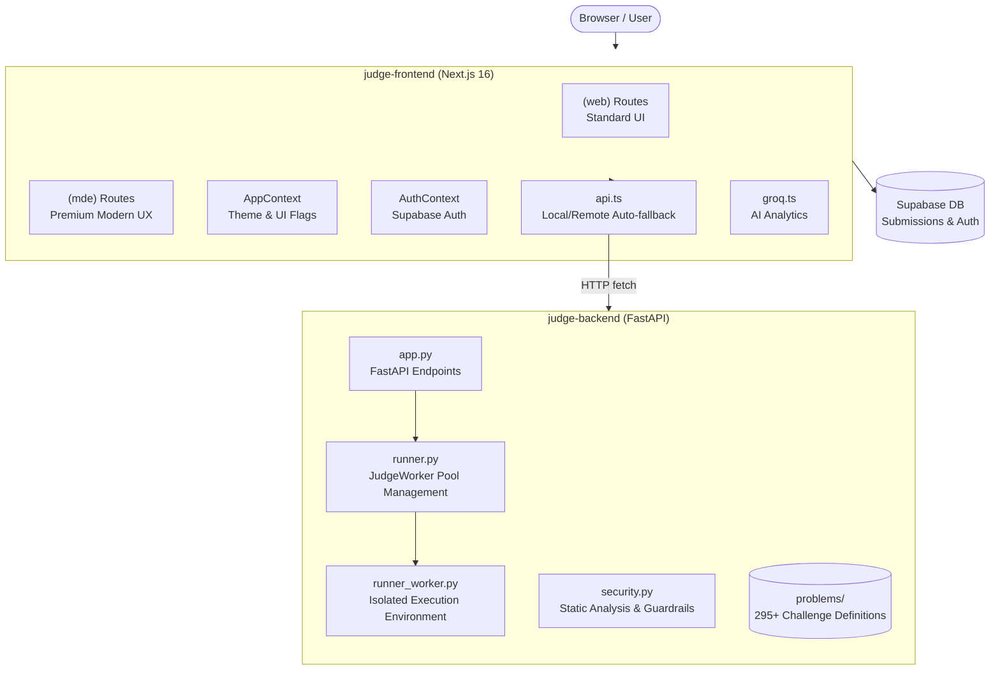

# ⚖️ Vlyxir 🚀

[🚀 Try Vlyxir Live](https://vlyxir.vercel.app)

Welcome to **Vlyxir**, a powerful, modern, and high-performance Online Judge and IDE platform. Designed to provide a premium LeetCode-style experience, Vlyxir combines lightning-fast execution with a state-of-the-art user interface.

Built with **FastAPI** 🌶, **Next.js 16** ⚛️, and **Supabase** ⚡, Vlyxir features a sophisticated persistent worker judge system and an immersive "Modern Design Experience" (MDE).

---

## 🆕 Recent Pushes (What's New)

We've been busy! Here are the latest updates to the platform:

- 🏆 **Global Leaderboard**: A fully integrated competitive ranking system with automated scoring logic (+10 for AC, -5 for WA).
- 👤 **Dynamic User Profiles**: Real-time rank display directly on user profiles, along with restricted 'Recent Activity' feeds.
- 🎯 **Accuracy 2.0**: Implemented first-submission-based accuracy calculation for more meaningful performance metrics.
- 🎨 **Unified Design System**: Centralized background gradients and layout management via a global `ClientLayout` for a seamless, app-like feel.
- 🛡️ **Secure Identity**: Strict username format restrictions to ensure URL safety and platform consistency.
- 📱 **App-like UX**: Enforced strict viewport constraints (`h-screen`, `overflow-hidden`) for core tools (IDE, Analysis, Judge) to maximize focus.

---

## 📸 Screenshots

| General UI | Code Editor & Problem | Submission Result |
| :---: | :---: | :---: |
|  |  |  |

---

## ✨ Key Features

- 🐍 **High-Performance Python Runner**: Utilizes a persistent **JudgeWorker** pool to eliminate subprocess spawn overhead for sub-millisecond judging.
- 🎨 **Modern Design Experience (MDE)**: A premium, glassmorphic interface with dynamic layouts, smooth transitions, and GPU-accelerated animations.
- 🤖 **AI Code Analysis**: Intelligent code review, time complexity estimation, and optimization suggestions powered by **Groq AI**.
- 🔐 **Secure Persistence**: Enterprise-grade user accounts, submission history, and problem stats managed via **Supabase**.
- 🛠 **Customizable IDE**: Monaco-based editor (VS Code's engine) with draggable panels, layout presets (Classic/Wide), and theme support.
- 🎯 **Comprehensive Problem Bank**: **295+ coding challenges** with deep test coverage (100-120 test cases each).
- 🚦 **Advanced Verdict System**:
  - 🟢 **AC (Accepted)** — Perfect solution!
  - 🔴 **WA (Wrong Answer)** — Output mismatch.
  - ⚠️ **RE (Runtime Error)** — Code crashed during execution.
  - ⏱ **TLE (Time Limit Exceeded)** — Strict 2-second timeout enforcement.
- 🌓 **Theme Intelligence**: System-aware light/dark modes with seamless transitions.

---

## 🧠 Architecture Overview

Vlyxir is built on a distributed architecture that decouples the high-security judging core from the modern web interface.



---

## 🛠 Tech Stack

- **Backend**: Python 🐍 + FastAPI 🌶 + `psutil` (Resource management)
- **Frontend**: Next.js 16 ⚛️ + React 19 + TypeScript 📘 + Tailwind CSS v4 🎨
- **Persistence**: Supabase ⚡ (PostgreSQL + Auth)
- **AI**: Groq SDK 🤖 (Llama-based analysis)
- **Animation**: Framer Motion + Anime.js 🎞
- **Editor**: Monaco Editor 💻

---

## 🚀 Getting Started

### 🌶 1. Fire up the Backend
Pre-requisite: Python 3.10+
```bash
cd judge-backend
pip install -r requirements.txt
python app.py
```
*The judge backend will start listening at `http://localhost:5000`.*

### ⚛️ 2. Boot up the Frontend
Pre-requisite: Node.js 18+
```bash
cd judge-frontend
npm install
npm run dev
```
*Open `http://localhost:3000` and experience the judge!*

---

## 🧭 The Roadmap

- [x] **Phase 1**: Core foundations & Verdicts.
- [x] **Phase 2**: Persistent worker judge pool (Optimization).
- [x] **Phase 3**: User accounts & Submission history via Supabase.
- [x] **Phase 4**: Modern Design Experience (MDE) routes.
- [x] **Phase 5**: Leaderboard & Competitive Scoring.
- [ ] **Phase 6**: Dockerized container isolation for code execution.
- [ ] **Phase 7**: Multi-language support (C++, Java, JS).

---

## 📜 License Notice

Vlyxir uses a dual-license structure:

- 👋 **Frontend (`/frontend`)**: MIT License — Open for modification and use.
- ⚖️ **Backend & Core (`/backend`, `/problems`, etc.)**: Vlyxir Proprietary License v1.0 — Restricted use.

See [LICENSE](LICENSE) for full details.

---

### 🙌 Join the Community
Questions? Suggestions? Feel free to open an issue or reach out at `daksh.singh.2407@gmail.com`.

*Made with ❤️ for the coding community.*
