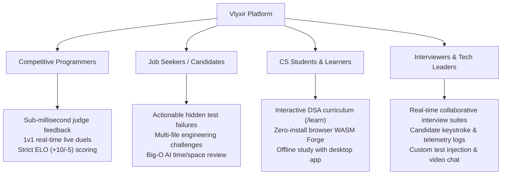

# ⚖️ Vlyxir — Unique Selling Propositions (USPs)

> **Document Class:** Strategic Product Architecture & Market Differentiation  
> **Platform Version:** 7.3.20  
> **Target Audience:** Developers, Technical Interviewers, Competitive Programmers, Engineering Leaders

---

## Executive Summary

Traditional algorithmic and competitive programming platforms (such as LeetCode, Codeforces, HackerRank, and CoderPad) were architected over a decade ago around a monolithic paradigm: **a single, isolated code snippet piped into standard input against standard output on a distant cloud server.**

While effective for basic syntax testing, this legacy approach introduces significant friction:
1. **Toy Problems vs. Real Systems:** Real-world engineering requires modular files, clear architecture, and clean design patterns—not 20 lines jammed into a single `class Solution:`.
2. **Opaque & Punitive Feedback:** Users are penalized with ambiguous verdicts (*"Wrong Answer on testcase 47/120"*), hiding critical debug inputs behind paywalls or vague hints.
3. **Fragmented Developer Workflows:** Programmers must juggle disjointed tools—writing code in an external IDE, seeking explanations from separate chatbots, and switching to Zoom or CoderPad for mock interviews.
4. **Cloud-Lock & Zero Offline Mobility:** Traditional judges cannot execute without high-latency cloud round-trips and fail entirely on airplanes or intermittent internet connections.

**Vlyxir** eliminates this friction. By unifying a **sub-millisecond persistent-worker judge engine**, **in-browser WebAssembly sandboxing**, **multi-file project grading**, **real-time multiplayer competition**, **integrated interview suites**, and **native desktop packaging**, Vlyxir delivers a full-lifecycle engineering ecosystem.

---

## The 10 Core USPs of Vlyxir

```
+---------------------------------------------------------------------------------------------------+
|                                      VLYXIR VALUE PROPOSITIONS                                    |
+---------------------------------+---------------------------------+-------------------------------+
|     ENGINEERING & EXECUTION     |      COMPETITIVE & SOCIAL       |      EXPERIENCE & TOOLING     |
+---------------------------------+---------------------------------+-------------------------------+
| 1. Multi-File Project Judging   | 5. Synchronized 1v1 Code Duels  | 8. Dual-Experience (Classic/  |
| 2. Zero-Latency Hybrid WASM     | 6. Collaborative Interview Room |    MDE Glassmorphic Design)   |
| 3. "Debug-First" Failure Reveal | 7. Multi-Model AI Intelligence  | 9. Integrated DSA Curriculum  |
| 4. Offline Desktop Native App   |    (Groq + Gemini Big-O Engine) | 10. Multi-Account Management  |
+---------------------------------+---------------------------------+-------------------------------+
```

---

### 1. The "Systems-First" Multi-File Project Online Judge
* **The Problem:** Mainstream platforms force developers to stuff entire solutions into a single file or function. This trains engineers for toy algorithm problems rather than real-world modular software architecture.
* **The Vlyxir USP:** Vlyxir supports **multi-file project judging** via its native `/run` and multi-file evaluation pipeline:
  - Users work across full virtual workspaces (`files: [{path, content}]`, `entrypoint: str`).
  - Safe realpath boundary enforcement and sandboxing prevent directory traversal.
  - Challenges can test real software design: e.g., *“Implement a distributed rate limiter across `storage.py`, `token_bucket.py`, and `client.py`”*.
  - Users can export the entire virtual project to a downloadable `.zip` archive at any time.

---

### 2. Zero-Latency Hybrid Execution (WASM Client-Side + Sub-Millisecond Cloud)
* **The Problem:** Platforms like LeetCode send every single test run to remote server queues, creating 2-to-5-second round-trip delays, queue stalls during contests, and massive cloud hosting bills.
* **The Vlyxir USP:** A **hybrid execution architecture**:
  - **Client-Side WASM Forge (`/forge`):** Powered by an in-browser WebAssembly Python runtime (Pyodide CPython 3.11 in a dedicated WebWorker). Users can run and test code with **0ms network latency**, complete client CPU isolation, and zero server infrastructure cost.
  - **Sub-Millisecond Cloud Judge Backend:** When submitting for official grading, the backend utilizes an in-memory pre-indexed problem cache and persistent IPC worker pool. **200 test cases evaluate in under 50 milliseconds**.

---

### 3. Transparent "Debug-First" Hidden Test Case Policy
* **The Problem:** Hitting a failed hidden test case on traditional platforms gives zero insight. Users are forced to guess edge cases blindly or pay for premium hint subscriptions.
* **The Vlyxir USP:** Vlyxir balances competitive integrity with actionable pedagogical feedback:
  - **Passing Hidden Cases:** Inputs and expected outputs remain completely obfuscated.
  - **Failing Hidden Case:** The moment code fails, the exact input that triggered the break, along with the actual output or error traceback, is dynamically surfaced.
  - Developers learn why their algorithmic assumption failed without leaking the entire test suite.

---

### 4. True Offline-First & Desktop-Native Online Judge
* **The Problem:** Online judges are completely inaccessible when flying, commuting, or dealing with unreliable internet connectivity.
* **The Vlyxir USP:** Vlyxir is packaged as a **cross-platform desktop application** (Electron 33 for macOS Apple Silicon DMG, Universal Binary, and Windows Portable/NSIS Exe):
  - Automatically probes local runtime (`http://localhost:5000`) before falling back to remote cloud servers.
  - Paired with Pyodide WASM and cached problem banks, developers can practice data structures, solve algorithms, and test solutions 100% offline.

---

### 5. Real-Time Synchronized 1v1 Algorithmic Duels
* **The Problem:** Competitive programming is typically solitary. Contests require joining fixed-time batches with delayed scoreboard refreshes.
* **The Vlyxir USP:** Vlyxir features an instantaneous **1v1 head-to-head live arena (`/duel`)**:
  - Powered by Supabase Realtime WebSockets with microsecond presence channels.
  - Live opponent progress tracking: see when your competitor passes sample test cases or triggers runtime errors in real time.
  - Automated Elo rating and global leaderboard (+10 XP for Accepted, -5 XP for Wrong Answer).

---

### 6. Built-in Collaborative Technical Interview Suite
* **The Problem:** Tech interviews are fragmented across Zoom, Google Docs, third-party scratchpads, and external coding platforms.
* **The Vlyxir USP:** A comprehensive **Collaborative Interview Suite (`/interview`)** in the same monorepo:
  - Role-gated capabilities (Interviewer vs. Candidate controls).
  - Synchronized dual-cursor Monaco Editor with real-time keystroke broadcast.
  - Interviewer live test case injection and private candidate performance telemetry logs.
  - Integrated WebRTC video/audio communication.

---

### 7. Tier-Gated Multi-Model AI Code Intelligence
* **The Problem:** Generic AI chatbots spoil answers instantly with copy-paste code snippets, destroying the learning process.
* **The Vlyxir USP:** Deeply integrated algorithmic code review powered by **Groq Cloud (Qwen 2.5 32B / LLaMA 3.3 70B)** and **Google Gemini (2.5 Flash / Pro)**:
  - **Automated Big-O Complexity Profiling:** Identifies theoretical time and space bounds based on AST structure.
  - **Progressive Hint Engine:** Guides developers through algorithmic bottlenecks without giving away the full solution.
  - **Static Code Quality & Antipattern Auditing:** Highlights recursion traps, unhandled edge cases, and memory inefficiencies.

---

### 8. Interactive 16-Category DSA Curriculum (`/learn`)
* **The Problem:** Theory and practice are fundamentally disconnected: students read algorithms on articles or textbooks, then struggle to find matched practice problems.
* **The Vlyxir USP:** An integrated **interactive DSA curriculum**:
  - 16 core computer science taxonomies (Arrays, Dynamic Programming, Graphs, Trees, Two Pointers, Monotonic Stacks, Sliding Window, Matrix Traversals, etc.).
  - Direct deep-links between conceptual walkthroughs and the 295+ curated problem bank.
  - Instant transition from theoretical explanation to code editor and judge evaluation in one click.

---

### 9. Dual-Experience Interface (Classic vs. MDE Glassmorphic Design)
* **The Problem:** Legacy judges are visually dated, utilitarian, and rigid—struggling on ultrawide monitors and lacking ergonomic customization.
* **The Vlyxir USP:** Built on Next.js 16, React 19, and Tailwind CSS v4 with a **Dual-Experience Paradigm**:
  - **Classic View:** Streamlined, familiar split-pane layout for pure focus.
  - **Modern Design Experience (MDE):** Atmospheric lighting, customizable ambient glassmorphism, GPU-accelerated motion (Framer Motion + Anime.js), dynamic viewport locking (`h-screen overflow-hidden`), and three layout modes (Classic, Grouped-Switch, and Stacked).
  - Monaco Code Editor matching Visual Studio Code's engine with font scaling, custom keybindings, and theme synchronization.

---

### 10. Multi-Account Switching & Local Persistence
* **The Problem:** Developers managing separate personal, professional, or competitive handles must constantly log out, re-authenticate, and lose active session state.
* **The Vlyxir USP:** Seamless **instant account switching**:
  - `AuthContext` with local multi-account registry (`SavedAccount[]`).
  - Switch identities, track separate streaks, and preserve progress without wiping local storage or re-entering credentials.
  - Integrated backup and restore scripts for submissions and challenge history.

---

## Competitive Feature Comparison Matrix

| Capability / Feature | LeetCode | Codeforces | HackerRank | CoderPad | **Vlyxir** |
| :--- | :---: | :---: | :---: | :---: | :---: |
| **Multi-File Project Judging** | ❌ | ❌ | ❌ | Partial (no judging) | **✅ Native (`run_code_multi`)** |
| **Zero-Latency In-Browser WASM Execution** | ❌ | ❌ | ❌ | ❌ | **✅ Full Pyodide 3.11 Runtime** |
| **Offline Desktop App (macOS & Windows)** | ❌ | ❌ | ❌ | ❌ | **✅ Electron Desktop Packaging** |
| **Fail-Revealed Hidden Test Case Policy** | ❌ (Paywalled) | ❌ | ❌ | ❌ | **✅ Actionable Failure Transparency** |
| **Sub-Millisecond Cloud Judge Latency** | ❌ (Queue based) | ❌ (Queue based) | ❌ (Queue based) | ❌ (Container boot) | **✅ Pre-cached (< 50ms for 200 cases)** |
| **Live 1v1 Real-Time Code Duels** | ❌ | ❌ | ❌ | ❌ | **✅ Live WebSocket Duel Arena** |
| **Built-in Collaborative Interview Rooms** | ❌ | ❌ | ❌ | ✅ ($$$ Paid) | **✅ Native with Video/Audio** |
| **Integrated Big-O & AI Code Review** | ❌ (Paid Addon) | ❌ | ❌ | ❌ | **✅ Multi-Model Groq & Gemini** |
| **Dual Interface (Classic & MDE Glassmorphic)** | ❌ | ❌ | ❌ | ❌ | **✅ Fully Themeable Modern UX** |
| **Multi-Account Switching without Relogging** | ❌ | ❌ | ❌ | ❌ | **✅ Native Account Switcher** |

---

## Target Personas & Value Realization



---

## Conclusion & Strategic Vision

Vlyxir bridges the gap between **academic algorithm puzzles** and **practical, real-world software engineering**. By combining instant local execution with robust cloud verification, transparent failure diagnostics, and multiplayer collaboration, Vlyxir sets a new benchmark for what a modern developer evaluation platform can be.
