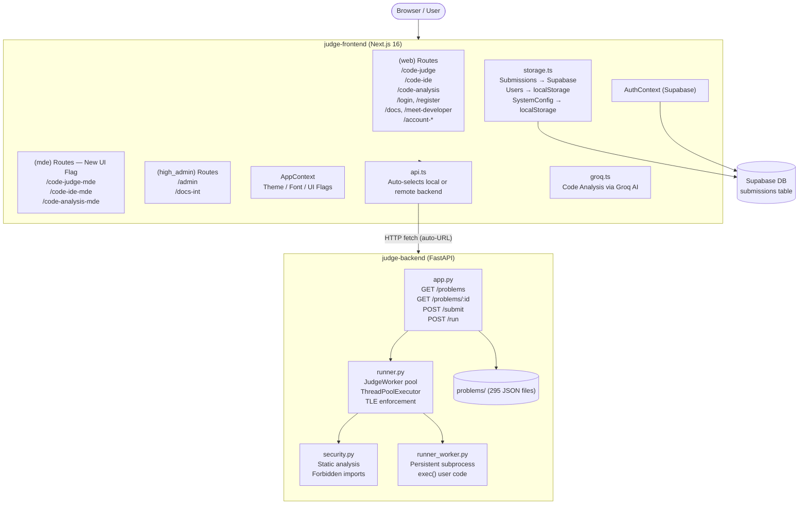

# CodeJudge — Full Codebase Analysis

## Overview

**CodeJudge** is a full-stack online judge / coding platform (LeetCode-style). It consists of two independently deployable subprojects:

| Layer | Stack | Deploy |
|---|---|---|
| `judge-backend` | Python · FastAPI · psutil | Vercel (serverless) |
| `judge-frontend` | Next.js 16 · React 19 · TailwindCSS v4 · Supabase | Vercel |

Version: **7.3.20** (from `package.json`)

---

## Architecture Diagram



---

## Backend (`judge-backend`)

### `app.py` — FastAPI Application

| Endpoint | Method | Purpose |
|---|---|---|
| `/` | GET | Health check |
| `/problems` | GET | List all 295 problems (summary only) |
| `/problems/{id}` | GET | Full problem detail with sample test cases |
| `/submit` | POST | Run code against all test cases (hidden + sample) |
| `/run` | POST | Free-run: execute code with custom stdin |

**Key design choices:**
- CORS is fully open (`allow_origins=["*"]`) — intentional for development/demo
- Hidden test case inputs/outputs are masked in the response; only failed results reveal the input
- `test_only=true` mode runs only sample test cases (for "Test" vs "Submit" behavior)

### `runner.py` — Code Execution Engine

- **Optimized mode** (default): Uses `JudgeWorker` — a **persistent subprocess pool** backed by `runner_worker.py`. Workers are initialized once with the user code (via `exec()`), then reused across test cases via JSON message passing over `stdin/stdout`. This drastically reduces per-test overhead.
- **Sequential fallback mode** (`ENABLE_OPTIMIZATION=False`): Spawns one `python` subprocess per test case — simpler but slow.
- **TLE handling**: A daemon thread reads from each worker's stdout; if `t.join(timeout)` completes with the thread still alive → `kill()` + restart worker.
- **Parallelism**: `ThreadPoolExecutor` runs all test cases concurrently, with workers pulled from a `queue.Queue`.

> [!WARNING]
> **Security gap**: `exec()` runs user code inside the worker process without a real sandbox (no Docker/seccomp/cgroups). The `security.py` static analysis is bypassable via string obfuscation.

### `security.py` — Static Analysis

- Regex-based forbidden pattern matching (networking, `os`, `subprocess`, `eval`, `exec`, `__import__`, etc.)
- Dual-layered: static analysis on submission + runtime `restricted_import` override in the worker
- **Limitation**: Bypassable via `importlib`, `ctypes`, base64-encoded strings, etc.

### `runner_worker.py`

- A long-lived subprocess that receives JSON messages (`init` / `run`) and replies with JSON
- Stores user code at init time; on each `run` message, routes stdin and captures stdout via `exec()`

### Problem Bank (`problems/`)

- **295 JSON files** covering difficulty range from basic warmups to hard DP/graph problems
- Each file contains: `id`, `title`, `description`, `difficulty`, `sample_test_cases`, `hidden_test_cases`, `input_format`, `output_format`, `constraints`
- Typical hidden test count: **100–120 per problem**
- Notable problems: Two Sum, Three Sum, LRU Cache, Find Median from Data Stream, Generate Parentheses, Minimum Path Sum, etc.

---

## Frontend (`judge-frontend`)

### Tech Stack

| Library | Version | Purpose |
|---|---|---|
| Next.js | ^16.1.6 | Framework (App Router) |
| React | 19.2.3 | UI |
| TailwindCSS | v4 | Styling |
| `@monaco-editor/react` | ^4.7.0 | Code editor |
| `@supabase/supabase-js` | ^2.101.1 | Auth + DB |
| `framer-motion` | ^12.27.5 | Animations |
| `animejs` | ^4.3.6 | Micro-animations |
| `groq-sdk` | ^1.1.2 | AI code analysis |
| `lucide-react` | ^0.563.0 | Icons |
| `@ducanh2912/next-pwa` | ^10.2.6 | PWA support |

### Route Groups

#### `(web)` — Standard UI Routes
| Route | Purpose |
|---|---|
| `/code-judge` | Main judge: problem list + Monaco editor + submit |
| `/code-ide` | Free-form Python IDE (stdin-based) |
| `/code-analysis` | AI-powered code analysis via Groq |
| `/login`, `/register` | Auth |
| `/docs` | Documentation |
| `/meet-developer` | About page |
| `/account-settings`, `/account-controls` | User settings |

#### `(mde)` — New UI (opt-in via `useNewUi` flag)
Mirror of `(web)` routes but with richer UX:
- `/code-ide-mde` — **Currently active file** — advanced multi-panel IDE with layout switcher
- `/code-judge-mde` — Enhanced judge UI
- `/code-analysis-mde` — Enhanced analysis UI

> [!NOTE]
> MDE routes redirect to their `(web)` counterparts when `useNewUi` is false (opt-in toggle in settings)

#### `(high_admin)` — Admin Panel
- `/admin` — System admin dashboard
- `/docs-int` — Internal docs (requires `DOCS_INT` permission)

### Key Library Files (`app/lib/`)

| File | Role |
|---|---|
| `context.tsx` | Global app state: theme (dark/light/system), font scale, editor font size, reduce-motion, hardware acceleration, mobile pill, new UI flag |
| `auth-context.tsx` | Supabase auth context (session/user) |
| `api.ts` | API client with **auto-URL fallback**: tries `localhost:5000` first (1.5s timeout), falls back to Vercel-deployed backend |
| `storage.ts` | Persistence layer: Supabase `submissions` table, localStorage user management, system config |
| `types.ts` | Shared TypeScript interfaces: `Problem`, `TestCaseResult`, `SubmitResponse`, `User`, `Permission` |
| `cache.ts` | In-memory problem list cache (SWR-style: returns stale, fetches fresh in background) |
| `groq.ts` | Groq API integration for AI code review |
| `paths.ts` | Route path helpers respecting `useNewUi` flag |
| `editor-config.ts` | Monaco editor configuration |

### State Architecture

```
AppWrapper (context.tsx)
  └── AuthProvider (auth-context.tsx) [Supabase session]
        └── Page Components
              ├── useAppContext() → theme, UI settings
              └── useAuth() → user, session, isLoading
```

### Theme System

- Three modes: `light | dark | system`
- Persisted in `localStorage` (`theme_mode` key)
- CSS class-based (`document.documentElement.classList.toggle("dark", ...)`)
- Animated transitions using CSS View Transitions API when available
- `reduce-motion` and `theme-gpu` classes for accessibility/performance

### `code-ide-mde/page.tsx` (Active File)

This is the most complex component in the frontend:

- **674 lines** of a full IDE interface
- **Resizable panels** using mouse drag (RAF-throttled, separate `isResizingMain` / `isResizingSecondary` refs)
- **Layout modes**: "Classic" (side-by-side) and "Wide" (editor top, input/output bottom)
- **Mobile support**: Tab-based (`code` | `output`) with an animated floating pill navigator
- **Auth gating**: Run button disabled without login; output panel shows `LoginPrompt`
- **Session state**: Code, input, and output persisted in `sessionStorage`
- **Anime.js**: Loading skeleton animation + mobile tab transition animations

### Authentication & Permissions

| Layer | Method |
|---|---|
| End-user auth | Supabase Auth (email/password) |
| Submission storage | Supabase `submissions` table (RLS by `user_id`) |
| Admin access | Custom `User` records in `localStorage` with `Permission[]` |
| Root user | Hardcoded `daksh` user seeded into localStorage |

> [!CAUTION]
> **Admin credentials are stored in plaintext in `localStorage`** and the root password (`daksh@codejudge`) is hardcoded in `storage.ts`. This is a significant security concern for any public deployment.

---

## Identified Issues & Observations

### 🔴 Critical
1. **Hardcoded root credentials** in `storage.ts` (line 78): `password: 'daksh@codejudge'`. Anyone with access to `localStorage` can see this.
2. **Code execution is not sandboxed**: Backend runs user Python code via `exec()` in a subprocess with only regex-based security. Sophisticated attacks can bypass this.

### 🟡 Notable
3. **`hidden_test_cases: never[]`** in `types.ts` (line 2): This is a stub type that effectively prevents assigning any real data to `hidden_test_cases` on the frontend. Likely a leftover from a refactor.
4. **CORS fully open** (`allow_origins=["*"]`) in the backend — acceptable for dev/demo, risky in production.
5. **Worker pool TLE race condition**: If a worker dies unexpectedly mid-job (not TLE), the error recovery may restart the worker but the test case result is lost.
6. **`api.ts` URL resolution is cached per page load** (`resolvedBaseUrl`). Switching from local to remote mid-session requires a reload.

### 🟢 Strengths
7. **SWR-style caching** in `cache.ts` and `api.ts`: stale-while-revalidate keeps the UI snappy.
8. **View Transitions API** for smooth theme switching with proper fallback.
9. **Parallel worker pool** significantly speeds up judging compared to N sequential subprocess spawns.
10. **Dual-route system** (`(web)` vs `(mde)`) allows opt-in UI experiments without breaking existing users.
11. **295 problems** with 100–120 hidden test cases each — a substantial and comprehensive problem bank.

---

## File Count Summary

| Area | Count |
|---|---|
| Problems (JSON) | 295 |
| Frontend source files | ~45+ |
| Backend Python files | 10 |
| Frontend routes | ~13 |
